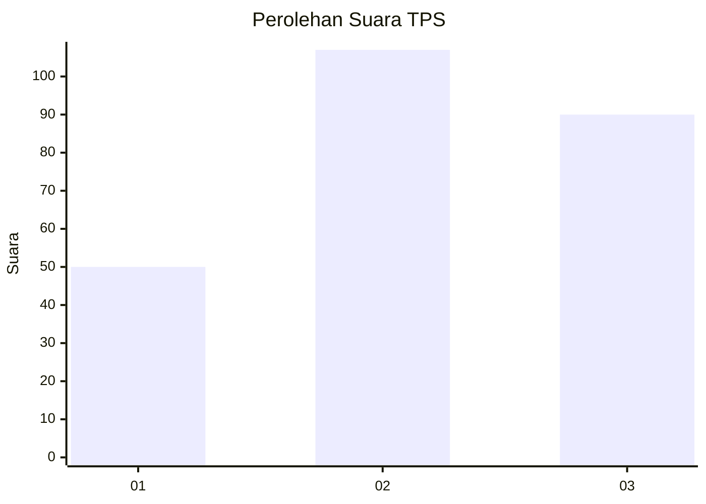
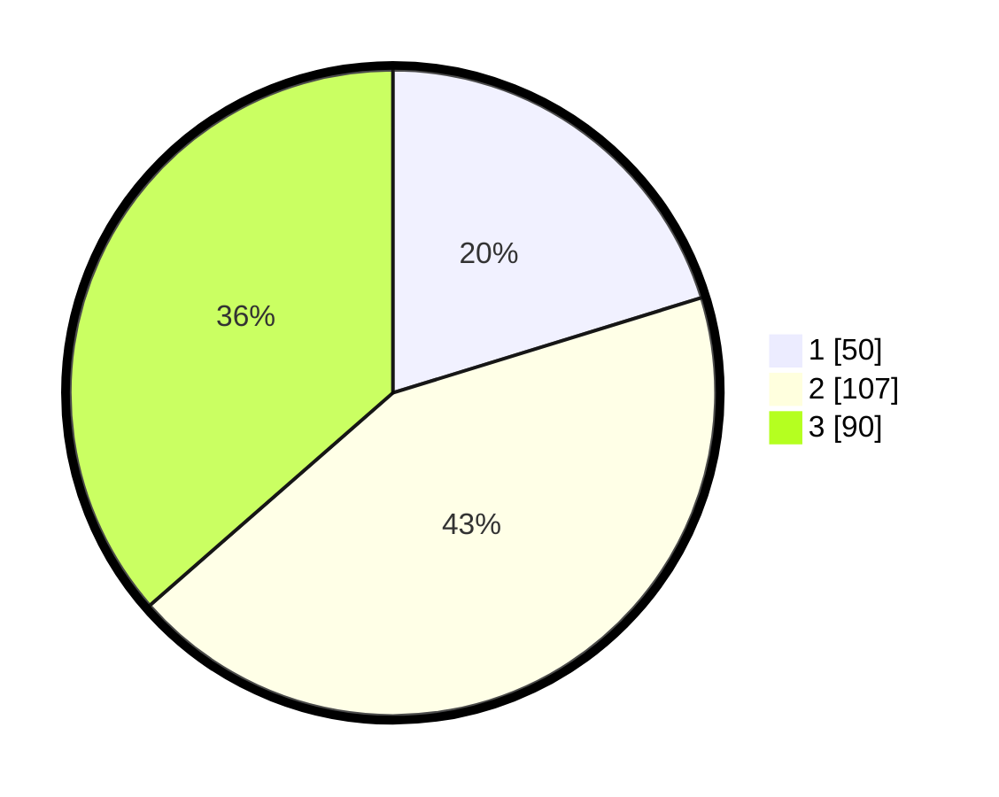

# Hasil

## Grafik

## Tabel

| No. | Nama Paslon    | Suara | Suara (raw) | Persentase |
|:--- |:-------------- | -----:| -----------:| ----------:|
| 1   | ANIES MUHAIMIN | 50    | [50][p-1]   | 20,24      |
| 2   | PRABOWO GIBRAN | 107   | [107][p-2]  | 43,32      |
| 3   | GANJAR MAHFUD  | 90    | [90][p-3]   | 36,44      |

[p-1]: https://github.com/gigit-pemilu/pemilu-2024-34-di-yogyakarta/blob/main/pilpres/hitung-suara/sub/34-di-yogyakarta/sub/01-kulon-progo/sub/07-pengasih/sub/2002-karangsari/sub/018-tps/sub/paslon-1.txt
[p-2]: https://github.com/gigit-pemilu/pemilu-2024-34-di-yogyakarta/blob/main/pilpres/hitung-suara/sub/34-di-yogyakarta/sub/01-kulon-progo/sub/07-pengasih/sub/2002-karangsari/sub/018-tps/sub/paslon-2.txt
[p-3]: https://github.com/gigit-pemilu/pemilu-2024-34-di-yogyakarta/blob/main/pilpres/hitung-suara/sub/34-di-yogyakarta/sub/01-kulon-progo/sub/07-pengasih/sub/2002-karangsari/sub/018-tps/sub/paslon-3.txt

## Foto C Plano

https://sirekap-obj-formc.kpu.go.id/1141/pemilu/ppwp/34/01/07/20/02/3401072002018-20240215-025158--191a1d90-804b-445e-96e4-562fbd06c6ef.jpg

https://sirekap-obj-formc.kpu.go.id/1141/pemilu/ppwp/34/01/07/20/02/3401072002018-20240215-025237--8da08d97-8cf9-4364-b042-9bfc70e689dd.jpg

https://sirekap-obj-formc.kpu.go.id/1141/pemilu/ppwp/34/01/07/20/02/3401072002018-20240216-135109--595c0575-3f48-4c73-a0c2-9d760b85aaf2.jpg

## Metadata

| Key        | Value               |
| ---------- | ------------------- |
| Time Stamp | 2024-02-16 14:00:34 |

