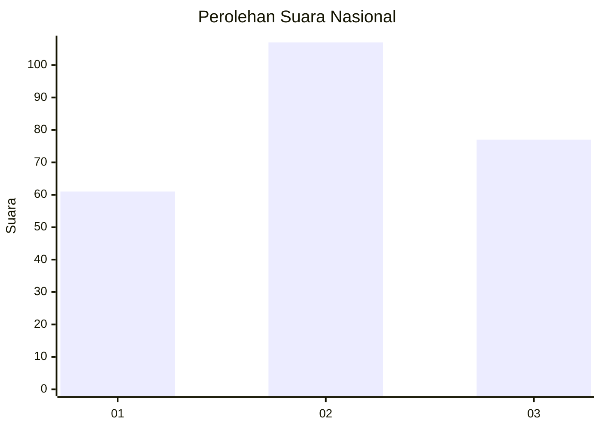
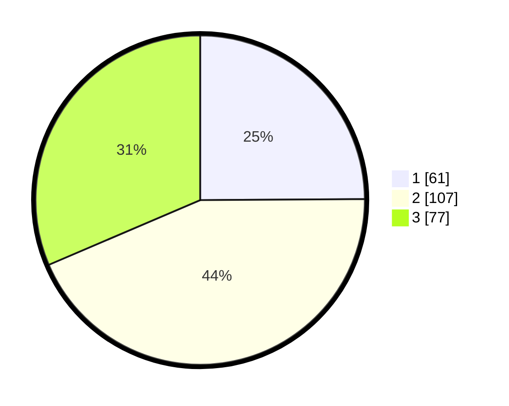

# Hasil

## Grafik

## Tabel

| No. | Nama Paslon    | Suara | Suara (raw) | Persentase |
|:--- |:-------------- | -----:| -----------:| ----------:|
| 1   | ANIES MUHAIMIN | 61    | [61][p-1]   | 24,90      |
| 2   | PRABOWO GIBRAN | 107   | [107][p-2]  | 43,67      |
| 3   | GANJAR MAHFUD  | 77    | [77][p-3]   | 31,43      |

[p-1]: https://github.com/gigit-pemilu/pemilu-2024/blob/main/pilpres/hitung-suara/sub/34-di-yogyakarta/sub/01-kulon-progo/sub/07-pengasih/sub/2002-karangsari/sub/027-tps/sub/paslon-1.txt
[p-2]: https://github.com/gigit-pemilu/pemilu-2024/blob/main/pilpres/hitung-suara/sub/34-di-yogyakarta/sub/01-kulon-progo/sub/07-pengasih/sub/2002-karangsari/sub/027-tps/sub/paslon-2.txt
[p-3]: https://github.com/gigit-pemilu/pemilu-2024/blob/main/pilpres/hitung-suara/sub/34-di-yogyakarta/sub/01-kulon-progo/sub/07-pengasih/sub/2002-karangsari/sub/027-tps/sub/paslon-3.txt

## Foto C Plano

https://sirekap-obj-formc.kpu.go.id/aee2/pemilu/ppwp/34/01/07/20/02/3401072002027-20240214-230555--47c2a612-756a-441b-9a47-11ab9537f837.jpg

https://sirekap-obj-formc.kpu.go.id/aee2/pemilu/ppwp/34/01/07/20/02/3401072002027-20240214-230654--8ef3803c-ff34-402b-ae53-df76e16c47f3.jpg

https://sirekap-obj-formc.kpu.go.id/aee2/pemilu/ppwp/34/01/07/20/02/3401072002027-20240214-230913--216b1ace-f730-40cd-a64a-4a17744860ae.jpg

## Metadata

| Key        | Value               |
| ---------- | ------------------- |
| Time Stamp | 2024-02-16 03:00:26 |

## DATA PEMILIH TETAP

Jumlah pemilih dalam DPT: **285**.
 * L: **124**.
 * P: **161**.

## DATA PENGGUNA HAK PILIH

Jumlah pengguna hak pilih dalam DPT: **245**.
 * L: **105**.
 * P: **140**.

Jumlah pengguna hak pilih dalam DPTb: **2**.
 * L: **1**.
 * P: **1**.

Jumlah pengguna hak pilih dalam DPK: **0**.
 * L: **0**.
 * P: **0**.

Jumlah pengguna hak pilih: **247**.
 * L: **106**.
 * P: **141**.

## JUMLAH SUARA SAH DAN TIDAK SAH

JUMLAH SELURUH SUARA SAH: **245**.

JUMLAH SUARA TIDAK SAH: **2**.

JUMLAH SELURUH SUARA SAH DAN SUARA TIDAK SAH: **247**.

