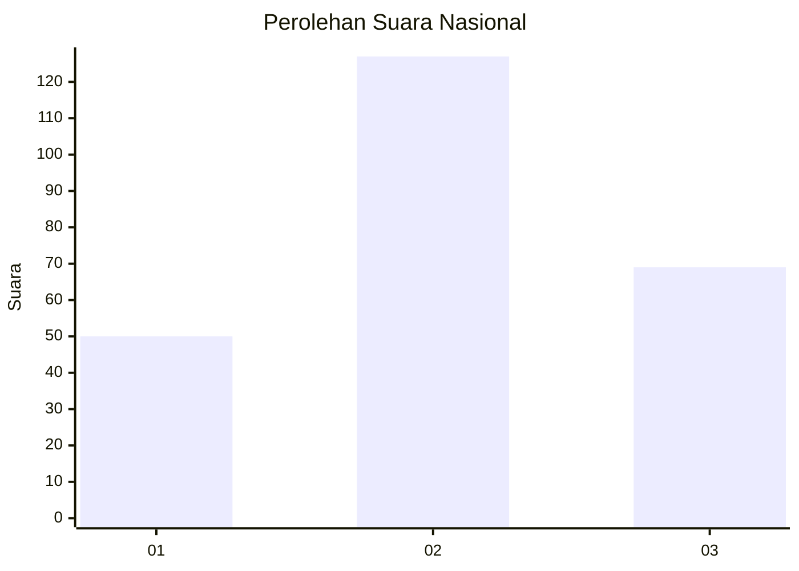
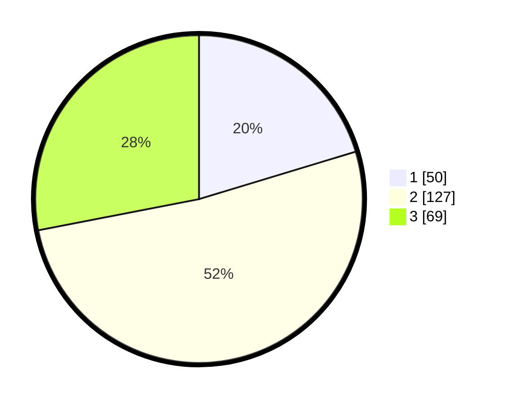

# Hasil

## Grafik

## Tabel

| No. | Nama Paslon    | Suara | Suara (raw) | Persentase |
|:--- |:-------------- | -----:| -----------:| ----------:|
| 1   | ANIES MUHAIMIN | 50    | [50][p-1]   | 20,33      |
| 2   | PRABOWO GIBRAN | 127   | [127][p-2]  | 51,63      |
| 3   | GANJAR MAHFUD  | 69    | [69][p-3]   | 28,05      |

[p-1]: https://github.com/gigit-pemilu/pemilu-2024/blob/main/pilpres/hitung-suara/sub/34-di-yogyakarta/sub/01-kulon-progo/sub/07-pengasih/sub/2002-karangsari/sub/030-tps/sub/paslon-1.txt
[p-2]: https://github.com/gigit-pemilu/pemilu-2024/blob/main/pilpres/hitung-suara/sub/34-di-yogyakarta/sub/01-kulon-progo/sub/07-pengasih/sub/2002-karangsari/sub/030-tps/sub/paslon-2.txt
[p-3]: https://github.com/gigit-pemilu/pemilu-2024/blob/main/pilpres/hitung-suara/sub/34-di-yogyakarta/sub/01-kulon-progo/sub/07-pengasih/sub/2002-karangsari/sub/030-tps/sub/paslon-3.txt

## Foto C Plano

https://sirekap-obj-formc.kpu.go.id/07a4/pemilu/ppwp/34/01/07/20/02/3401072002030-20240215-130620--183e5470-827c-4c78-98b8-4152b169a133.jpg

https://sirekap-obj-formc.kpu.go.id/07a4/pemilu/ppwp/34/01/07/20/02/3401072002030-20240214-230237--671f44a6-3b6f-418b-a229-d81400a04a5c.jpg

https://sirekap-obj-formc.kpu.go.id/07a4/pemilu/ppwp/34/01/07/20/02/3401072002030-20240217-171046--4100c7ce-db40-45b7-89d6-224b41ce6979.jpg

## Metadata

| Key        | Value               |
| ---------- | ------------------- |
| Time Stamp | 2024-02-17 17:30:00 |

