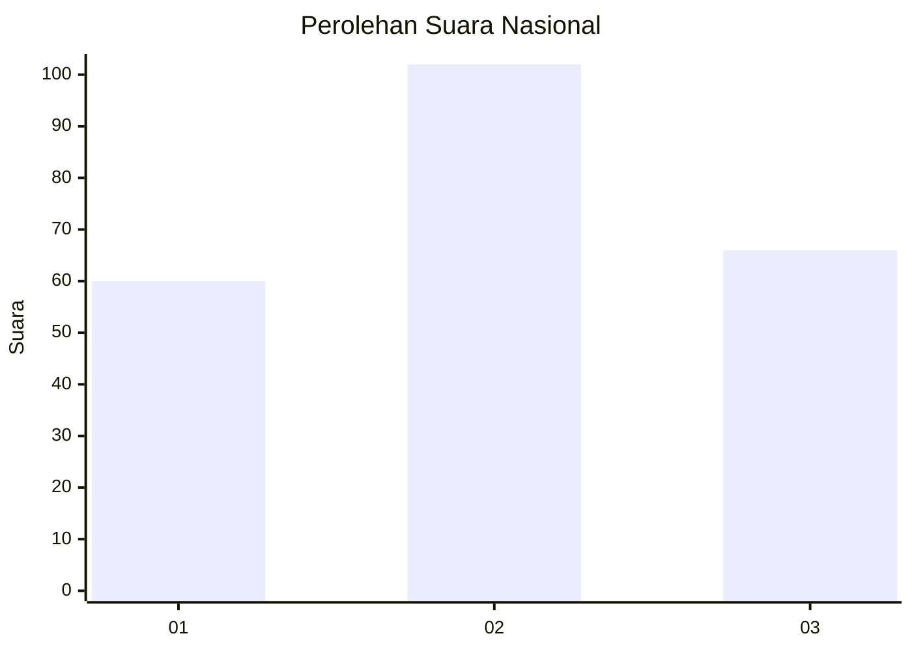
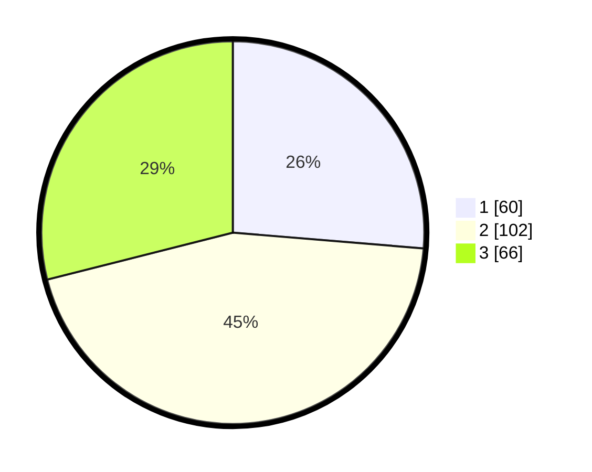

# Hasil

## Grafik

## Tabel

| No. | Nama Paslon    | Suara | Suara (raw) | Persentase |
|:--- |:-------------- | -----:| -----------:| ----------:|
| 1   | ANIES MUHAIMIN | 60    | [60][p-1]   | 26,32      |
| 2   | PRABOWO GIBRAN | 102   | [102][p-2]  | 44,74      |
| 3   | GANJAR MAHFUD  | 66    | [66][p-3]   | 28,95      |

[p-1]: https://github.com/gigit-pemilu/pemilu-2024/blob/main/pilpres/hitung-suara/sub/34-di-yogyakarta/sub/01-kulon-progo/sub/07-pengasih/sub/2003-kedungsari/sub/006-tps/sub/paslon-1.txt
[p-2]: https://github.com/gigit-pemilu/pemilu-2024/blob/main/pilpres/hitung-suara/sub/34-di-yogyakarta/sub/01-kulon-progo/sub/07-pengasih/sub/2003-kedungsari/sub/006-tps/sub/paslon-2.txt
[p-3]: https://github.com/gigit-pemilu/pemilu-2024/blob/main/pilpres/hitung-suara/sub/34-di-yogyakarta/sub/01-kulon-progo/sub/07-pengasih/sub/2003-kedungsari/sub/006-tps/sub/paslon-3.txt

## Foto C Plano

https://sirekap-obj-formc.kpu.go.id/e62c/pemilu/ppwp/34/01/07/20/03/3401072003006-20240214-155027--85108cdc-2c1b-4eb6-b7bc-fb1c96c7cec1.jpg

https://sirekap-obj-formc.kpu.go.id/e62c/pemilu/ppwp/34/01/07/20/03/3401072003006-20240214-231358--e49a12ab-a241-4022-8e3b-08ba656f1eaa.jpg

## Metadata

| Key        | Value               |
| ---------- | ------------------- |
| Time Stamp | 2024-02-24 22:31:28 |

