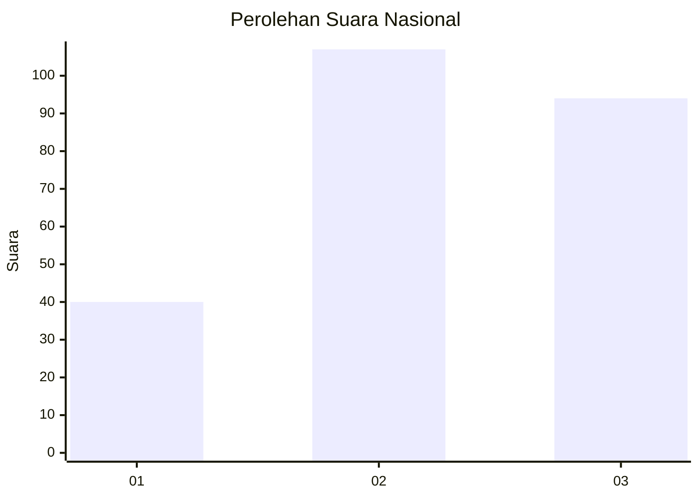
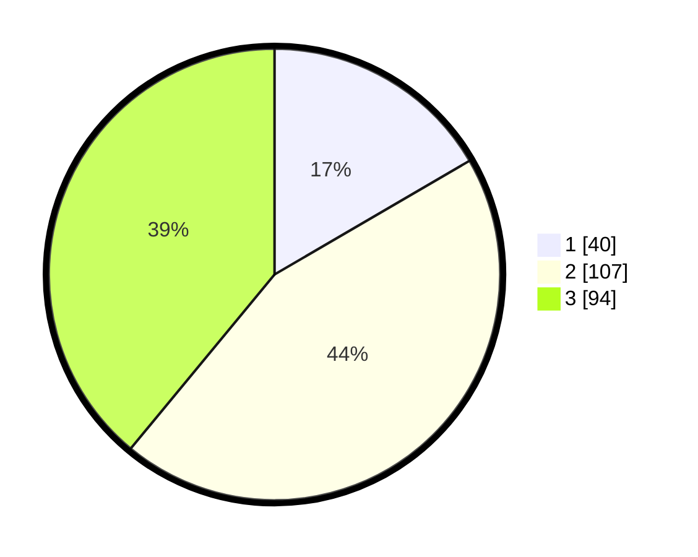

# Hasil

## Grafik

## Tabel

| No. | Nama Paslon    | Suara | Suara (raw) | Persentase |
|:--- |:-------------- | -----:| -----------:| ----------:|
| 1   | ANIES MUHAIMIN | 40    | [40][p-1]   | 16,60      |
| 2   | PRABOWO GIBRAN | 107   | [107][p-2]  | 44,40      |
| 3   | GANJAR MAHFUD  | 94    | [94][p-3]   | 39,00      |

[p-1]: https://github.com/gigit-pemilu/pemilu-2024/blob/main/pilpres/hitung-suara/sub/34-di-yogyakarta/sub/01-kulon-progo/sub/07-pengasih/sub/2003-kedungsari/sub/013-tps/sub/paslon-1.txt
[p-2]: https://github.com/gigit-pemilu/pemilu-2024/blob/main/pilpres/hitung-suara/sub/34-di-yogyakarta/sub/01-kulon-progo/sub/07-pengasih/sub/2003-kedungsari/sub/013-tps/sub/paslon-2.txt
[p-3]: https://github.com/gigit-pemilu/pemilu-2024/blob/main/pilpres/hitung-suara/sub/34-di-yogyakarta/sub/01-kulon-progo/sub/07-pengasih/sub/2003-kedungsari/sub/013-tps/sub/paslon-3.txt

## Foto C Plano

https://sirekap-obj-formc.kpu.go.id/56d9/pemilu/ppwp/34/01/07/20/03/3401072003013-20240215-001622--71c2d4bd-fb1a-4c75-baaa-103ec0168031.jpg

https://sirekap-obj-formc.kpu.go.id/56d9/pemilu/ppwp/34/01/07/20/03/3401072003013-20240215-001216--88f70cd1-5b5c-4a79-a7e4-e45ba75a7744.jpg

https://sirekap-obj-formc.kpu.go.id/56d9/pemilu/ppwp/34/01/07/20/03/3401072003013-20240215-001437--efb9b139-d390-4cf7-857d-8d3b6ace3746.jpg

## Metadata

| Key        | Value               |
| ---------- | ------------------- |
| Time Stamp | 2024-02-16 05:00:26 |

## DATA PEMILIH TETAP

Jumlah pemilih dalam DPT: **284**.
 * L: **133**.
 * P: **151**.

## DATA PENGGUNA HAK PILIH

Jumlah pengguna hak pilih dalam DPT: **244**.
 * L: **122**.
 * P: **122**.

Jumlah pengguna hak pilih dalam DPTb: **2**.
 * L: **1**.
 * P: **1**.

Jumlah pengguna hak pilih dalam DPK: **1**.
 * L: **1**.
 * P: **0**.

Jumlah pengguna hak pilih: **247**.
 * L: **124**.
 * P: **123**.

## JUMLAH SUARA SAH DAN TIDAK SAH

JUMLAH SELURUH SUARA SAH: **241**.

JUMLAH SUARA TIDAK SAH: **6**.

JUMLAH SELURUH SUARA SAH DAN SUARA TIDAK SAH: **247**.

