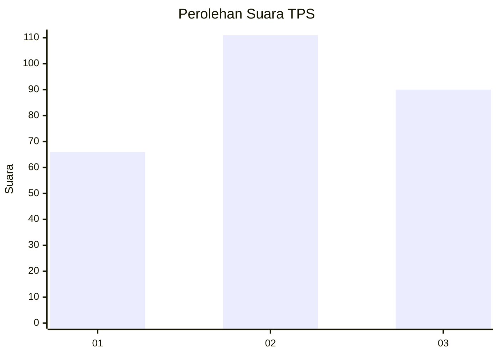
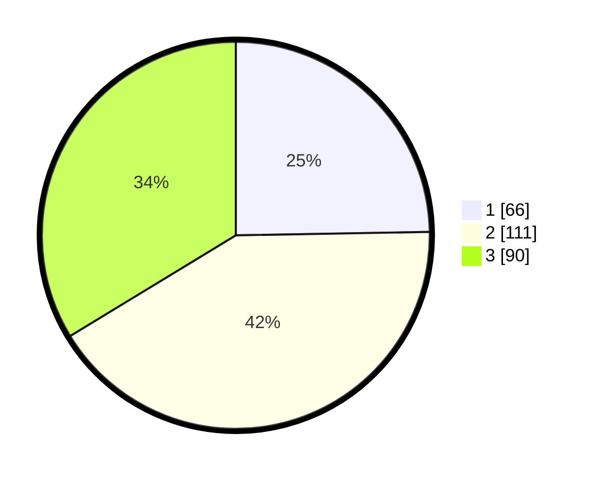

# Hasil

## Grafik

## Tabel

| No. | Nama Paslon    | Suara | Suara (raw) | Persentase |
|:--- |:-------------- | -----:| -----------:| ----------:|
| 1   | ANIES MUHAIMIN | 66    | [66][p-1]   | 24,72      |
| 2   | PRABOWO GIBRAN | 111   | [111][p-2]  | 41,57      |
| 3   | GANJAR MAHFUD  | 90    | [90][p-3]   | 33,71      |

[p-1]: https://github.com/gigit-pemilu/pemilu-2024-34-di-yogyakarta/blob/main/pilpres/hitung-suara/sub/34-di-yogyakarta/sub/01-kulon-progo/sub/07-pengasih/sub/2004-margosari/sub/004-tps/sub/paslon-1.txt
[p-2]: https://github.com/gigit-pemilu/pemilu-2024-34-di-yogyakarta/blob/main/pilpres/hitung-suara/sub/34-di-yogyakarta/sub/01-kulon-progo/sub/07-pengasih/sub/2004-margosari/sub/004-tps/sub/paslon-2.txt
[p-3]: https://github.com/gigit-pemilu/pemilu-2024-34-di-yogyakarta/blob/main/pilpres/hitung-suara/sub/34-di-yogyakarta/sub/01-kulon-progo/sub/07-pengasih/sub/2004-margosari/sub/004-tps/sub/paslon-3.txt

## Foto C Plano

https://sirekap-obj-formc.kpu.go.id/6245/pemilu/ppwp/34/01/07/20/04/3401072004004-20240215-023109--20ac616d-553c-4de6-ab1a-907039963758.jpg

https://sirekap-obj-formc.kpu.go.id/6245/pemilu/ppwp/34/01/07/20/04/3401072004004-20240215-023319--bf394981-bf9e-4ad2-a1d0-12bc0eb476b2.jpg

https://sirekap-obj-formc.kpu.go.id/6245/pemilu/ppwp/34/01/07/20/04/3401072004004-20240215-023502--627cb4e1-bdaa-4b10-8743-021657556605.jpg

## Metadata

| Key        | Value               |
| ---------- | ------------------- |
| Time Stamp | 2024-02-15 21:30:27 |

## DATA PEMILIH TETAP

Jumlah pemilih dalam DPT: **284**.
 * L: **130**.
 * P: **154**.

## DATA PENGGUNA HAK PILIH

Jumlah pengguna hak pilih dalam DPT: **248**.
 * L: **112**.
 * P: **136**.

Jumlah pengguna hak pilih dalam DPTb: **19**.
 * L: **8**.
 * P: **11**.

Jumlah pengguna hak pilih dalam DPK: **2**.
 * L: **2**.
 * P: **0**.

Jumlah pengguna hak pilih: **269**.
 * L: **122**.
 * P: **147**.

## JUMLAH SUARA SAH DAN TIDAK SAH

JUMLAH SELURUH SUARA SAH: **267**.

JUMLAH SUARA TIDAK SAH: **2**.

JUMLAH SELURUH SUARA SAH DAN SUARA TIDAK SAH: **269**.

