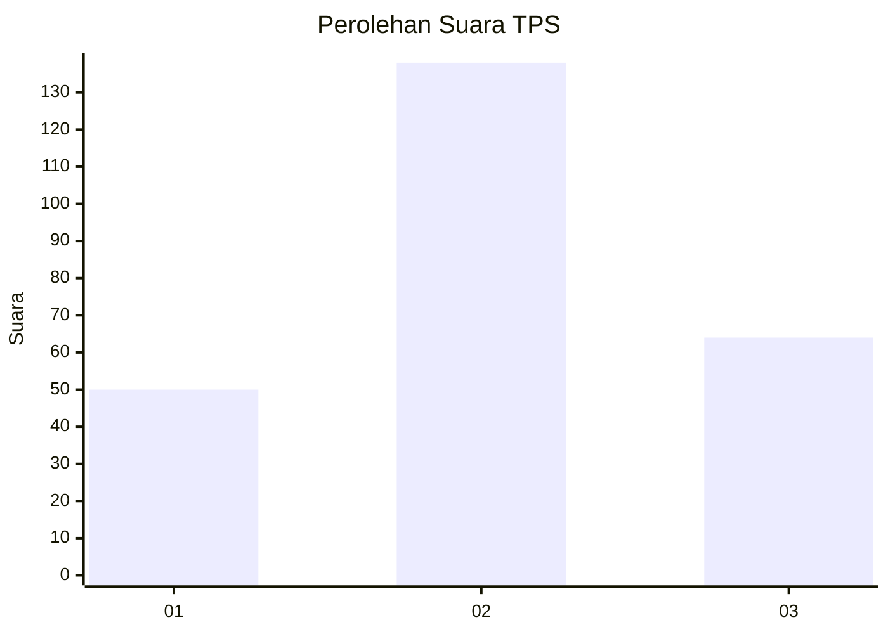
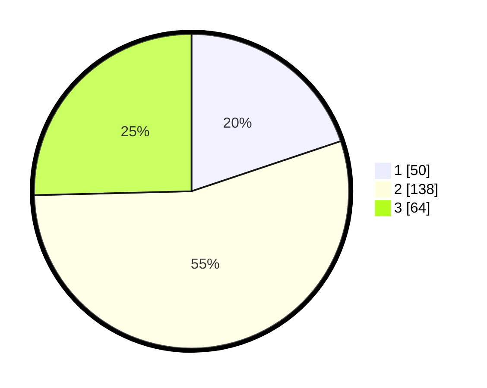

# Hasil

## Grafik

## Tabel

| No. | Nama Paslon    | Suara | Suara (raw) | Persentase |
|:--- |:-------------- | -----:| -----------:| ----------:|
| 1   | ANIES MUHAIMIN | 50    | [50][p-1]   | 19,84      |
| 2   | PRABOWO GIBRAN | 138   | [138][p-2]  | 54,76      |
| 3   | GANJAR MAHFUD  | 64    | [64][p-3]   | 25,40      |

[p-1]: https://github.com/gigit-pemilu/pemilu-2024-34-di-yogyakarta/blob/main/pilpres/hitung-suara/sub/34-di-yogyakarta/sub/01-kulon-progo/sub/07-pengasih/sub/2004-margosari/sub/005-tps/sub/paslon-1.txt
[p-2]: https://github.com/gigit-pemilu/pemilu-2024-34-di-yogyakarta/blob/main/pilpres/hitung-suara/sub/34-di-yogyakarta/sub/01-kulon-progo/sub/07-pengasih/sub/2004-margosari/sub/005-tps/sub/paslon-2.txt
[p-3]: https://github.com/gigit-pemilu/pemilu-2024-34-di-yogyakarta/blob/main/pilpres/hitung-suara/sub/34-di-yogyakarta/sub/01-kulon-progo/sub/07-pengasih/sub/2004-margosari/sub/005-tps/sub/paslon-3.txt

## Foto C Plano

https://sirekap-obj-formc.kpu.go.id/d593/pemilu/ppwp/34/01/07/20/04/3401072004005-20240215-061216--9ac5948f-85ae-4f5d-865f-4477d9786165.jpg

https://sirekap-obj-formc.kpu.go.id/d593/pemilu/ppwp/34/01/07/20/04/3401072004005-20240215-060810--81ea2cbf-9cb1-4bcc-9d89-d9fa4bdce45a.jpg

## Metadata

| Key        | Value               |
| ---------- | ------------------- |
| Time Stamp | 2024-02-22 12:00:00 |

