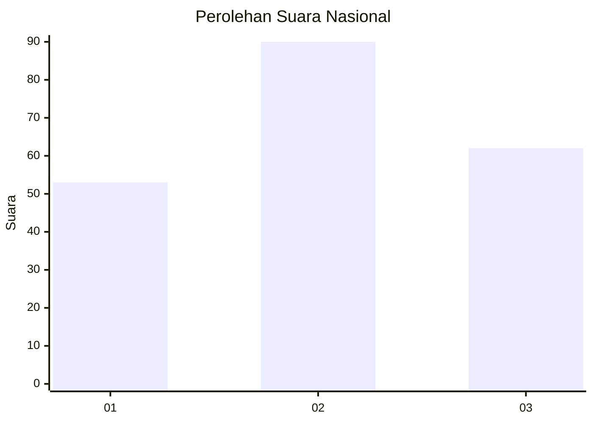
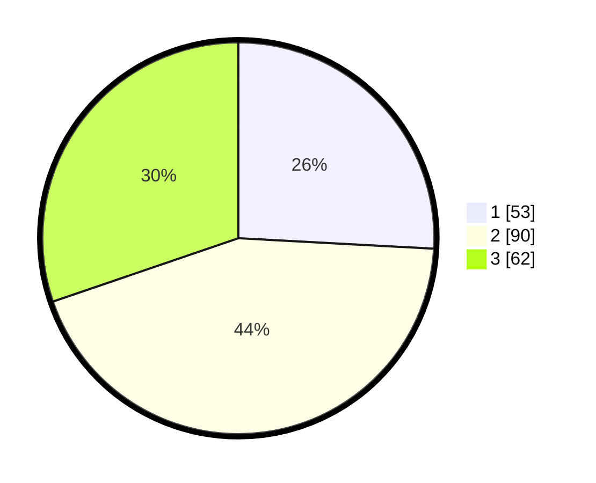

# Hasil

## Grafik

## Tabel

| No. | Nama Paslon    | Suara | Suara (raw) | Persentase |
|:--- |:-------------- | -----:| -----------:| ----------:|
| 1   | ANIES MUHAIMIN | 53    | [53][p-1]   | 25,85      |
| 2   | PRABOWO GIBRAN | 90    | [90][p-2]   | 43,90      |
| 3   | GANJAR MAHFUD  | 62    | [62][p-3]   | 30,24      |

[p-1]: https://github.com/gigit-pemilu/pemilu-2024/blob/main/pilpres/hitung-suara/sub/34-di-yogyakarta/sub/01-kulon-progo/sub/07-pengasih/sub/2004-margosari/sub/015-tps/sub/paslon-1.txt
[p-2]: https://github.com/gigit-pemilu/pemilu-2024/blob/main/pilpres/hitung-suara/sub/34-di-yogyakarta/sub/01-kulon-progo/sub/07-pengasih/sub/2004-margosari/sub/015-tps/sub/paslon-2.txt
[p-3]: https://github.com/gigit-pemilu/pemilu-2024/blob/main/pilpres/hitung-suara/sub/34-di-yogyakarta/sub/01-kulon-progo/sub/07-pengasih/sub/2004-margosari/sub/015-tps/sub/paslon-3.txt

## Foto C Plano

https://sirekap-obj-formc.kpu.go.id/1b87/pemilu/ppwp/34/01/07/20/04/3401072004015-20240215-024909--b5c06a71-d1fa-4cd0-ab4f-9e098d7aa829.jpg

https://sirekap-obj-formc.kpu.go.id/1b87/pemilu/ppwp/34/01/07/20/04/3401072004015-20240215-023808--705d20aa-a8b4-4089-939c-e823517aea67.jpg

https://sirekap-obj-formc.kpu.go.id/1b87/pemilu/ppwp/34/01/07/20/04/3401072004015-20240215-023940--375ceedc-d62f-42ae-b301-60731d45e0b6.jpg

## Metadata

| Key        | Value               |
| ---------- | ------------------- |
| Time Stamp | 2024-02-16 05:00:26 |

