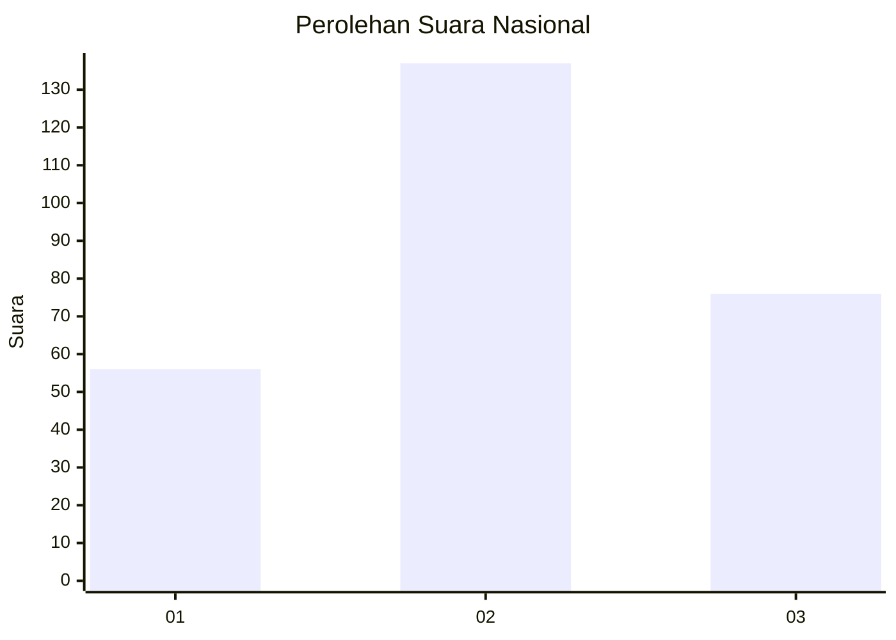
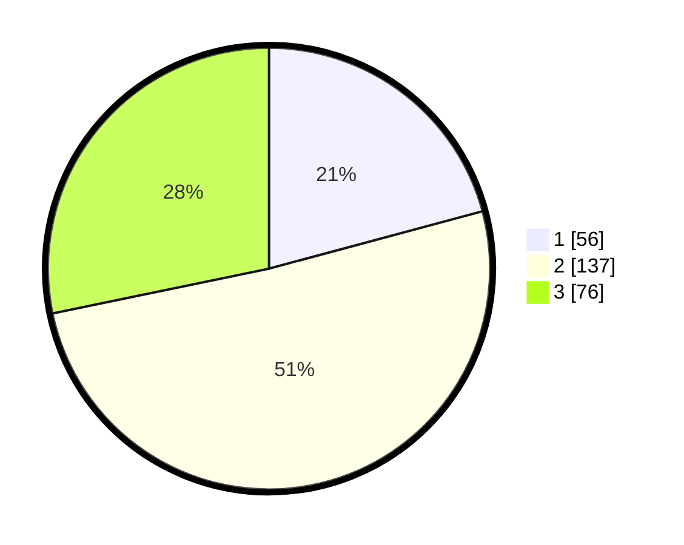

# Hasil

## Grafik

## Tabel

| No. | Nama Paslon    | Suara | Suara (raw) | Persentase |
|:--- |:-------------- | -----:| -----------:| ----------:|
| 1   | ANIES MUHAIMIN | 56    | [56][p-1]   | 20,82      |
| 2   | PRABOWO GIBRAN | 137   | [137][p-2]  | 50,93      |
| 3   | GANJAR MAHFUD  | 76    | [76][p-3]   | 28,25      |

[p-1]: https://github.com/gigit-pemilu/pemilu-2024/blob/main/pilpres/hitung-suara/sub/34-di-yogyakarta/sub/01-kulon-progo/sub/07-pengasih/sub/2004-margosari/sub/016-tps/sub/paslon-1.txt
[p-2]: https://github.com/gigit-pemilu/pemilu-2024/blob/main/pilpres/hitung-suara/sub/34-di-yogyakarta/sub/01-kulon-progo/sub/07-pengasih/sub/2004-margosari/sub/016-tps/sub/paslon-2.txt
[p-3]: https://github.com/gigit-pemilu/pemilu-2024/blob/main/pilpres/hitung-suara/sub/34-di-yogyakarta/sub/01-kulon-progo/sub/07-pengasih/sub/2004-margosari/sub/016-tps/sub/paslon-3.txt

## Foto C Plano

https://sirekap-obj-formc.kpu.go.id/022d/pemilu/ppwp/34/01/07/20/04/3401072004016-20240214-235037--f2318044-0146-43c3-96ea-00a869e0f725.jpg

https://sirekap-obj-formc.kpu.go.id/022d/pemilu/ppwp/34/01/07/20/04/3401072004016-20240214-235217--c7e62cd9-c878-495c-93af-10e727f7388c.jpg

https://sirekap-obj-formc.kpu.go.id/022d/pemilu/ppwp/34/01/07/20/04/3401072004016-20240214-235546--b5bbb5c4-a4ed-41aa-b989-b965513e1a3d.jpg

## Metadata

| Key        | Value               |
| ---------- | ------------------- |
| Time Stamp | 2024-02-15 21:30:27 |

## DATA PEMILIH TETAP

Jumlah pemilih dalam DPT: **287**.
 * L: **135**.
 * P: **152**.

## DATA PENGGUNA HAK PILIH

Jumlah pengguna hak pilih dalam DPT: **258**.
 * L: **116**.
 * P: **142**.

Jumlah pengguna hak pilih dalam DPTb: **15**.
 * L: **2**.
 * P: **13**.

Jumlah pengguna hak pilih dalam DPK: **1**.
 * L: **0**.
 * P: **1**.

Jumlah pengguna hak pilih: **274**.
 * L: **118**.
 * P: **156**.

## JUMLAH SUARA SAH DAN TIDAK SAH

JUMLAH SELURUH SUARA SAH: **269**.

JUMLAH SUARA TIDAK SAH: **5**.

JUMLAH SELURUH SUARA SAH DAN SUARA TIDAK SAH: **274**.

