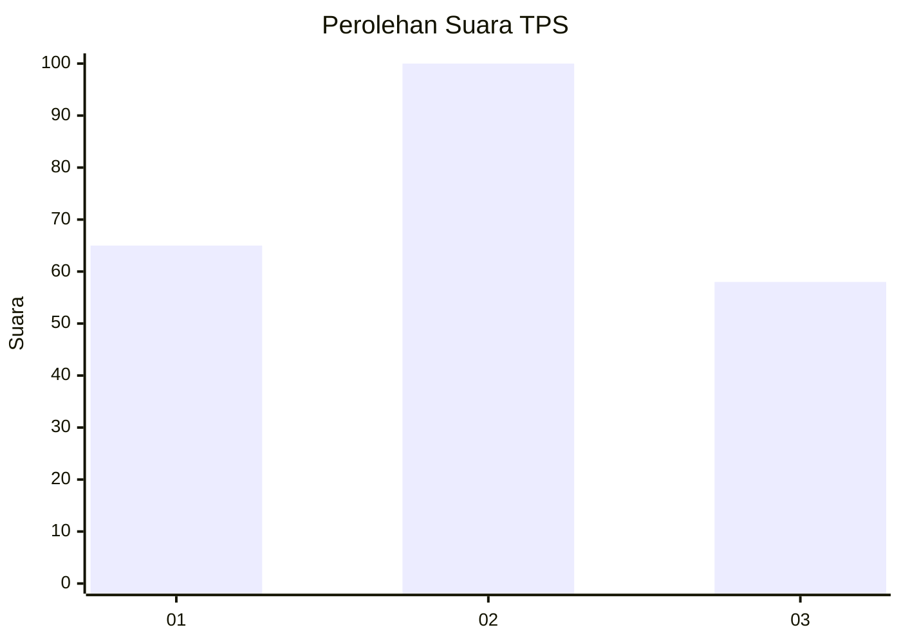
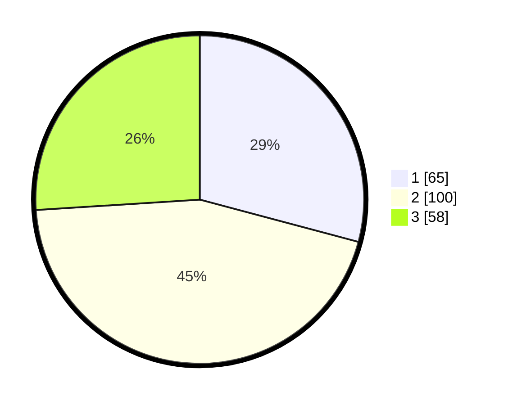

# Hasil

## Grafik

## Tabel

| No. | Nama Paslon    | Suara | Suara (raw) | Persentase |
|:--- |:-------------- | -----:| -----------:| ----------:|
| 1   | ANIES MUHAIMIN | 65    | [65][p-1]   | 29,15      |
| 2   | PRABOWO GIBRAN | 100   | [100][p-2]  | 44,84      |
| 3   | GANJAR MAHFUD  | 58    | [58][p-3]   | 26,01      |

[p-1]: https://github.com/gigit-pemilu/pemilu-2024-34-di-yogyakarta/blob/main/pilpres/hitung-suara/sub/34-di-yogyakarta/sub/01-kulon-progo/sub/07-pengasih/sub/2005-pengasih/sub/001-tps/sub/paslon-1.txt
[p-2]: https://github.com/gigit-pemilu/pemilu-2024-34-di-yogyakarta/blob/main/pilpres/hitung-suara/sub/34-di-yogyakarta/sub/01-kulon-progo/sub/07-pengasih/sub/2005-pengasih/sub/001-tps/sub/paslon-2.txt
[p-3]: https://github.com/gigit-pemilu/pemilu-2024-34-di-yogyakarta/blob/main/pilpres/hitung-suara/sub/34-di-yogyakarta/sub/01-kulon-progo/sub/07-pengasih/sub/2005-pengasih/sub/001-tps/sub/paslon-3.txt

## Foto C Plano

https://sirekap-obj-formc.kpu.go.id/c4e5/pemilu/ppwp/34/01/07/20/05/3401072005001-20240214-232503--720d3808-8e59-48c5-9859-604cbb892663.jpg

https://sirekap-obj-formc.kpu.go.id/c4e5/pemilu/ppwp/34/01/07/20/05/3401072005001-20240214-232616--84f3920e-3193-4a08-bf26-a2343c05ed5f.jpg

https://sirekap-obj-formc.kpu.go.id/c4e5/pemilu/ppwp/34/01/07/20/05/3401072005001-20240215-020618--a7073462-f549-4cb7-83bb-8c623f3eedf9.jpg

## Metadata

| Key        | Value               |
| ---------- | ------------------- |
| Time Stamp | 2024-02-15 15:00:29 |

