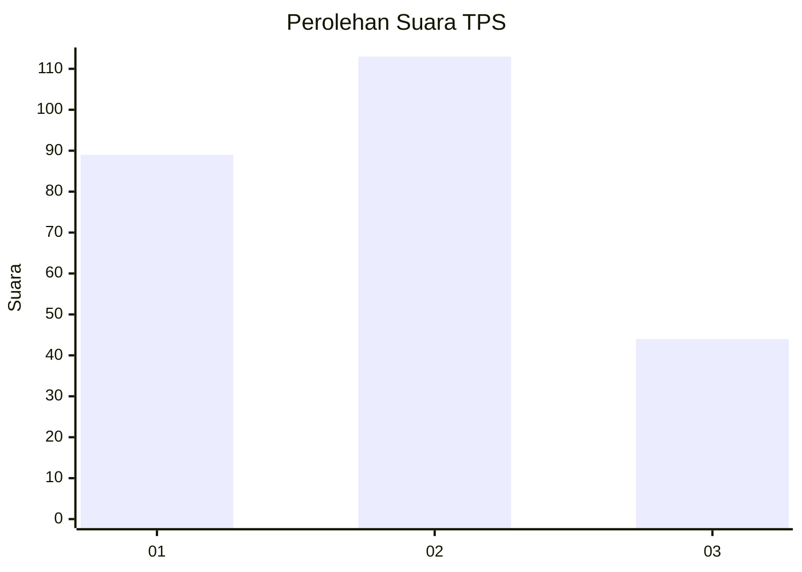
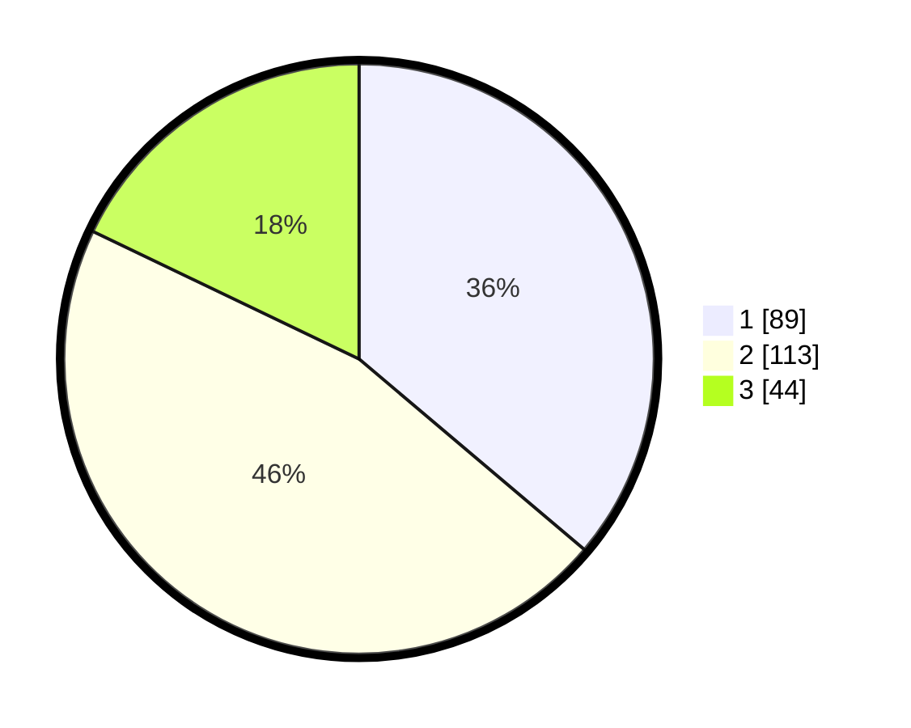

# Hasil

## Grafik

## Tabel

| No. | Nama Paslon    | Suara | Suara (raw) | Persentase |
|:--- |:-------------- | -----:| -----------:| ----------:|
| 1   | ANIES MUHAIMIN | 89    | [89][p-1]   | 36,18      |
| 2   | PRABOWO GIBRAN | 113   | [113][p-2]  | 45,93      |
| 3   | GANJAR MAHFUD  | 44    | [44][p-3]   | 17,89      |

[p-1]: https://github.com/gigit-pemilu/pemilu-2024-34-di-yogyakarta/blob/main/pilpres/hitung-suara/sub/34-di-yogyakarta/sub/01-kulon-progo/sub/07-pengasih/sub/2005-pengasih/sub/002-tps/sub/paslon-1.txt
[p-2]: https://github.com/gigit-pemilu/pemilu-2024-34-di-yogyakarta/blob/main/pilpres/hitung-suara/sub/34-di-yogyakarta/sub/01-kulon-progo/sub/07-pengasih/sub/2005-pengasih/sub/002-tps/sub/paslon-2.txt
[p-3]: https://github.com/gigit-pemilu/pemilu-2024-34-di-yogyakarta/blob/main/pilpres/hitung-suara/sub/34-di-yogyakarta/sub/01-kulon-progo/sub/07-pengasih/sub/2005-pengasih/sub/002-tps/sub/paslon-3.txt

## Foto C Plano

https://sirekap-obj-formc.kpu.go.id/5159/pemilu/ppwp/34/01/07/20/05/3401072005002-20240214-230645--7ea0bc69-6ba5-4c14-bb40-890765e8b046.jpg

https://sirekap-obj-formc.kpu.go.id/5159/pemilu/ppwp/34/01/07/20/05/3401072005002-20240214-230721--bdc92f70-58cb-41c8-878c-c518b0177f5c.jpg

https://sirekap-obj-formc.kpu.go.id/5159/pemilu/ppwp/34/01/07/20/05/3401072005002-20240214-230912--a977e2fb-a075-4a9b-b846-4d3229b2cac4.jpg

## Metadata

| Key        | Value               |
| ---------- | ------------------- |
| Time Stamp | 2024-02-15 21:30:27 |

## DATA PEMILIH TETAP

Jumlah pemilih dalam DPT: **261**.
 * L: **125**.
 * P: **136**.

## DATA PENGGUNA HAK PILIH

Jumlah pengguna hak pilih dalam DPT: **230**.
 * L: **105**.
 * P: **125**.

Jumlah pengguna hak pilih dalam DPTb: **13**.
 * L: **12**.
 * P: **1**.

Jumlah pengguna hak pilih dalam DPK: **9**.
 * L: **4**.
 * P: **5**.

Jumlah pengguna hak pilih: **252**.
 * L: **119**.
 * P: **131**.

## JUMLAH SUARA SAH DAN TIDAK SAH

JUMLAH SELURUH SUARA SAH: **246**.

JUMLAH SUARA TIDAK SAH: **6**.

JUMLAH SELURUH SUARA SAH DAN SUARA TIDAK SAH: **252**.

