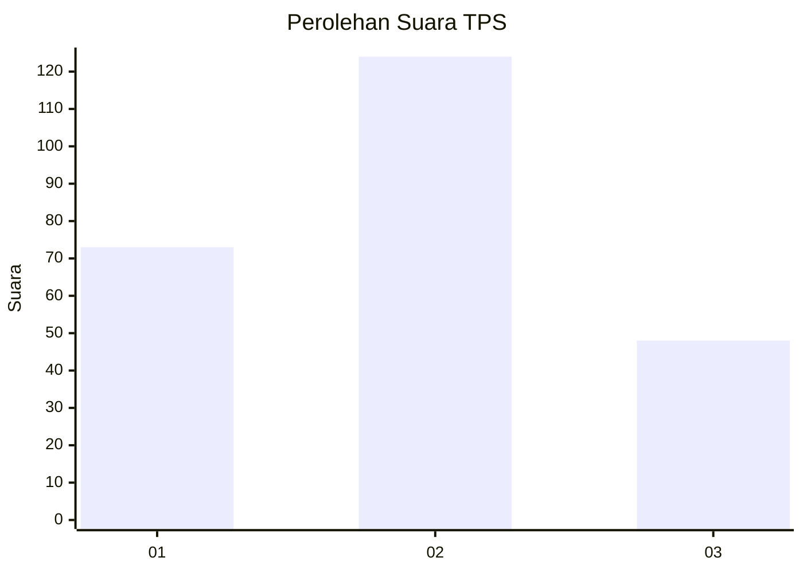
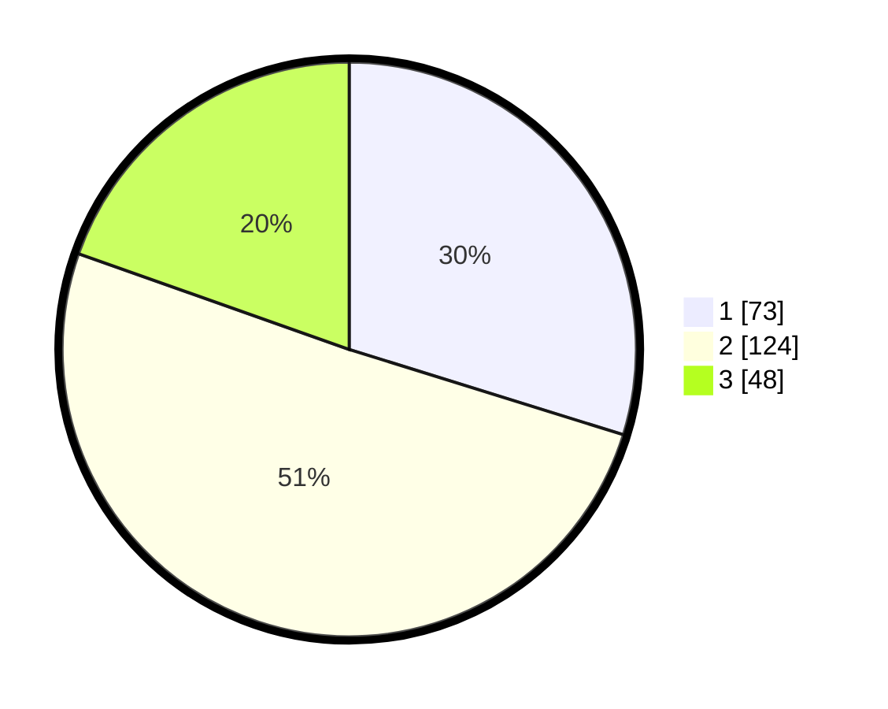

# Hasil

## Grafik

## Tabel

| No. | Nama Paslon    | Suara | Suara (raw) | Persentase |
|:--- |:-------------- | -----:| -----------:| ----------:|
| 1   | ANIES MUHAIMIN | 73    | [73][p-1]   | 29,80      |
| 2   | PRABOWO GIBRAN | 124   | [124][p-2]  | 50,61      |
| 3   | GANJAR MAHFUD  | 48    | [48][p-3]   | 19,59      |

[p-1]: https://github.com/gigit-pemilu/pemilu-2024-34-di-yogyakarta/blob/main/pilpres/hitung-suara/sub/34-di-yogyakarta/sub/01-kulon-progo/sub/07-pengasih/sub/2005-pengasih/sub/003-tps/sub/paslon-1.txt
[p-2]: https://github.com/gigit-pemilu/pemilu-2024-34-di-yogyakarta/blob/main/pilpres/hitung-suara/sub/34-di-yogyakarta/sub/01-kulon-progo/sub/07-pengasih/sub/2005-pengasih/sub/003-tps/sub/paslon-2.txt
[p-3]: https://github.com/gigit-pemilu/pemilu-2024-34-di-yogyakarta/blob/main/pilpres/hitung-suara/sub/34-di-yogyakarta/sub/01-kulon-progo/sub/07-pengasih/sub/2005-pengasih/sub/003-tps/sub/paslon-3.txt

## Foto C Plano

https://sirekap-obj-formc.kpu.go.id/0e24/pemilu/ppwp/34/01/07/20/05/3401072005003-20240214-155917--65a9c22b-7010-47c4-b5e6-2692d68e4bca.jpg

https://sirekap-obj-formc.kpu.go.id/0e24/pemilu/ppwp/34/01/07/20/05/3401072005003-20240214-160124--e5628e79-72dc-4e23-8ba6-d140bdb7b011.jpg

https://sirekap-obj-formc.kpu.go.id/0e24/pemilu/ppwp/34/01/07/20/05/3401072005003-20240216-104056--2d14830b-c258-4359-b75c-6026eac5f0d4.jpg

## Metadata

| Key        | Value               |
| ---------- | ------------------- |
| Time Stamp | 2024-02-16 11:00:29 |

## DATA PEMILIH TETAP

Jumlah pemilih dalam DPT: **273**.
 * L: **130**.
 * P: **143**.

## DATA PENGGUNA HAK PILIH

Jumlah pengguna hak pilih dalam DPT: **234**.
 * L: **107**.
 * P: **127**.

Jumlah pengguna hak pilih dalam DPTb: **16**.
 * L: **7**.
 * P: **9**.

Jumlah pengguna hak pilih dalam DPK: **0**.
 * L: **0**.
 * P: **0**.

Jumlah pengguna hak pilih: **250**.
 * L: **114**.
 * P: **136**.

## JUMLAH SUARA SAH DAN TIDAK SAH

JUMLAH SELURUH SUARA SAH: **245**.

JUMLAH SUARA TIDAK SAH: **5**.

JUMLAH SELURUH SUARA SAH DAN SUARA TIDAK SAH: **250**.

