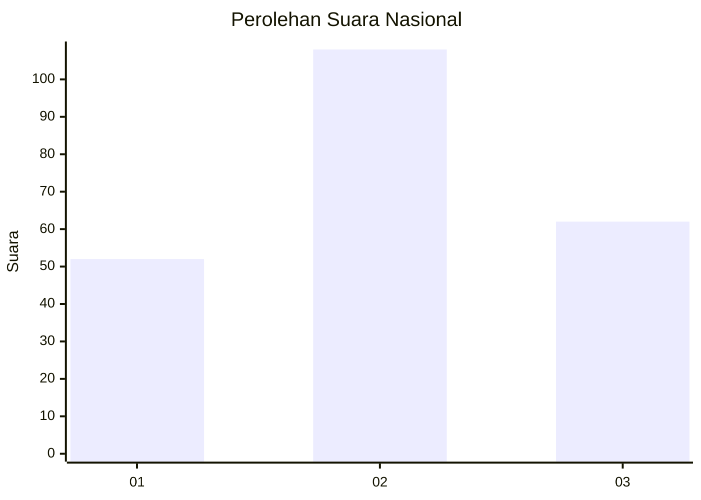
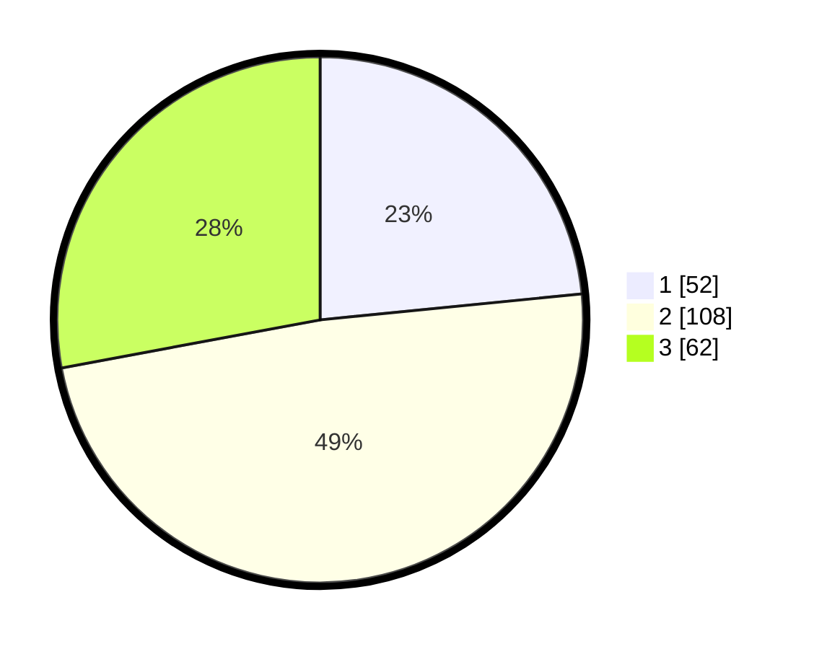

# Hasil

## Grafik

## Tabel

| No. | Nama Paslon    | Suara | Suara (raw) | Persentase |
|:--- |:-------------- | -----:| -----------:| ----------:|
| 1   | ANIES MUHAIMIN | 52    | [52][p-1]   | 23,42      |
| 2   | PRABOWO GIBRAN | 108   | [108][p-2]  | 48,65      |
| 3   | GANJAR MAHFUD  | 62    | [62][p-3]   | 27,93      |

[p-1]: https://github.com/gigit-pemilu/pemilu-2024/blob/main/pilpres/hitung-suara/sub/34-di-yogyakarta/sub/01-kulon-progo/sub/07-pengasih/sub/2005-pengasih/sub/005-tps/sub/paslon-1.txt
[p-2]: https://github.com/gigit-pemilu/pemilu-2024/blob/main/pilpres/hitung-suara/sub/34-di-yogyakarta/sub/01-kulon-progo/sub/07-pengasih/sub/2005-pengasih/sub/005-tps/sub/paslon-2.txt
[p-3]: https://github.com/gigit-pemilu/pemilu-2024/blob/main/pilpres/hitung-suara/sub/34-di-yogyakarta/sub/01-kulon-progo/sub/07-pengasih/sub/2005-pengasih/sub/005-tps/sub/paslon-3.txt

## Foto C Plano

https://sirekap-obj-formc.kpu.go.id/bd2b/pemilu/ppwp/34/01/07/20/05/3401072005005-20240214-205824--fe8b9137-fe01-41a2-a35f-59557dc46eaf.jpg

https://sirekap-obj-formc.kpu.go.id/bd2b/pemilu/ppwp/34/01/07/20/05/3401072005005-20240215-022725--9707d3ca-ef66-4eca-8f05-c2261f99fc2d.jpg

https://sirekap-obj-formc.kpu.go.id/bd2b/pemilu/ppwp/34/01/07/20/05/3401072005005-20240215-022619--89332fc3-731e-43f3-b43e-c8c2f4f3465d.jpg

## Metadata

| Key        | Value               |
| ---------- | ------------------- |
| Time Stamp | 2024-02-15 09:00:24 |

## DATA PEMILIH TETAP

Jumlah pemilih dalam DPT: **247**.
 * L: **115**.
 * P: **132**.

## DATA PENGGUNA HAK PILIH

Jumlah pengguna hak pilih dalam DPT: **222**.
 * L: **98**.
 * P: **124**.

Jumlah pengguna hak pilih dalam DPTb: **3**.
 * L: **0**.
 * P: **3**.

Jumlah pengguna hak pilih dalam DPK: **2**.
 * L: **1**.
 * P: **1**.

Jumlah pengguna hak pilih: **227**.
 * L: **99**.
 * P: **128**.

## JUMLAH SUARA SAH DAN TIDAK SAH

JUMLAH SELURUH SUARA SAH: **222**.

JUMLAH SUARA TIDAK SAH: **5**.

JUMLAH SELURUH SUARA SAH DAN SUARA TIDAK SAH: **227**.

