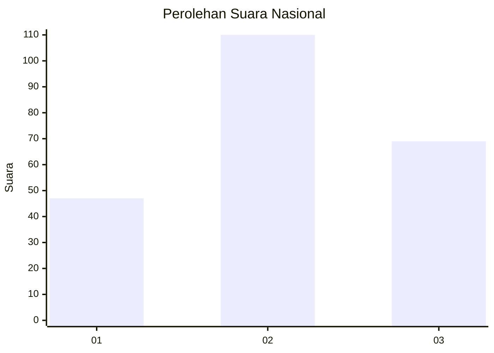
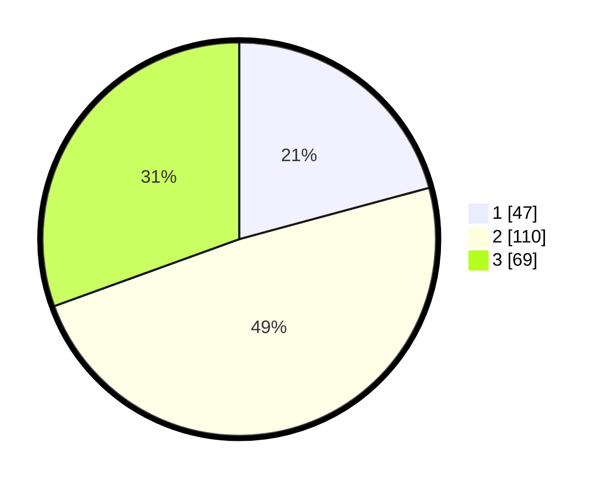

# Hasil

## Grafik

## Tabel

| No. | Nama Paslon    | Suara | Suara (raw) | Persentase |
|:--- |:-------------- | -----:| -----------:| ----------:|
| 1   | ANIES MUHAIMIN | 47    | [47][p-1]   | 20,80      |
| 2   | PRABOWO GIBRAN | 110   | [110][p-2]  | 48,67      |
| 3   | GANJAR MAHFUD  | 69    | [69][p-3]   | 30,53      |

[p-1]: https://github.com/gigit-pemilu/pemilu-2024/blob/main/pilpres/hitung-suara/sub/34-di-yogyakarta/sub/01-kulon-progo/sub/07-pengasih/sub/2005-pengasih/sub/008-tps/sub/paslon-1.txt
[p-2]: https://github.com/gigit-pemilu/pemilu-2024/blob/main/pilpres/hitung-suara/sub/34-di-yogyakarta/sub/01-kulon-progo/sub/07-pengasih/sub/2005-pengasih/sub/008-tps/sub/paslon-2.txt
[p-3]: https://github.com/gigit-pemilu/pemilu-2024/blob/main/pilpres/hitung-suara/sub/34-di-yogyakarta/sub/01-kulon-progo/sub/07-pengasih/sub/2005-pengasih/sub/008-tps/sub/paslon-3.txt

## Foto C Plano

https://sirekap-obj-formc.kpu.go.id/62ee/pemilu/ppwp/34/01/07/20/05/3401072005008-20240214-202320--dddae088-b685-44fe-8a68-c7e4f40e8aa0.jpg

https://sirekap-obj-formc.kpu.go.id/62ee/pemilu/ppwp/34/01/07/20/05/3401072005008-20240214-202420--5616a11c-9164-444d-a03c-552ca1e7ed07.jpg

https://sirekap-obj-formc.kpu.go.id/62ee/pemilu/ppwp/34/01/07/20/05/3401072005008-20240214-202957--f9ff5ef8-3e26-4dbb-bcf9-5314ce8e4034.jpg

## Metadata

| Key        | Value               |
| ---------- | ------------------- |
| Time Stamp | 2024-02-15 09:00:24 |

## DATA PEMILIH TETAP

Jumlah pemilih dalam DPT: **250**.
 * L: **119**.
 * P: **131**.

## DATA PENGGUNA HAK PILIH

Jumlah pengguna hak pilih dalam DPT: **218**.
 * L: **104**.
 * P: **114**.

Jumlah pengguna hak pilih dalam DPTb: **11**.
 * L: **2**.
 * P: **9**.

Jumlah pengguna hak pilih dalam DPK: **5**.
 * L: **3**.
 * P: **2**.

Jumlah pengguna hak pilih: **234**.
 * L: **109**.
 * P: **125**.

## JUMLAH SUARA SAH DAN TIDAK SAH

JUMLAH SELURUH SUARA SAH: **226**.

JUMLAH SUARA TIDAK SAH: **8**.

JUMLAH SELURUH SUARA SAH DAN SUARA TIDAK SAH: **234**.

