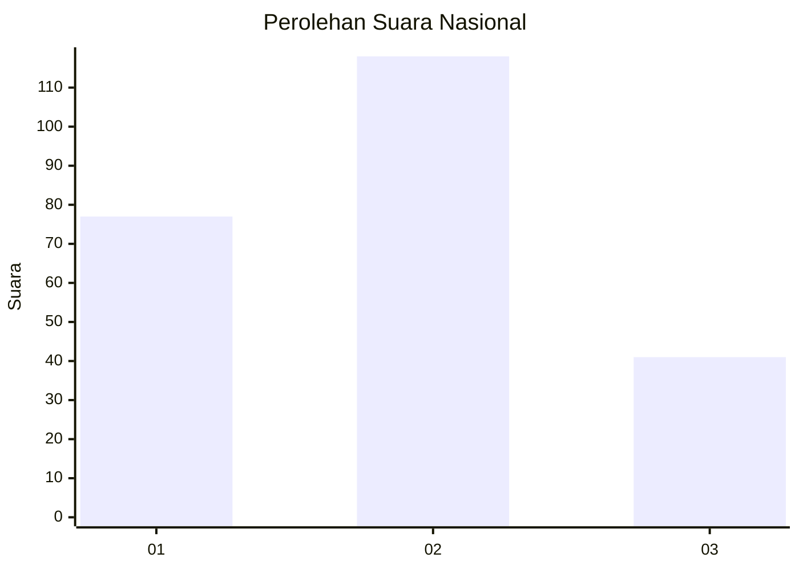
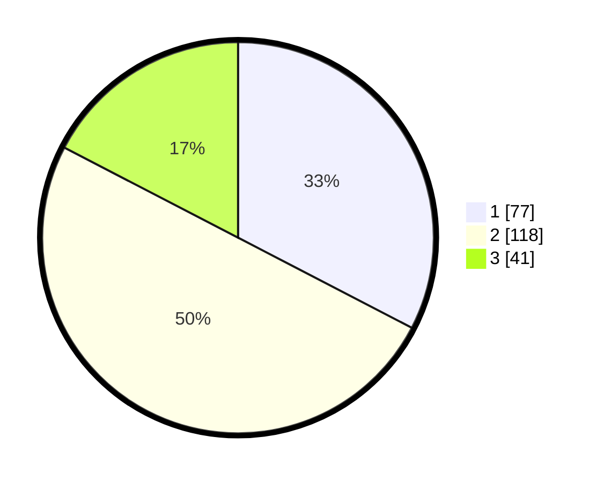

# Hasil

## Grafik

## Tabel

| No. | Nama Paslon    | Suara | Suara (raw) | Persentase |
|:--- |:-------------- | -----:| -----------:| ----------:|
| 1   | ANIES MUHAIMIN | 77    | [77][p-1]   | 32,63      |
| 2   | PRABOWO GIBRAN | 118   | [118][p-2]  | 50,00      |
| 3   | GANJAR MAHFUD  | 41    | [41][p-3]   | 17,37      |

[p-1]: https://github.com/gigit-pemilu/pemilu-2024/blob/main/pilpres/hitung-suara/sub/34-di-yogyakarta/sub/01-kulon-progo/sub/07-pengasih/sub/2005-pengasih/sub/010-tps/sub/paslon-1.txt
[p-2]: https://github.com/gigit-pemilu/pemilu-2024/blob/main/pilpres/hitung-suara/sub/34-di-yogyakarta/sub/01-kulon-progo/sub/07-pengasih/sub/2005-pengasih/sub/010-tps/sub/paslon-2.txt
[p-3]: https://github.com/gigit-pemilu/pemilu-2024/blob/main/pilpres/hitung-suara/sub/34-di-yogyakarta/sub/01-kulon-progo/sub/07-pengasih/sub/2005-pengasih/sub/010-tps/sub/paslon-3.txt

## Foto C Plano

https://sirekap-obj-formc.kpu.go.id/c7f0/pemilu/ppwp/34/01/07/20/05/3401072005010-20240214-231516--df7f29fe-0cec-4329-9576-699b69d761fb.jpg

https://sirekap-obj-formc.kpu.go.id/c7f0/pemilu/ppwp/34/01/07/20/05/3401072005010-20240214-155228--ef52027a-7071-45f6-bbd0-e5b607fb6372.jpg

https://sirekap-obj-formc.kpu.go.id/c7f0/pemilu/ppwp/34/01/07/20/05/3401072005010-20240214-233350--f1b64102-b8ce-4c3f-8826-2b7a862d37ac.jpg

## Metadata

| Key        | Value               |
| ---------- | ------------------- |
| Time Stamp | 2024-02-16 06:00:27 |

## DATA PEMILIH TETAP

Jumlah pemilih dalam DPT: **285**.
 * L: **140**.
 * P: **145**.

## DATA PENGGUNA HAK PILIH

Jumlah pengguna hak pilih dalam DPT: **212**.
 * L: **101**.
 * P: **111**.

Jumlah pengguna hak pilih dalam DPTb: **24**.
 * L: **6**.
 * P: **18**.

Jumlah pengguna hak pilih dalam DPK: **2**.
 * L: **1**.
 * P: **1**.

Jumlah pengguna hak pilih: **0**.
 * L: **0**.
 * P: **0**.

## JUMLAH SUARA SAH DAN TIDAK SAH

JUMLAH SELURUH SUARA SAH: **236**.

JUMLAH SUARA TIDAK SAH: **2**.

JUMLAH SELURUH SUARA SAH DAN SUARA TIDAK SAH: **238**.

