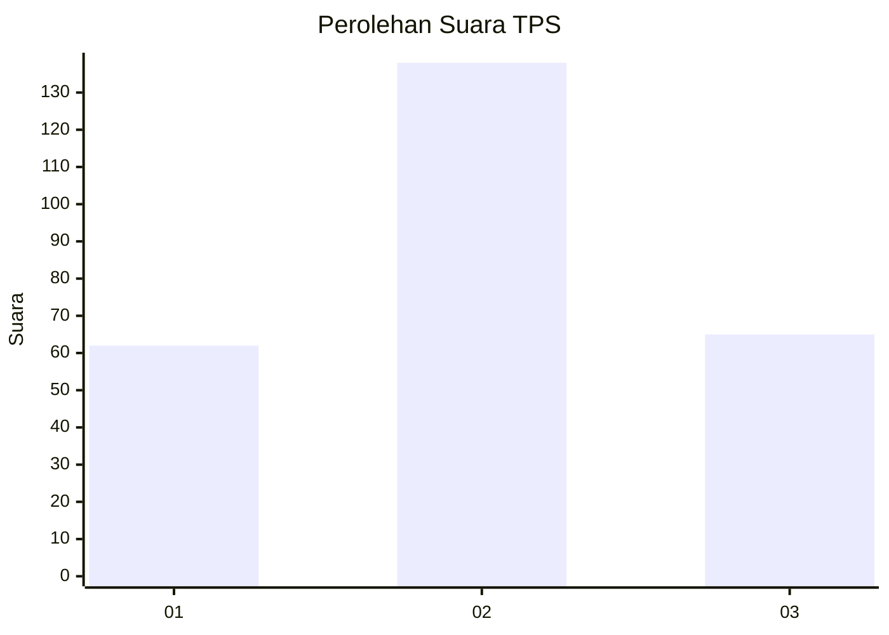
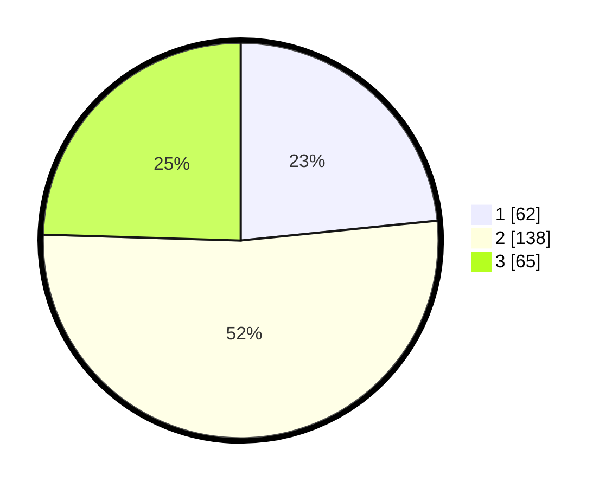

# Hasil

## Grafik

## Tabel

| No. | Nama Paslon    | Suara | Suara (raw) | Persentase |
|:--- |:-------------- | -----:| -----------:| ----------:|
| 1   | ANIES MUHAIMIN | 62    | [62][p-1]   | 23,40      |
| 2   | PRABOWO GIBRAN | 138   | [138][p-2]  | 52,08      |
| 3   | GANJAR MAHFUD  | 65    | [65][p-3]   | 24,53      |

[p-1]: https://github.com/gigit-pemilu/pemilu-2024-34-di-yogyakarta/blob/main/pilpres/hitung-suara/sub/34-di-yogyakarta/sub/01-kulon-progo/sub/07-pengasih/sub/2005-pengasih/sub/011-tps/sub/paslon-1.txt
[p-2]: https://github.com/gigit-pemilu/pemilu-2024-34-di-yogyakarta/blob/main/pilpres/hitung-suara/sub/34-di-yogyakarta/sub/01-kulon-progo/sub/07-pengasih/sub/2005-pengasih/sub/011-tps/sub/paslon-2.txt
[p-3]: https://github.com/gigit-pemilu/pemilu-2024-34-di-yogyakarta/blob/main/pilpres/hitung-suara/sub/34-di-yogyakarta/sub/01-kulon-progo/sub/07-pengasih/sub/2005-pengasih/sub/011-tps/sub/paslon-3.txt

## Foto C Plano

https://sirekap-obj-formc.kpu.go.id/0683/pemilu/ppwp/34/01/07/20/05/3401072005011-20240215-005432--3cc6f27b-605f-4b3f-a034-3ed8633241a6.jpg

https://sirekap-obj-formc.kpu.go.id/0683/pemilu/ppwp/34/01/07/20/05/3401072005011-20240215-005453--810f6795-dba9-403e-8bfc-84b2e7214ceb.jpg

https://sirekap-obj-formc.kpu.go.id/0683/pemilu/ppwp/34/01/07/20/05/3401072005011-20240215-005443--f8327df3-17d5-4b97-9e9c-c315ff1ccb15.jpg

## Metadata

| Key        | Value               |
| ---------- | ------------------- |
| Time Stamp | 2024-02-15 15:00:29 |

## DATA PEMILIH TETAP

Jumlah pemilih dalam DPT: **279**.
 * L: **129**.
 * P: **150**.

## DATA PENGGUNA HAK PILIH

Jumlah pengguna hak pilih dalam DPT: **250**.
 * L: **112**.
 * P: **138**.

Jumlah pengguna hak pilih dalam DPTb: **22**.
 * L: **10**.
 * P: **12**.

Jumlah pengguna hak pilih dalam DPK: **0**.
 * L: **0**.
 * P: **0**.

Jumlah pengguna hak pilih: **272**.
 * L: **122**.
 * P: **150**.

## JUMLAH SUARA SAH DAN TIDAK SAH

JUMLAH SELURUH SUARA SAH: **265**.

JUMLAH SUARA TIDAK SAH: **7**.

JUMLAH SELURUH SUARA SAH DAN SUARA TIDAK SAH: **272**.

