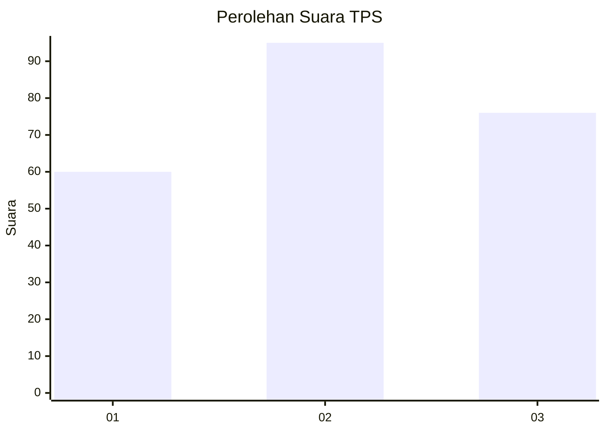
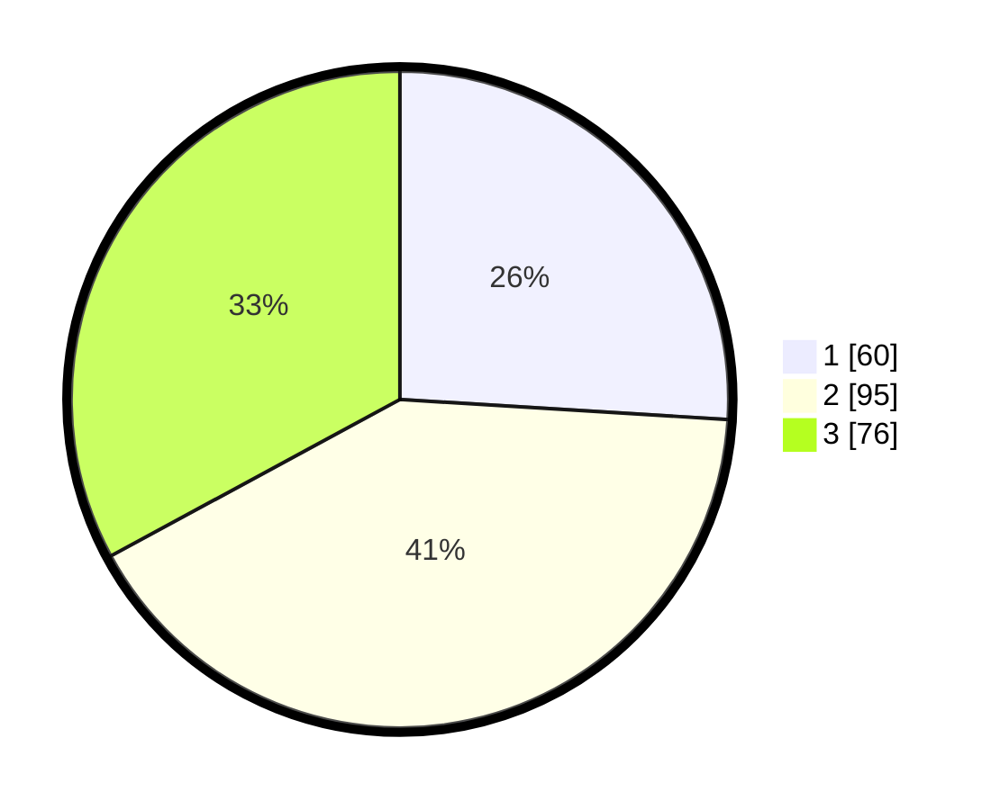

# Hasil

## Grafik

## Tabel

| No. | Nama Paslon    | Suara | Suara (raw) | Persentase |
|:--- |:-------------- | -----:| -----------:| ----------:|
| 1   | ANIES MUHAIMIN | 60    | [60][p-1]   | 25,97      |
| 2   | PRABOWO GIBRAN | 95    | [95][p-2]   | 41,13      |
| 3   | GANJAR MAHFUD  | 76    | [76][p-3]   | 32,90      |

[p-1]: https://github.com/gigit-pemilu/pemilu-2024-34-di-yogyakarta/blob/main/pilpres/hitung-suara/sub/34-di-yogyakarta/sub/01-kulon-progo/sub/07-pengasih/sub/2005-pengasih/sub/015-tps/sub/paslon-1.txt
[p-2]: https://github.com/gigit-pemilu/pemilu-2024-34-di-yogyakarta/blob/main/pilpres/hitung-suara/sub/34-di-yogyakarta/sub/01-kulon-progo/sub/07-pengasih/sub/2005-pengasih/sub/015-tps/sub/paslon-2.txt
[p-3]: https://github.com/gigit-pemilu/pemilu-2024-34-di-yogyakarta/blob/main/pilpres/hitung-suara/sub/34-di-yogyakarta/sub/01-kulon-progo/sub/07-pengasih/sub/2005-pengasih/sub/015-tps/sub/paslon-3.txt

## Foto C Plano

https://sirekap-obj-formc.kpu.go.id/7b34/pemilu/ppwp/34/01/07/20/05/3401072005015-20240215-022042--64b6d935-5934-4e8a-af5b-3305530b5cd9.jpg

https://sirekap-obj-formc.kpu.go.id/7b34/pemilu/ppwp/34/01/07/20/05/3401072005015-20240215-022238--715987dd-e841-4681-95ad-92997af20c73.jpg

https://sirekap-obj-formc.kpu.go.id/7b34/pemilu/ppwp/34/01/07/20/05/3401072005015-20240215-022416--3de45d22-7835-4ba4-a15f-845171a515bc.jpg

## Metadata

| Key        | Value               |
| ---------- | ------------------- |
| Time Stamp | 2024-02-16 06:00:27 |

## DATA PEMILIH TETAP

Jumlah pemilih dalam DPT: **247**.
 * L: **120**.
 * P: **127**.

## DATA PENGGUNA HAK PILIH

Jumlah pengguna hak pilih dalam DPT: **222**.
 * L: **105**.
 * P: **117**.

Jumlah pengguna hak pilih dalam DPTb: **13**.
 * L: **3**.
 * P: **10**.

Jumlah pengguna hak pilih dalam DPK: **0**.
 * L: **0**.
 * P: **0**.

Jumlah pengguna hak pilih: **235**.
 * L: **108**.
 * P: **127**.

## JUMLAH SUARA SAH DAN TIDAK SAH

JUMLAH SELURUH SUARA SAH: **231**.

JUMLAH SUARA TIDAK SAH: **4**.

JUMLAH SELURUH SUARA SAH DAN SUARA TIDAK SAH: **235**.

