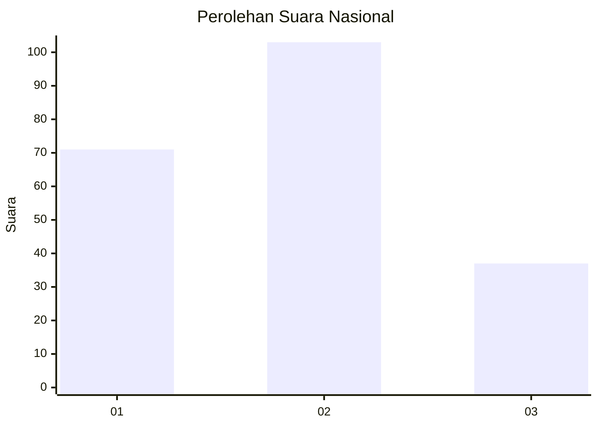
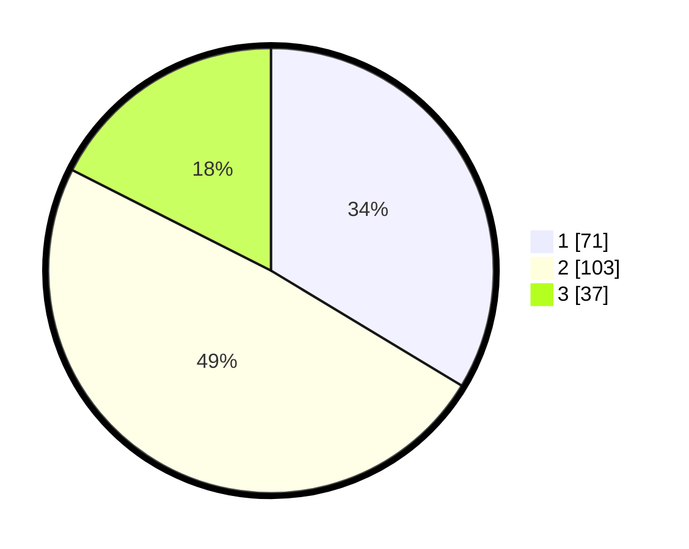

# Hasil

## Grafik

## Tabel

| No. | Nama Paslon    | Suara | Suara (raw) | Persentase |
|:--- |:-------------- | -----:| -----------:| ----------:|
| 1   | ANIES MUHAIMIN | 71    | [71][p-1]   | 33,65      |
| 2   | PRABOWO GIBRAN | 103   | [103][p-2]  | 48,82      |
| 3   | GANJAR MAHFUD  | 37    | [37][p-3]   | 17,54      |

[p-1]: https://github.com/gigit-pemilu/pemilu-2024/blob/main/pilpres/hitung-suara/sub/34-di-yogyakarta/sub/01-kulon-progo/sub/07-pengasih/sub/2005-pengasih/sub/028-tps/sub/paslon-1.txt
[p-2]: https://github.com/gigit-pemilu/pemilu-2024/blob/main/pilpres/hitung-suara/sub/34-di-yogyakarta/sub/01-kulon-progo/sub/07-pengasih/sub/2005-pengasih/sub/028-tps/sub/paslon-2.txt
[p-3]: https://github.com/gigit-pemilu/pemilu-2024/blob/main/pilpres/hitung-suara/sub/34-di-yogyakarta/sub/01-kulon-progo/sub/07-pengasih/sub/2005-pengasih/sub/028-tps/sub/paslon-3.txt

## Foto C Plano

https://sirekap-obj-formc.kpu.go.id/1568/pemilu/ppwp/34/01/07/20/05/3401072005028-20240216-123341--d0f61240-9272-4880-9f90-7d1da6e18b7b.jpg

https://sirekap-obj-formc.kpu.go.id/1568/pemilu/ppwp/34/01/07/20/05/3401072005028-20240216-123344--148978c7-d7ed-4771-939e-96341eb0c4cf.jpg

https://sirekap-obj-formc.kpu.go.id/1568/pemilu/ppwp/34/01/07/20/05/3401072005028-20240216-123342--a12042e8-31c9-42bd-bdad-7cceceabc031.jpg

## Metadata

| Key        | Value               |
| ---------- | ------------------- |
| Time Stamp | 2024-02-22 02:00:00 |

## DATA PEMILIH TETAP

Jumlah pemilih dalam DPT: **244**.
 * L: **120**.
 * P: **124**.

## DATA PENGGUNA HAK PILIH

Jumlah pengguna hak pilih dalam DPT: **205**.
 * L: **99**.
 * P: **106**.

Jumlah pengguna hak pilih dalam DPTb: **9**.
 * L: **2**.
 * P: **7**.

Jumlah pengguna hak pilih dalam DPK: **3**.
 * L: **1**.
 * P: **2**.

Jumlah pengguna hak pilih: **217**.
 * L: **102**.
 * P: **115**.

## JUMLAH SUARA SAH DAN TIDAK SAH

JUMLAH SELURUH SUARA SAH: **211**.

JUMLAH SUARA TIDAK SAH: **6**.

JUMLAH SELURUH SUARA SAH DAN SUARA TIDAK SAH: **217**.

