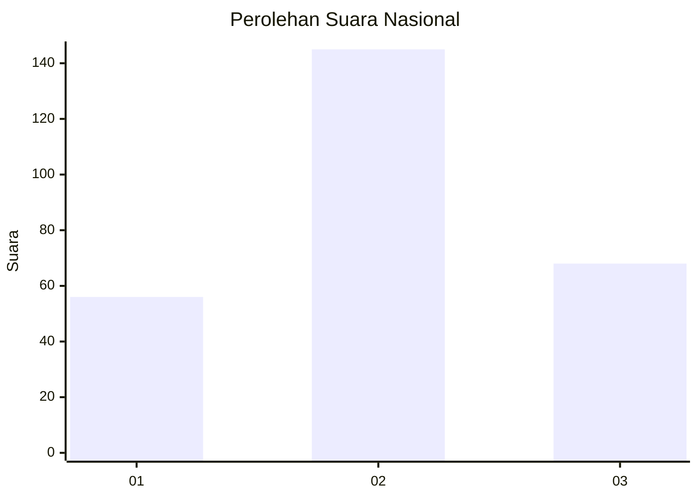
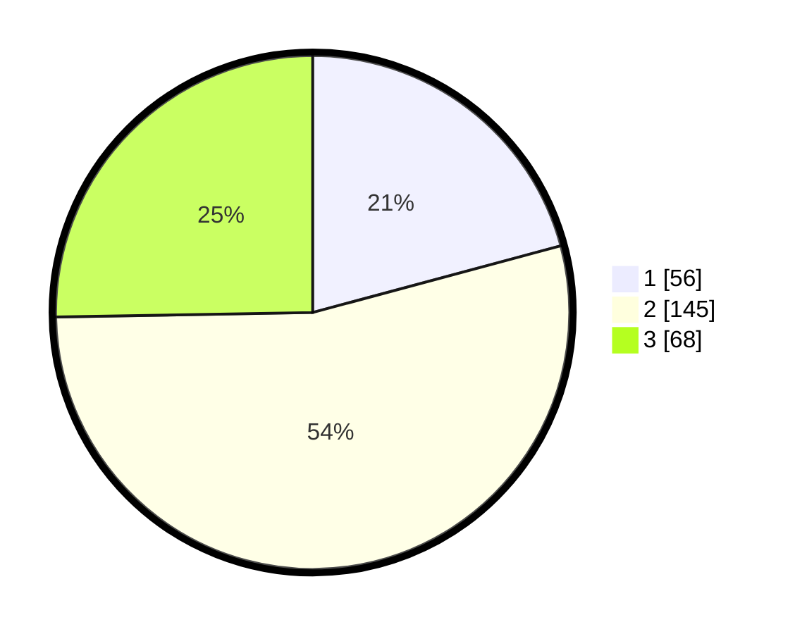

# Hasil

## Grafik

## Tabel

| No. | Nama Paslon    | Suara | Suara (raw) | Persentase |
|:--- |:-------------- | -----:| -----------:| ----------:|
| 1   | ANIES MUHAIMIN | 56    | [56][p-1]   | 20,82      |
| 2   | PRABOWO GIBRAN | 145   | [145][p-2]  | 53,90      |
| 3   | GANJAR MAHFUD  | 68    | [68][p-3]   | 25,28      |

[p-1]: https://github.com/gigit-pemilu/pemilu-2024/blob/main/pilpres/hitung-suara/sub/34-di-yogyakarta/sub/01-kulon-progo/sub/07-pengasih/sub/2006-sendangsari/sub/004-tps/sub/paslon-1.txt
[p-2]: https://github.com/gigit-pemilu/pemilu-2024/blob/main/pilpres/hitung-suara/sub/34-di-yogyakarta/sub/01-kulon-progo/sub/07-pengasih/sub/2006-sendangsari/sub/004-tps/sub/paslon-2.txt
[p-3]: https://github.com/gigit-pemilu/pemilu-2024/blob/main/pilpres/hitung-suara/sub/34-di-yogyakarta/sub/01-kulon-progo/sub/07-pengasih/sub/2006-sendangsari/sub/004-tps/sub/paslon-3.txt

## Foto C Plano

https://sirekap-obj-formc.kpu.go.id/2c9f/pemilu/ppwp/34/01/07/20/06/3401072006004-20240216-040423--304b0d44-ff1f-4658-b5bf-34aa84b05347.jpg

https://sirekap-obj-formc.kpu.go.id/2c9f/pemilu/ppwp/34/01/07/20/06/3401072006004-20240216-040425--60f07bd8-f8cc-4b7f-bf85-e994ce046108.jpg

https://sirekap-obj-formc.kpu.go.id/2c9f/pemilu/ppwp/34/01/07/20/06/3401072006004-20240216-040424--237bbc73-d466-4d43-a69b-45bdf32ecf50.jpg

## Metadata

| Key        | Value               |
| ---------- | ------------------- |
| Time Stamp | 2024-02-21 16:00:00 |

## DATA PEMILIH TETAP

Jumlah pemilih dalam DPT: **292**.
 * L: **144**.
 * P: **148**.

## DATA PENGGUNA HAK PILIH

Jumlah pengguna hak pilih dalam DPT: **268**.
 * L: **133**.
 * P: **135**.

Jumlah pengguna hak pilih dalam DPTb: **5**.
 * L: **5**.
 * P: **0**.

Jumlah pengguna hak pilih dalam DPK: **4**.
 * L: **2**.
 * P: **2**.

Jumlah pengguna hak pilih: **277**.
 * L: **140**.
 * P: **137**.

## JUMLAH SUARA SAH DAN TIDAK SAH

JUMLAH SELURUH SUARA SAH: **269**.

JUMLAH SUARA TIDAK SAH: **8**.

JUMLAH SELURUH SUARA SAH DAN SUARA TIDAK SAH: **277**.

