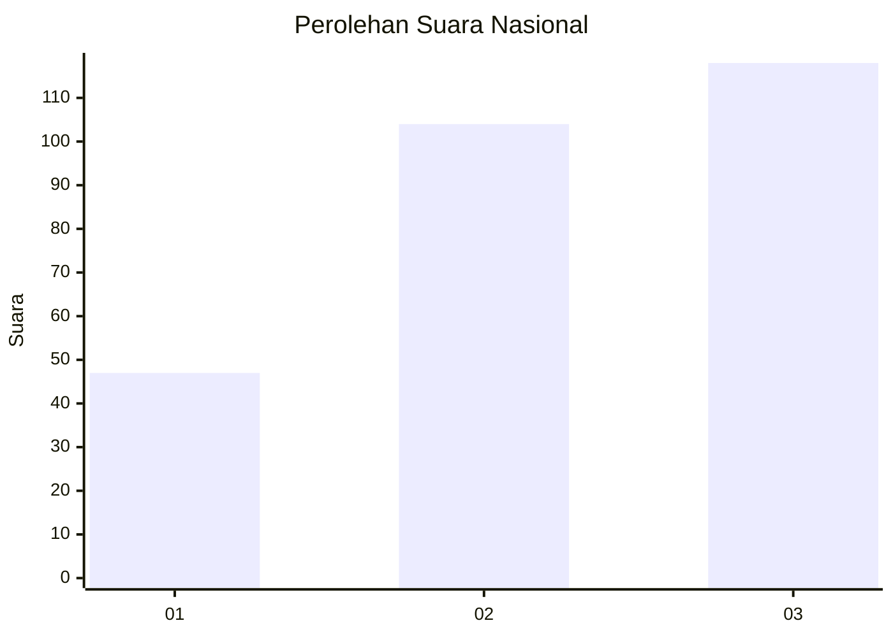
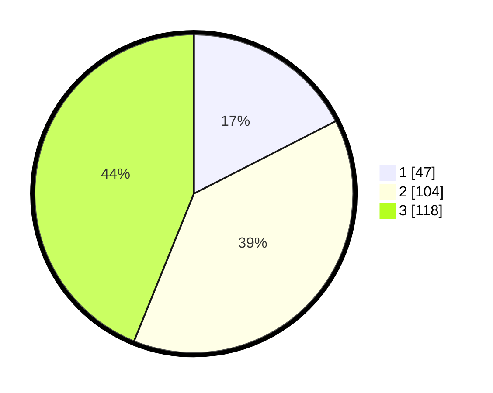

# Hasil

## Grafik

## Tabel

| No. | Nama Paslon    | Suara | Suara (raw) | Persentase |
|:--- |:-------------- | -----:| -----------:| ----------:|
| 1   | ANIES MUHAIMIN | 47    | [47][p-1]   | 17,47      |
| 2   | PRABOWO GIBRAN | 104   | [104][p-2]  | 38,66      |
| 3   | GANJAR MAHFUD  | 118   | [118][p-3]  | 43,87      |

[p-1]: https://github.com/gigit-pemilu/pemilu-2024/blob/main/pilpres/hitung-suara/sub/34-di-yogyakarta/sub/01-kulon-progo/sub/07-pengasih/sub/2006-sendangsari/sub/007-tps/sub/paslon-1.txt
[p-2]: https://github.com/gigit-pemilu/pemilu-2024/blob/main/pilpres/hitung-suara/sub/34-di-yogyakarta/sub/01-kulon-progo/sub/07-pengasih/sub/2006-sendangsari/sub/007-tps/sub/paslon-2.txt
[p-3]: https://github.com/gigit-pemilu/pemilu-2024/blob/main/pilpres/hitung-suara/sub/34-di-yogyakarta/sub/01-kulon-progo/sub/07-pengasih/sub/2006-sendangsari/sub/007-tps/sub/paslon-3.txt

## Foto C Plano

https://sirekap-obj-formc.kpu.go.id/05c3/pemilu/ppwp/34/01/07/20/06/3401072006007-20240215-020334--0f6526ad-182e-405b-b042-eb28c9db7a54.jpg

https://sirekap-obj-formc.kpu.go.id/05c3/pemilu/ppwp/34/01/07/20/06/3401072006007-20240214-210421--7feeb07c-9334-400f-aa2b-2addbed89457.jpg

https://sirekap-obj-formc.kpu.go.id/05c3/pemilu/ppwp/34/01/07/20/06/3401072006007-20240214-210610--eea8dea9-d1c6-40cb-8c48-0b95f6e5055a.jpg

## Metadata

| Key        | Value               |
| ---------- | ------------------- |
| Time Stamp | 2024-02-15 15:00:29 |

## DATA PEMILIH TETAP

Jumlah pemilih dalam DPT: **299**.
 * L: **148**.
 * P: **151**.

## DATA PENGGUNA HAK PILIH

Jumlah pengguna hak pilih dalam DPT: **267**.
 * L: **129**.
 * P: **138**.

Jumlah pengguna hak pilih dalam DPTb: **5**.
 * L: **5**.
 * P: **0**.

Jumlah pengguna hak pilih dalam DPK: **1**.
 * L: **0**.
 * P: **1**.

Jumlah pengguna hak pilih: **273**.
 * L: **134**.
 * P: **139**.

## JUMLAH SUARA SAH DAN TIDAK SAH

JUMLAH SELURUH SUARA SAH: **269**.

JUMLAH SUARA TIDAK SAH: **4**.

JUMLAH SELURUH SUARA SAH DAN SUARA TIDAK SAH: **273**.

