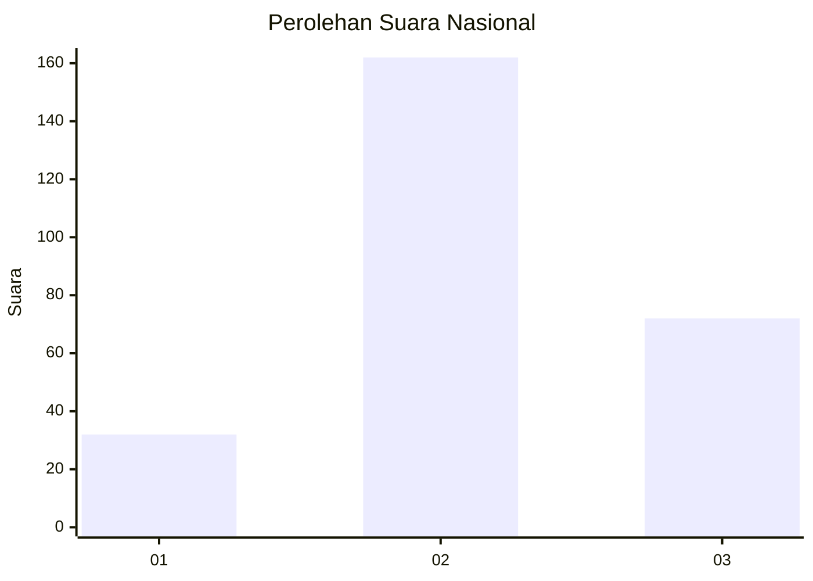
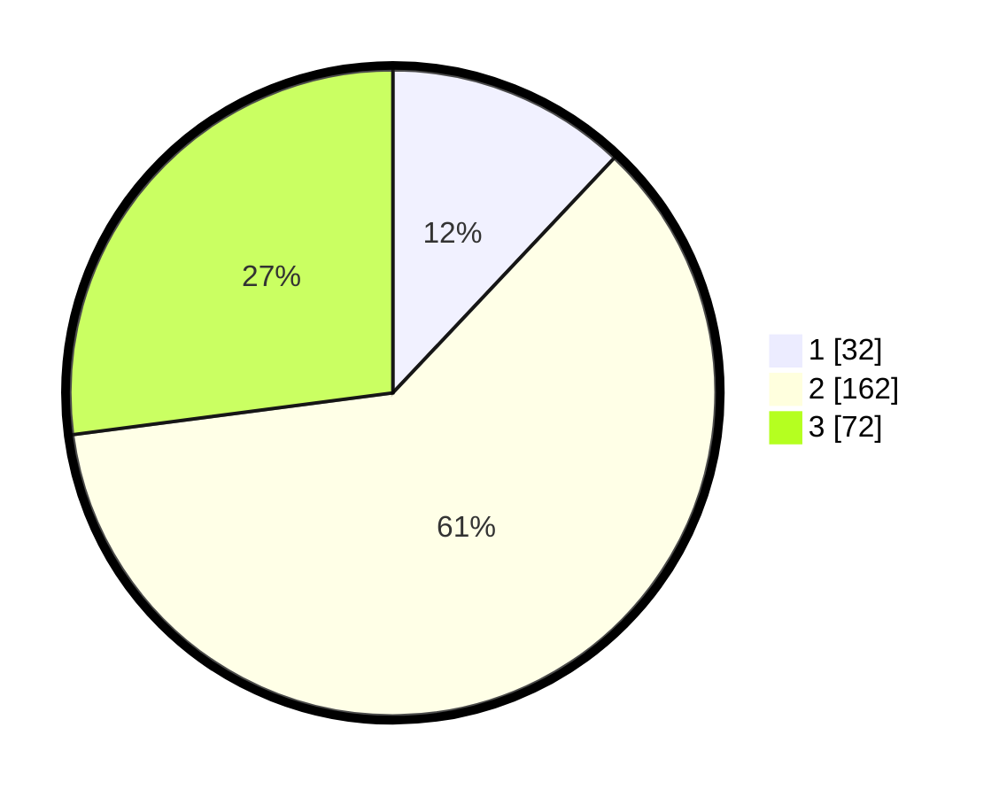

# Hasil

## Grafik

## Tabel

| No. | Nama Paslon    | Suara | Suara (raw) | Persentase |
|:--- |:-------------- | -----:| -----------:| ----------:|
| 1   | ANIES MUHAIMIN | 32    | [32][p-1]   | 12,03      |
| 2   | PRABOWO GIBRAN | 162   | [162][p-2]  | 60,90      |
| 3   | GANJAR MAHFUD  | 72    | [72][p-3]   | 27,07      |

[p-1]: https://github.com/gigit-pemilu/pemilu-2024/blob/main/pilpres/hitung-suara/sub/34-di-yogyakarta/sub/01-kulon-progo/sub/07-pengasih/sub/2006-sendangsari/sub/014-tps/sub/paslon-1.txt
[p-2]: https://github.com/gigit-pemilu/pemilu-2024/blob/main/pilpres/hitung-suara/sub/34-di-yogyakarta/sub/01-kulon-progo/sub/07-pengasih/sub/2006-sendangsari/sub/014-tps/sub/paslon-2.txt
[p-3]: https://github.com/gigit-pemilu/pemilu-2024/blob/main/pilpres/hitung-suara/sub/34-di-yogyakarta/sub/01-kulon-progo/sub/07-pengasih/sub/2006-sendangsari/sub/014-tps/sub/paslon-3.txt

## Foto C Plano

https://sirekap-obj-formc.kpu.go.id/0edb/pemilu/ppwp/34/01/07/20/06/3401072006014-20240216-141710--aa3b4e84-b627-40c1-b7b1-47b188fac10d.jpg

https://sirekap-obj-formc.kpu.go.id/0edb/pemilu/ppwp/34/01/07/20/06/3401072006014-20240215-012528--1e84510f-0829-46ab-aada-3dc2d8d0a699.jpg

https://sirekap-obj-formc.kpu.go.id/0edb/pemilu/ppwp/34/01/07/20/06/3401072006014-20240216-141710--6b21719e-ccd5-4938-b7ad-88a238bc74ca.jpg

## Metadata

| Key        | Value               |
| ---------- | ------------------- |
| Time Stamp | 2024-02-16 14:30:33 |

## DATA PEMILIH TETAP

Jumlah pemilih dalam DPT: **297**.
 * L: **145**.
 * P: **152**.

## DATA PENGGUNA HAK PILIH

Jumlah pengguna hak pilih dalam DPT: **261**.
 * L: **127**.
 * P: **134**.

Jumlah pengguna hak pilih dalam DPTb: **10**.
 * L: **1**.
 * P: **9**.

Jumlah pengguna hak pilih dalam DPK: **1**.
 * L: **1**.
 * P: **0**.

Jumlah pengguna hak pilih: **272**.
 * L: **129**.
 * P: **143**.

## JUMLAH SUARA SAH DAN TIDAK SAH

JUMLAH SELURUH SUARA SAH: **266**.

JUMLAH SUARA TIDAK SAH: **6**.

JUMLAH SELURUH SUARA SAH DAN SUARA TIDAK SAH: **272**.

