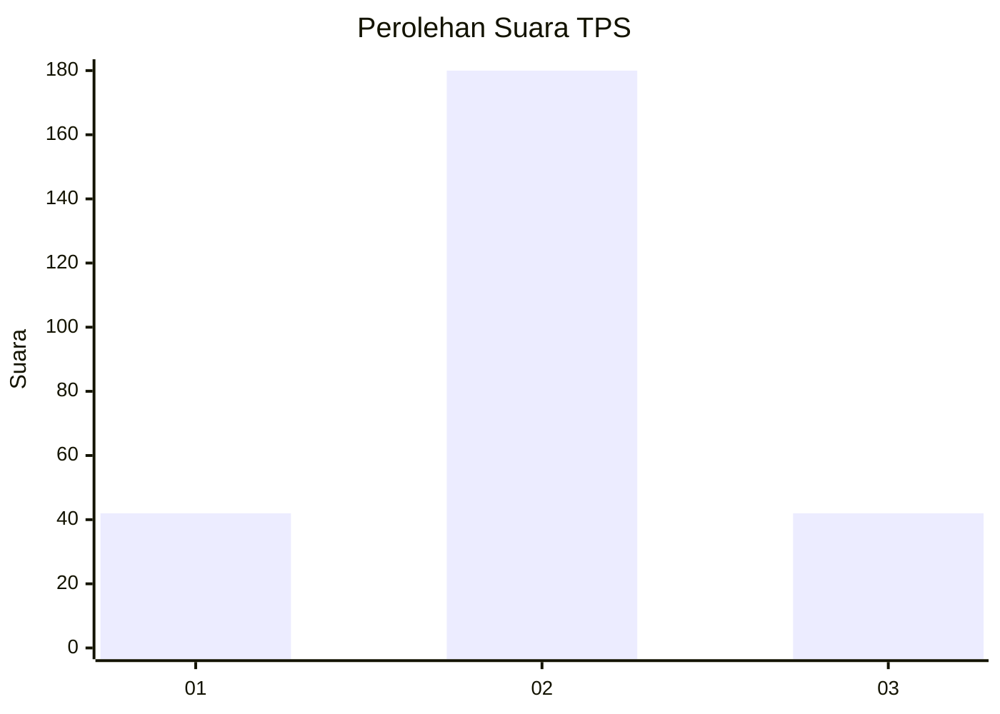
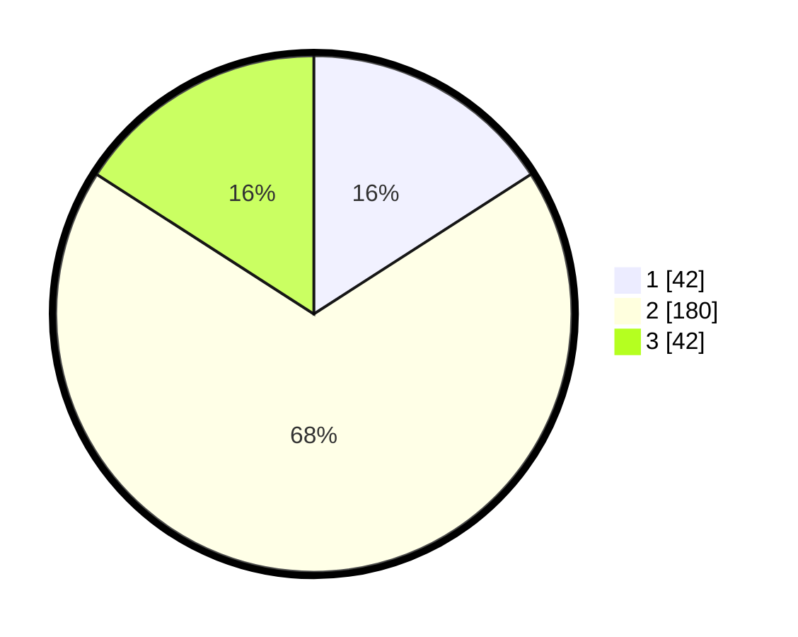

# Hasil

## Grafik

## Tabel

| No. | Nama Paslon    | Suara | Suara (raw) | Persentase |
|:--- |:-------------- | -----:| -----------:| ----------:|
| 1   | ANIES MUHAIMIN | 42    | [42][p-1]   | 15,91      |
| 2   | PRABOWO GIBRAN | 180   | [180][p-2]  | 68,18      |
| 3   | GANJAR MAHFUD  | 42    | [42][p-3]   | 15,91      |

[p-1]: https://github.com/gigit-pemilu/pemilu-2024-34-di-yogyakarta/blob/main/pilpres/hitung-suara/sub/34-di-yogyakarta/sub/01-kulon-progo/sub/07-pengasih/sub/2006-sendangsari/sub/017-tps/sub/paslon-1.txt
[p-2]: https://github.com/gigit-pemilu/pemilu-2024-34-di-yogyakarta/blob/main/pilpres/hitung-suara/sub/34-di-yogyakarta/sub/01-kulon-progo/sub/07-pengasih/sub/2006-sendangsari/sub/017-tps/sub/paslon-2.txt
[p-3]: https://github.com/gigit-pemilu/pemilu-2024-34-di-yogyakarta/blob/main/pilpres/hitung-suara/sub/34-di-yogyakarta/sub/01-kulon-progo/sub/07-pengasih/sub/2006-sendangsari/sub/017-tps/sub/paslon-3.txt

## Foto C Plano

https://sirekap-obj-formc.kpu.go.id/1ef6/pemilu/ppwp/34/01/07/20/06/3401072006017-20240214-191605--7389606b-9500-4332-8d37-bd13b0ec05d1.jpg

https://sirekap-obj-formc.kpu.go.id/1ef6/pemilu/ppwp/34/01/07/20/06/3401072006017-20240214-212720--d316b8e5-15d4-42d6-b4cc-85a722d185ce.jpg

https://sirekap-obj-formc.kpu.go.id/1ef6/pemilu/ppwp/34/01/07/20/06/3401072006017-20240216-120802--86adc3d1-a9cc-435a-b8dc-ce7f2ffd780a.jpg

## Metadata

| Key        | Value               |
| ---------- | ------------------- |
| Time Stamp | 2024-02-16 12:51:22 |

## DATA PEMILIH TETAP

Jumlah pemilih dalam DPT: **289**.
 * L: **136**.
 * P: **153**.

## DATA PENGGUNA HAK PILIH

Jumlah pengguna hak pilih dalam DPT: **257**.
 * L: **119**.
 * P: **138**.

Jumlah pengguna hak pilih dalam DPTb: **13**.
 * L: **8**.
 * P: **5**.

Jumlah pengguna hak pilih dalam DPK: **2**.
 * L: **0**.
 * P: **2**.

Jumlah pengguna hak pilih: **272**.
 * L: **127**.
 * P: **145**.

## JUMLAH SUARA SAH DAN TIDAK SAH

JUMLAH SELURUH SUARA SAH: **264**.

JUMLAH SUARA TIDAK SAH: **8**.

JUMLAH SELURUH SUARA SAH DAN SUARA TIDAK SAH: **272**.

