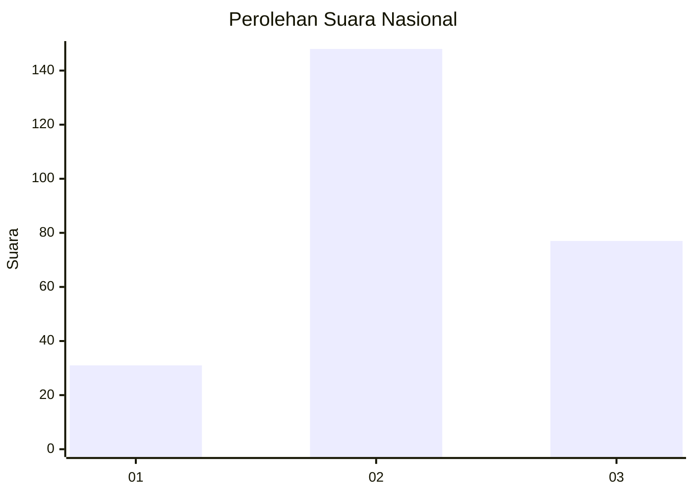
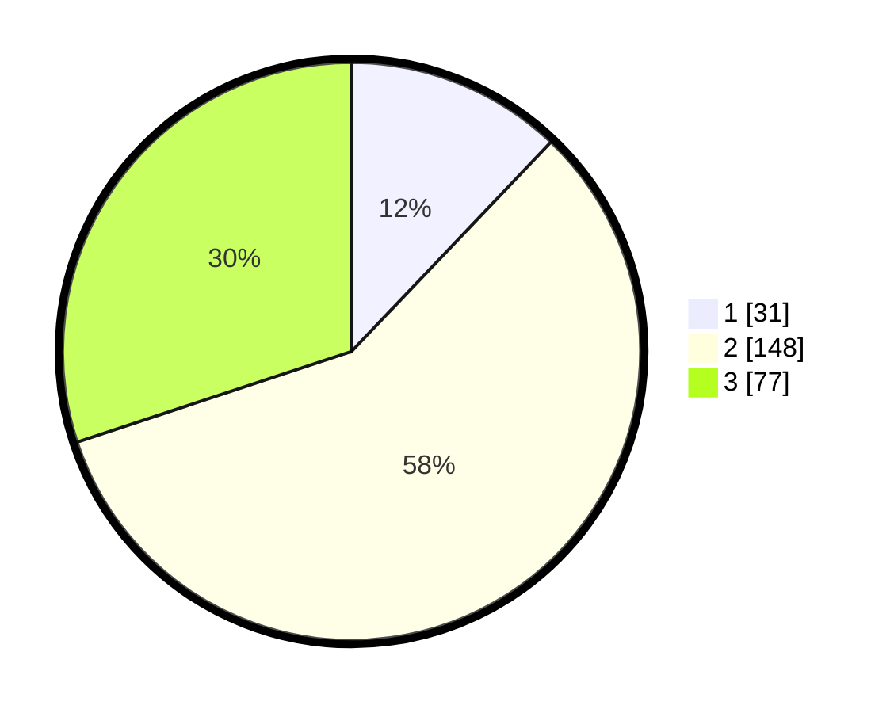

# Hasil

## Grafik

## Tabel

| No. | Nama Paslon    | Suara | Suara (raw) | Persentase |
|:--- |:-------------- | -----:| -----------:| ----------:|
| 1   | ANIES MUHAIMIN | 31    | [31][p-1]   | 12,11      |
| 2   | PRABOWO GIBRAN | 148   | [148][p-2]  | 57,81      |
| 3   | GANJAR MAHFUD  | 77    | [77][p-3]   | 30,08      |

[p-1]: https://github.com/gigit-pemilu/pemilu-2024/blob/main/pilpres/hitung-suara/sub/34-di-yogyakarta/sub/01-kulon-progo/sub/07-pengasih/sub/2006-sendangsari/sub/018-tps/sub/paslon-1.txt
[p-2]: https://github.com/gigit-pemilu/pemilu-2024/blob/main/pilpres/hitung-suara/sub/34-di-yogyakarta/sub/01-kulon-progo/sub/07-pengasih/sub/2006-sendangsari/sub/018-tps/sub/paslon-2.txt
[p-3]: https://github.com/gigit-pemilu/pemilu-2024/blob/main/pilpres/hitung-suara/sub/34-di-yogyakarta/sub/01-kulon-progo/sub/07-pengasih/sub/2006-sendangsari/sub/018-tps/sub/paslon-3.txt

## Foto C Plano

https://sirekap-obj-formc.kpu.go.id/a7e3/pemilu/ppwp/34/01/07/20/06/3401072006018-20240214-200850--94e4c953-d905-408f-920f-dfa3874fd64f.jpg

https://sirekap-obj-formc.kpu.go.id/a7e3/pemilu/ppwp/34/01/07/20/06/3401072006018-20240214-201031--a8b685f8-36a6-4ee6-9179-ef553879a4a0.jpg

https://sirekap-obj-formc.kpu.go.id/a7e3/pemilu/ppwp/34/01/07/20/06/3401072006018-20240217-122002--b46fae7a-d41f-480f-9d3e-e3261d9eaeaf.jpg

## Metadata

| Key        | Value               |
| ---------- | ------------------- |
| Time Stamp | 2024-02-17 13:37:34 |

## DATA PEMILIH TETAP

Jumlah pemilih dalam DPT: **294**.
 * L: **144**.
 * P: **150**.

## DATA PENGGUNA HAK PILIH

Jumlah pengguna hak pilih dalam DPT: **251**.
 * L: **120**.
 * P: **131**.

Jumlah pengguna hak pilih dalam DPTb: **11**.
 * L: **5**.
 * P: **6**.

Jumlah pengguna hak pilih dalam DPK: **1**.
 * L: **1**.
 * P: **0**.

Jumlah pengguna hak pilih: **263**.
 * L: **126**.
 * P: **137**.

## JUMLAH SUARA SAH DAN TIDAK SAH

JUMLAH SELURUH SUARA SAH: **256**.

JUMLAH SUARA TIDAK SAH: **7**.

JUMLAH SELURUH SUARA SAH DAN SUARA TIDAK SAH: **263**.

