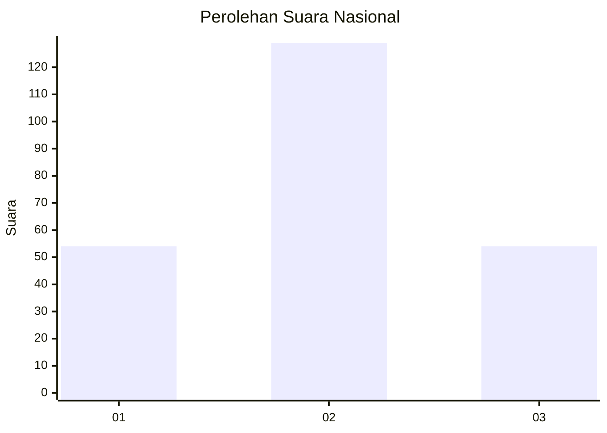
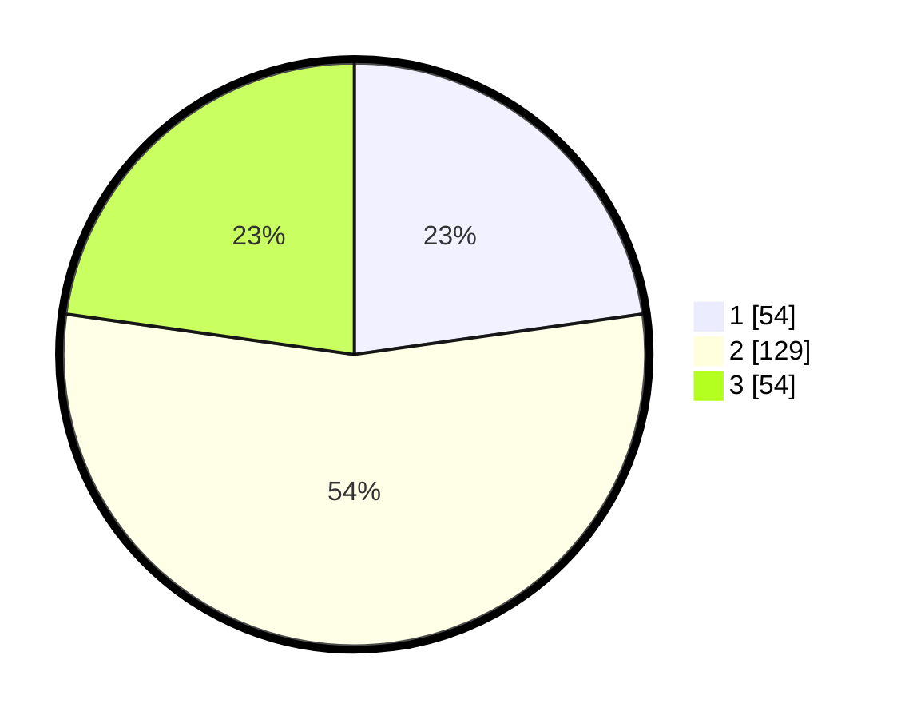

# Hasil

## Grafik

## Tabel

| No. | Nama Paslon    | Suara | Suara (raw) | Persentase |
|:--- |:-------------- | -----:| -----------:| ----------:|
| 1   | ANIES MUHAIMIN | 54    | [54][p-1]   | 22,78      |
| 2   | PRABOWO GIBRAN | 129   | [129][p-2]  | 54,43      |
| 3   | GANJAR MAHFUD  | 54    | [54][p-3]   | 22,78      |

[p-1]: https://github.com/gigit-pemilu/pemilu-2024/blob/main/pilpres/hitung-suara/sub/34-di-yogyakarta/sub/01-kulon-progo/sub/07-pengasih/sub/2007-sidomulyo/sub/005-tps/sub/paslon-1.txt
[p-2]: https://github.com/gigit-pemilu/pemilu-2024/blob/main/pilpres/hitung-suara/sub/34-di-yogyakarta/sub/01-kulon-progo/sub/07-pengasih/sub/2007-sidomulyo/sub/005-tps/sub/paslon-2.txt
[p-3]: https://github.com/gigit-pemilu/pemilu-2024/blob/main/pilpres/hitung-suara/sub/34-di-yogyakarta/sub/01-kulon-progo/sub/07-pengasih/sub/2007-sidomulyo/sub/005-tps/sub/paslon-3.txt

## Foto C Plano

https://sirekap-obj-formc.kpu.go.id/55f3/pemilu/ppwp/34/01/07/20/07/3401072007005-20240214-215335--61b413ff-05b8-445b-be98-956995e8c3d1.jpg

https://sirekap-obj-formc.kpu.go.id/55f3/pemilu/ppwp/34/01/07/20/07/3401072007005-20240214-215351--b51327f0-05fd-467a-a33d-3a6df53911ee.jpg

## Metadata

| Key        | Value               |
| ---------- | ------------------- |
| Time Stamp | 2024-02-15 20:30:46 |

