# Hasil

## Grafik

```mermaid
%%{init: {"pie": {"textPosition": 0.5}, "themeVariables": {"pieOuterStrokeWidth": "5px"}} }%%
pie showData
    "1" : 44
    "2" : 129
    "3" : 67
```

## Tabel

| No. | Nama Paslon    | Suara | Suara (raw) | Persentase |
|:--- |:-------------- | -----:| -----------:| ----------:|
| 1   | ANIES MUHAIMIN | 44    | [44][p-1]   | 18,33      |
| 2   | PRABOWO GIBRAN | 129   | [129][p-2]  | 53,75      |
| 3   | GANJAR MAHFUD  | 67    | [67][p-3]   | 27,92      |

[p-1]: https://github.com/gigit-pemilu/pemilu-2024/blob/main/pilpres/hitung-suara/sub/34-di-yogyakarta/sub/01-kulon-progo/sub/07-pengasih/sub/2007-sidomulyo/sub/006-tps/sub/paslon-1.txt
[p-2]: https://github.com/gigit-pemilu/pemilu-2024/blob/main/pilpres/hitung-suara/sub/34-di-yogyakarta/sub/01-kulon-progo/sub/07-pengasih/sub/2007-sidomulyo/sub/006-tps/sub/paslon-2.txt
[p-3]: https://github.com/gigit-pemilu/pemilu-2024/blob/main/pilpres/hitung-suara/sub/34-di-yogyakarta/sub/01-kulon-progo/sub/07-pengasih/sub/2007-sidomulyo/sub/006-tps/sub/paslon-3.txt

## Foto C Plano

https://sirekap-obj-formc.kpu.go.id/e062/pemilu/ppwp/34/01/07/20/07/3401072007006-20240214-205155--d6e6dacd-a80b-4d19-a214-96172aaa9c7b.jpg

https://sirekap-obj-formc.kpu.go.id/e062/pemilu/ppwp/34/01/07/20/07/3401072007006-20240214-214715--7ea5a5a5-f324-4f24-957b-232a9efc76fd.jpg

https://sirekap-obj-formc.kpu.go.id/e062/pemilu/ppwp/34/01/07/20/07/3401072007006-20240214-214922--91b0b15c-4ac7-4166-8b40-06b8b65a94f7.jpg

## Metadata

| Key        | Value               |
| ---------- | ------------------- |
| Time Stamp | 2024-02-16 06:30:27 |

## DATA PEMILIH TETAP

Jumlah pemilih dalam DPT: **285**.
 * L: **148**.
 * P: **137**.

## DATA PENGGUNA HAK PILIH

Jumlah pengguna hak pilih dalam DPT: **245**.
 * L: **128**.
 * P: **117**.

Jumlah pengguna hak pilih dalam DPTb: **2**.
 * L: **2**.
 * P: **0**.

Jumlah pengguna hak pilih dalam DPK: **1**.
 * L: **1**.
 * P: **0**.

Jumlah pengguna hak pilih: **248**.
 * L: **131**.
 * P: **117**.

## JUMLAH SUARA SAH DAN TIDAK SAH

JUMLAH SELURUH SUARA SAH: **240**.

JUMLAH SUARA TIDAK SAH: **8**.

JUMLAH SELURUH SUARA SAH DAN SUARA TIDAK SAH: **248**.

