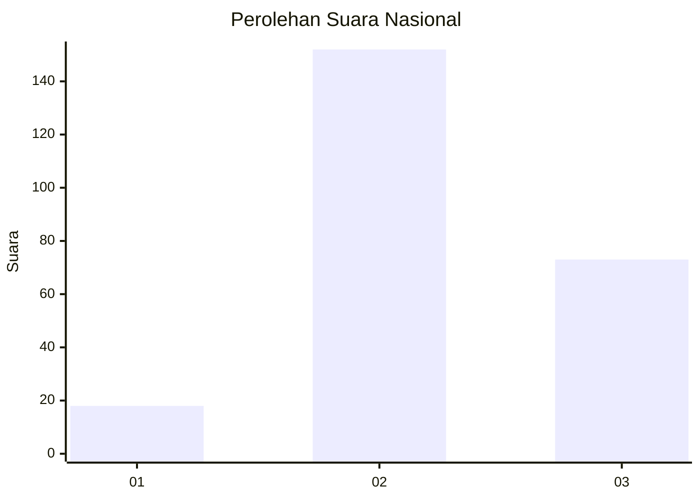
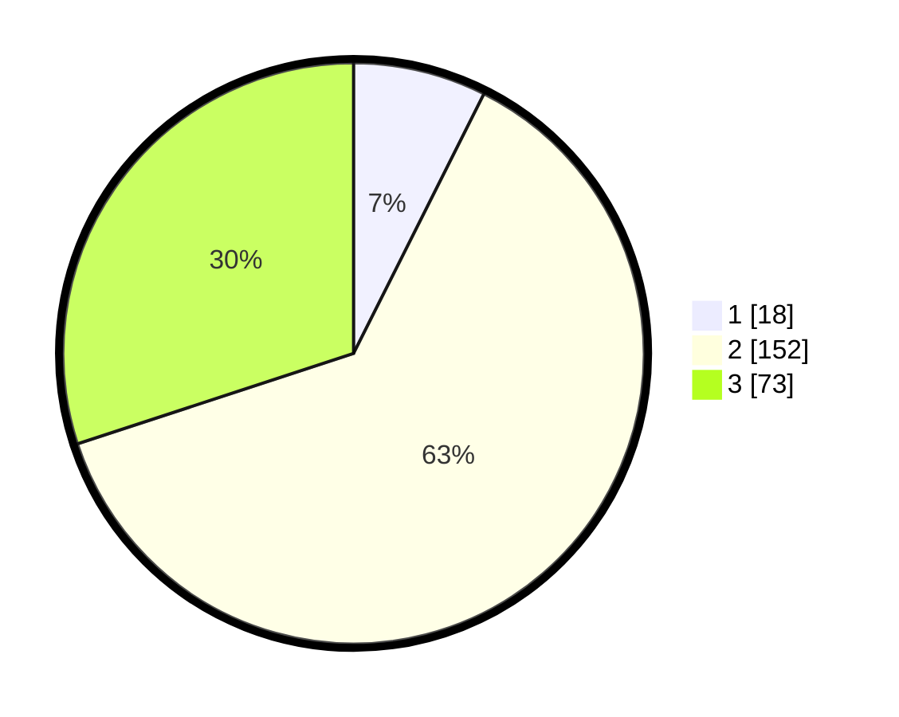

# Hasil

## Grafik

## Tabel

| No. | Nama Paslon    | Suara | Suara (raw) | Persentase |
|:--- |:-------------- | -----:| -----------:| ----------:|
| 1   | ANIES MUHAIMIN | 18    | [18][p-1]   | 7,41       |
| 2   | PRABOWO GIBRAN | 152   | [152][p-2]  | 62,55      |
| 3   | GANJAR MAHFUD  | 73    | [73][p-3]   | 30,04      |

[p-1]: https://github.com/gigit-pemilu/pemilu-2024/blob/main/pilpres/hitung-suara/sub/34-di-yogyakarta/sub/01-kulon-progo/sub/07-pengasih/sub/2007-sidomulyo/sub/008-tps/sub/paslon-1.txt
[p-2]: https://github.com/gigit-pemilu/pemilu-2024/blob/main/pilpres/hitung-suara/sub/34-di-yogyakarta/sub/01-kulon-progo/sub/07-pengasih/sub/2007-sidomulyo/sub/008-tps/sub/paslon-2.txt
[p-3]: https://github.com/gigit-pemilu/pemilu-2024/blob/main/pilpres/hitung-suara/sub/34-di-yogyakarta/sub/01-kulon-progo/sub/07-pengasih/sub/2007-sidomulyo/sub/008-tps/sub/paslon-3.txt

## Foto C Plano

https://sirekap-obj-formc.kpu.go.id/55eb/pemilu/ppwp/34/01/07/20/07/3401072007008-20240215-030916--c3aa4a4b-4357-427c-888f-7ff45218ced2.jpg

https://sirekap-obj-formc.kpu.go.id/55eb/pemilu/ppwp/34/01/07/20/07/3401072007008-20240215-012657--ec30fbb3-8241-463e-8ed3-199ca3f5e3e6.jpg

https://sirekap-obj-formc.kpu.go.id/55eb/pemilu/ppwp/34/01/07/20/07/3401072007008-20240215-031109--9790fbb3-553b-4117-882c-d52ac536d564.jpg

## Metadata

| Key        | Value               |
| ---------- | ------------------- |
| Time Stamp | 2024-02-15 15:00:29 |

