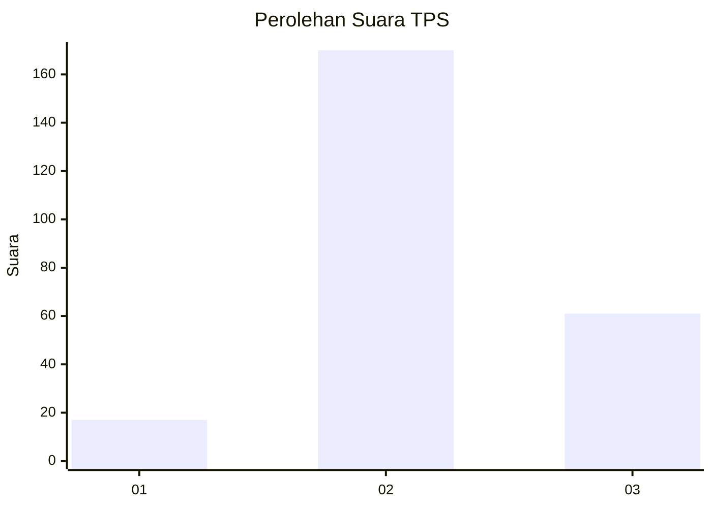
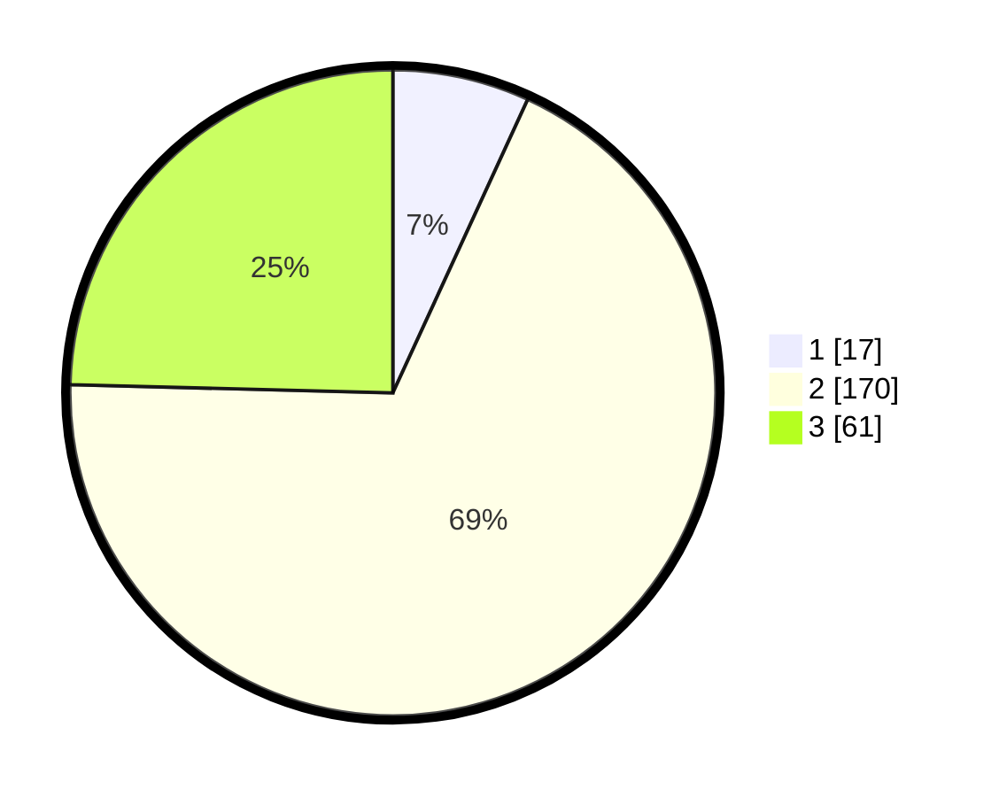

# Hasil

## Grafik

## Tabel

| No. | Nama Paslon    | Suara | Suara (raw) | Persentase |
|:--- |:-------------- | -----:| -----------:| ----------:|
| 1   | ANIES MUHAIMIN | 17    | [17][p-1]   | 6,85       |
| 2   | PRABOWO GIBRAN | 170   | [170][p-2]  | 68,55      |
| 3   | GANJAR MAHFUD  | 61    | [61][p-3]   | 24,60      |

[p-1]: https://github.com/gigit-pemilu/pemilu-2024-34-di-yogyakarta/blob/main/pilpres/hitung-suara/sub/34-di-yogyakarta/sub/01-kulon-progo/sub/07-pengasih/sub/2007-sidomulyo/sub/015-tps/sub/paslon-1.txt
[p-2]: https://github.com/gigit-pemilu/pemilu-2024-34-di-yogyakarta/blob/main/pilpres/hitung-suara/sub/34-di-yogyakarta/sub/01-kulon-progo/sub/07-pengasih/sub/2007-sidomulyo/sub/015-tps/sub/paslon-2.txt
[p-3]: https://github.com/gigit-pemilu/pemilu-2024-34-di-yogyakarta/blob/main/pilpres/hitung-suara/sub/34-di-yogyakarta/sub/01-kulon-progo/sub/07-pengasih/sub/2007-sidomulyo/sub/015-tps/sub/paslon-3.txt

## Foto C Plano

https://sirekap-obj-formc.kpu.go.id/3326/pemilu/ppwp/34/01/07/20/07/3401072007015-20240214-195808--f131848a-90a7-4a98-b907-65bc7008f9eb.jpg

https://sirekap-obj-formc.kpu.go.id/3326/pemilu/ppwp/34/01/07/20/07/3401072007015-20240214-195832--4203bb29-4c78-4a7b-9171-e8da24b3ffb4.jpg

https://sirekap-obj-formc.kpu.go.id/3326/pemilu/ppwp/34/01/07/20/07/3401072007015-20240214-141709--ed9fa65b-cf90-440f-bf96-d49b1ffeabb8.jpg

## Metadata

| Key        | Value               |
| ---------- | ------------------- |
| Time Stamp | 2024-02-14 21:46:01 |

