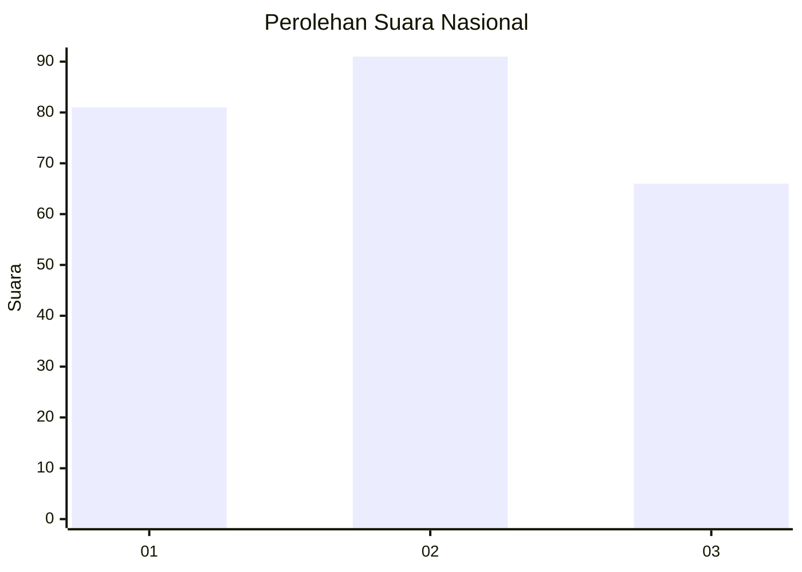
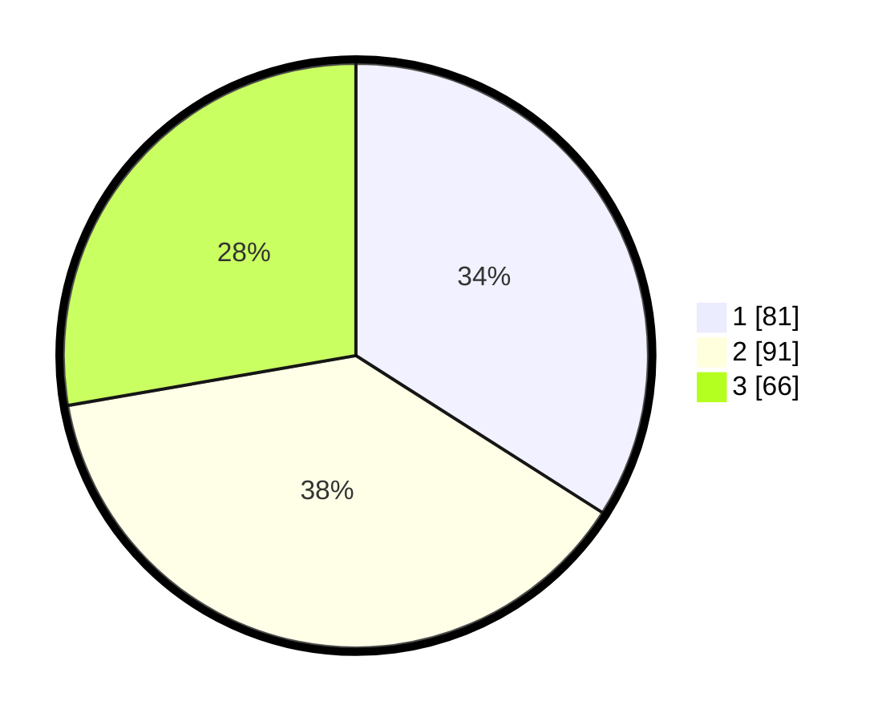

# Hasil

## Grafik

## Tabel

| No. | Nama Paslon    | Suara | Suara (raw) | Persentase |
|:--- |:-------------- | -----:| -----------:| ----------:|
| 1   | ANIES MUHAIMIN | 81    | [81][p-1]   | 34,03      |
| 2   | PRABOWO GIBRAN | 91    | [91][p-2]   | 38,24      |
| 3   | GANJAR MAHFUD  | 66    | [66][p-3]   | 27,73      |

[p-1]: https://github.com/gigit-pemilu/pemilu-2024/blob/main/pilpres/hitung-suara/sub/34-di-yogyakarta/sub/01-kulon-progo/sub/08-kokap/sub/2001-hargomulyo/sub/001-tps/sub/paslon-1.txt
[p-2]: https://github.com/gigit-pemilu/pemilu-2024/blob/main/pilpres/hitung-suara/sub/34-di-yogyakarta/sub/01-kulon-progo/sub/08-kokap/sub/2001-hargomulyo/sub/001-tps/sub/paslon-2.txt
[p-3]: https://github.com/gigit-pemilu/pemilu-2024/blob/main/pilpres/hitung-suara/sub/34-di-yogyakarta/sub/01-kulon-progo/sub/08-kokap/sub/2001-hargomulyo/sub/001-tps/sub/paslon-3.txt

## Foto C Plano

https://sirekap-obj-formc.kpu.go.id/3ac0/pemilu/ppwp/34/01/08/20/01/3401082001001-20240216-134032--7e5bd503-ed29-47d8-b68d-8389216da0bd.jpg

https://sirekap-obj-formc.kpu.go.id/3ac0/pemilu/ppwp/34/01/08/20/01/3401082001001-20240216-134033--4e3821c7-99c5-47cf-9cc7-3afa17a002ca.jpg

https://sirekap-obj-formc.kpu.go.id/3ac0/pemilu/ppwp/34/01/08/20/01/3401082001001-20240216-134033--c26db56c-5fae-40f1-8839-4198054c891f.jpg

## Metadata

| Key        | Value               |
| ---------- | ------------------- |
| Time Stamp | 2024-02-21 14:00:00 |

## DATA PEMILIH TETAP

Jumlah pemilih dalam DPT: **285**.
 * L: **144**.
 * P: **141**.

## DATA PENGGUNA HAK PILIH

Jumlah pengguna hak pilih dalam DPT: **285**.
 * L: **144**.
 * P: **141**.

Jumlah pengguna hak pilih dalam DPTb: **6**.
 * L: **3**.
 * P: **3**.

Jumlah pengguna hak pilih dalam DPK: **0**.
 * L: **0**.
 * P: **0**.

Jumlah pengguna hak pilih: **291**.
 * L: **147**.
 * P: **144**.

## JUMLAH SUARA SAH DAN TIDAK SAH

JUMLAH SELURUH SUARA SAH: **238**.

JUMLAH SUARA TIDAK SAH: **7**.

JUMLAH SELURUH SUARA SAH DAN SUARA TIDAK SAH: **245**.

