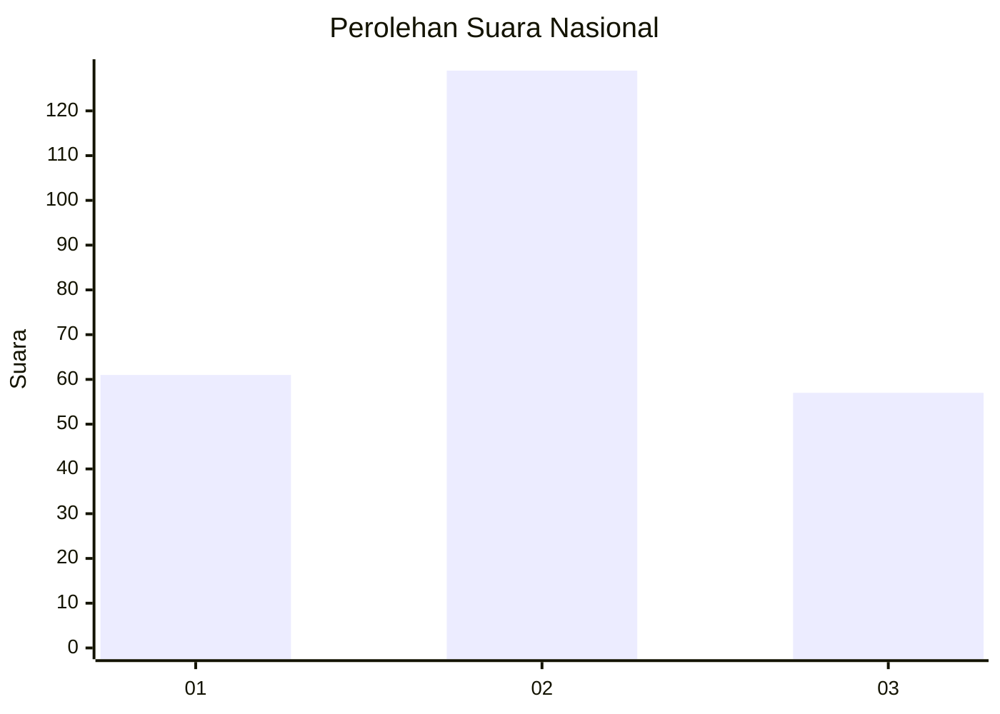
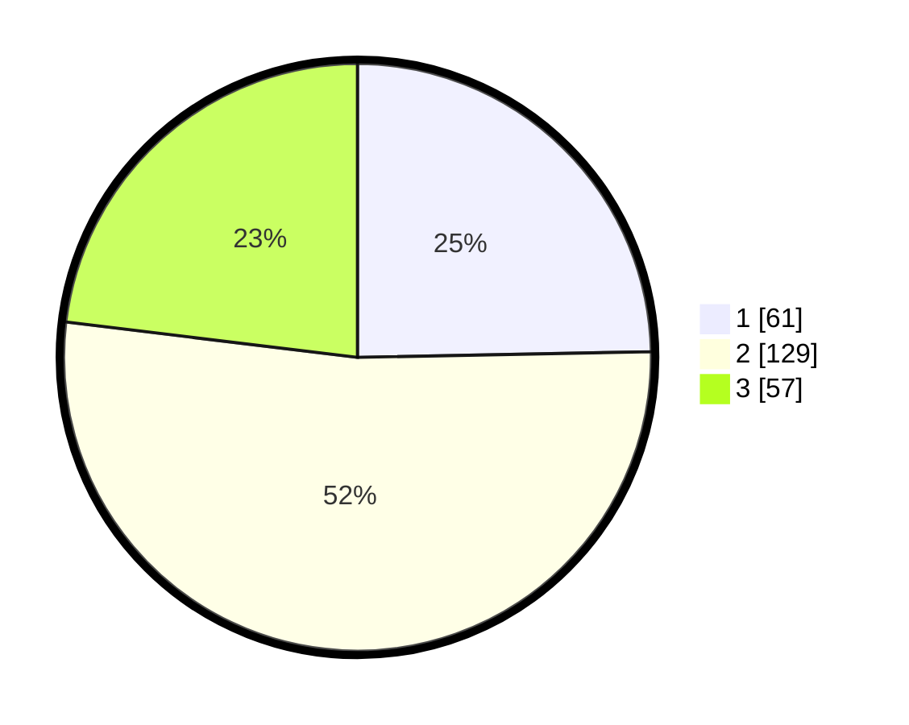

# Hasil

## Grafik

## Tabel

| No. | Nama Paslon    | Suara | Suara (raw) | Persentase |
|:--- |:-------------- | -----:| -----------:| ----------:|
| 1   | ANIES MUHAIMIN | 61    | [61][p-1]   | 24,70      |
| 2   | PRABOWO GIBRAN | 129   | [129][p-2]  | 52,23      |
| 3   | GANJAR MAHFUD  | 57    | [57][p-3]   | 23,08      |

[p-1]: https://github.com/gigit-pemilu/pemilu-2024/blob/main/pilpres/hitung-suara/sub/34-di-yogyakarta/sub/01-kulon-progo/sub/08-kokap/sub/2001-hargomulyo/sub/002-tps/sub/paslon-1.txt
[p-2]: https://github.com/gigit-pemilu/pemilu-2024/blob/main/pilpres/hitung-suara/sub/34-di-yogyakarta/sub/01-kulon-progo/sub/08-kokap/sub/2001-hargomulyo/sub/002-tps/sub/paslon-2.txt
[p-3]: https://github.com/gigit-pemilu/pemilu-2024/blob/main/pilpres/hitung-suara/sub/34-di-yogyakarta/sub/01-kulon-progo/sub/08-kokap/sub/2001-hargomulyo/sub/002-tps/sub/paslon-3.txt

## Foto C Plano

https://sirekap-obj-formc.kpu.go.id/53c1/pemilu/ppwp/34/01/08/20/01/3401082001002-20240216-000141--2d6ef36b-0e7f-4621-bf9d-3d4a88b499eb.jpg

https://sirekap-obj-formc.kpu.go.id/53c1/pemilu/ppwp/34/01/08/20/01/3401082001002-20240216-000143--df7657ac-2116-4375-806c-a1ea12a51542.jpg

https://sirekap-obj-formc.kpu.go.id/53c1/pemilu/ppwp/34/01/08/20/01/3401082001002-20240216-000142--4f74448f-8091-4836-83c9-23ac53d79889.jpg

## Metadata

| Key        | Value               |
| ---------- | ------------------- |
| Time Stamp | 2024-02-21 14:00:00 |

## DATA PEMILIH TETAP

Jumlah pemilih dalam DPT: **289**.
 * L: **145**.
 * P: **144**.

## DATA PENGGUNA HAK PILIH

Jumlah pengguna hak pilih dalam DPT: **248**.
 * L: **119**.
 * P: **129**.

Jumlah pengguna hak pilih dalam DPTb: **3**.
 * L: **1**.
 * P: **2**.

Jumlah pengguna hak pilih dalam DPK: **0**.
 * L: **0**.
 * P: **0**.

Jumlah pengguna hak pilih: **251**.
 * L: **120**.
 * P: **131**.

## JUMLAH SUARA SAH DAN TIDAK SAH

JUMLAH SELURUH SUARA SAH: **247**.

JUMLAH SUARA TIDAK SAH: **4**.

JUMLAH SELURUH SUARA SAH DAN SUARA TIDAK SAH: **251**.

