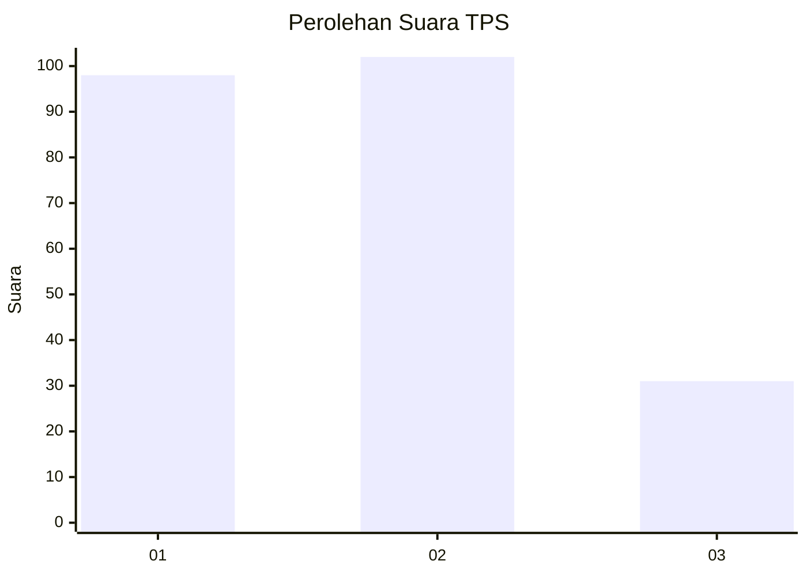
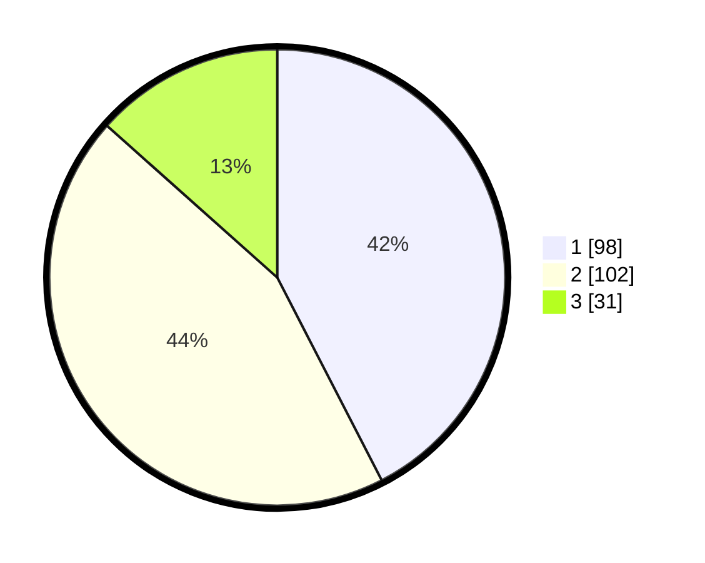

# Hasil

## Grafik

## Tabel

| No. | Nama Paslon    | Suara | Suara (raw) | Persentase |
|:--- |:-------------- | -----:| -----------:| ----------:|
| 1   | ANIES MUHAIMIN | 98    | [98][p-1]   | 42,42      |
| 2   | PRABOWO GIBRAN | 102   | [102][p-2]  | 44,16      |
| 3   | GANJAR MAHFUD  | 31    | [31][p-3]   | 13,42      |

[p-1]: https://github.com/gigit-pemilu/pemilu-2024-34-di-yogyakarta/blob/main/pilpres/hitung-suara/sub/34-di-yogyakarta/sub/01-kulon-progo/sub/08-kokap/sub/2001-hargomulyo/sub/003-tps/sub/paslon-1.txt
[p-2]: https://github.com/gigit-pemilu/pemilu-2024-34-di-yogyakarta/blob/main/pilpres/hitung-suara/sub/34-di-yogyakarta/sub/01-kulon-progo/sub/08-kokap/sub/2001-hargomulyo/sub/003-tps/sub/paslon-2.txt
[p-3]: https://github.com/gigit-pemilu/pemilu-2024-34-di-yogyakarta/blob/main/pilpres/hitung-suara/sub/34-di-yogyakarta/sub/01-kulon-progo/sub/08-kokap/sub/2001-hargomulyo/sub/003-tps/sub/paslon-3.txt

## Foto C Plano

https://sirekap-obj-formc.kpu.go.id/b560/pemilu/ppwp/34/01/08/20/01/3401082001003-20240216-131311--39d43ca8-10d9-470f-963f-6b425f7186c0.jpg

https://sirekap-obj-formc.kpu.go.id/b560/pemilu/ppwp/34/01/08/20/01/3401082001003-20240216-131313--aa22ef66-6e12-49bf-bccf-722b357b17ab.jpg

https://sirekap-obj-formc.kpu.go.id/b560/pemilu/ppwp/34/01/08/20/01/3401082001003-20240216-131312--10673d97-0e0b-47a7-b7bf-1155292e07cb.jpg

## Metadata

| Key        | Value               |
| ---------- | ------------------- |
| Time Stamp | 2024-02-21 11:00:00 |

## DATA PEMILIH TETAP

Jumlah pemilih dalam DPT: **286**.
 * L: **148**.
 * P: **138**.

## DATA PENGGUNA HAK PILIH

Jumlah pengguna hak pilih dalam DPT: **233**.
 * L: **120**.
 * P: **113**.

Jumlah pengguna hak pilih dalam DPTb: **2**.
 * L: **1**.
 * P: **1**.

Jumlah pengguna hak pilih dalam DPK: **0**.
 * L: **0**.
 * P: **0**.

Jumlah pengguna hak pilih: **235**.
 * L: **121**.
 * P: **114**.

## JUMLAH SUARA SAH DAN TIDAK SAH

JUMLAH SELURUH SUARA SAH: **231**.

JUMLAH SUARA TIDAK SAH: **4**.

JUMLAH SELURUH SUARA SAH DAN SUARA TIDAK SAH: **235**.

