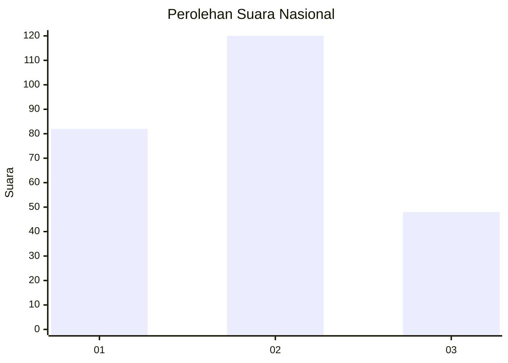
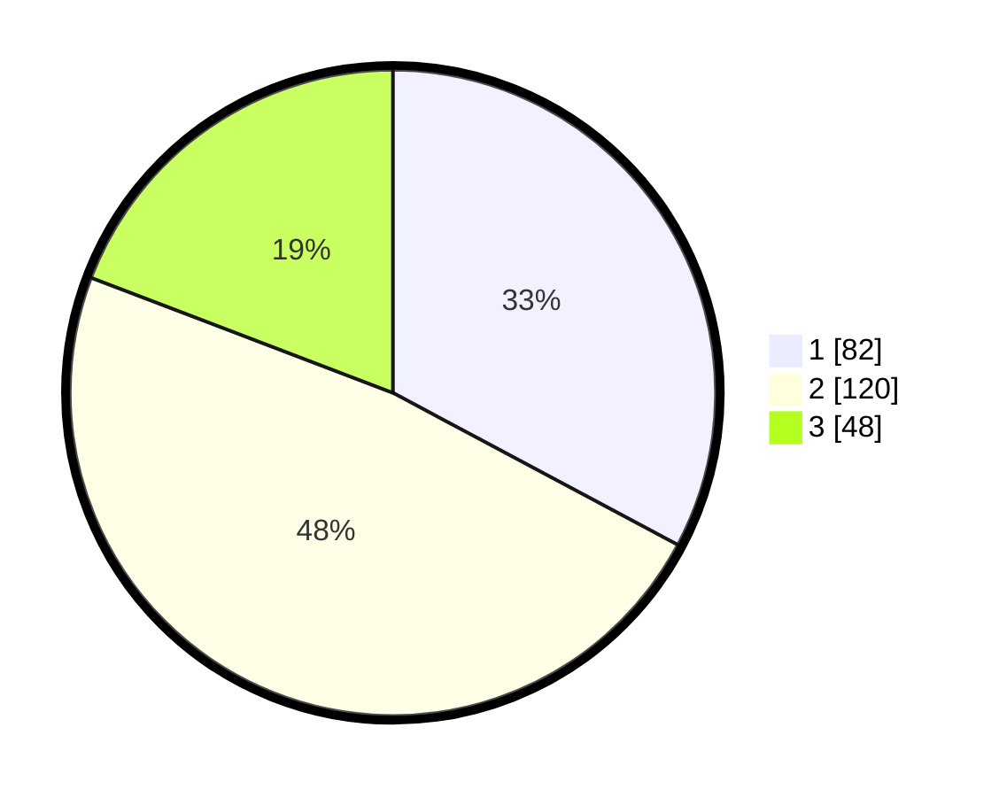

# Hasil

## Grafik

## Tabel

| No. | Nama Paslon    | Suara | Suara (raw) | Persentase |
|:--- |:-------------- | -----:| -----------:| ----------:|
| 1   | ANIES MUHAIMIN | 82    | [82][p-1]   | 32,80      |
| 2   | PRABOWO GIBRAN | 120   | [120][p-2]  | 48,00      |
| 3   | GANJAR MAHFUD  | 48    | [48][p-3]   | 19,20      |

[p-1]: https://github.com/gigit-pemilu/pemilu-2024/blob/main/pilpres/hitung-suara/sub/34-di-yogyakarta/sub/01-kulon-progo/sub/08-kokap/sub/2001-hargomulyo/sub/004-tps/sub/paslon-1.txt
[p-2]: https://github.com/gigit-pemilu/pemilu-2024/blob/main/pilpres/hitung-suara/sub/34-di-yogyakarta/sub/01-kulon-progo/sub/08-kokap/sub/2001-hargomulyo/sub/004-tps/sub/paslon-2.txt
[p-3]: https://github.com/gigit-pemilu/pemilu-2024/blob/main/pilpres/hitung-suara/sub/34-di-yogyakarta/sub/01-kulon-progo/sub/08-kokap/sub/2001-hargomulyo/sub/004-tps/sub/paslon-3.txt

## Foto C Plano

https://sirekap-obj-formc.kpu.go.id/4acc/pemilu/ppwp/34/01/08/20/01/3401082001004-20240216-135238--54b7eba3-6ed7-4994-922e-b79b5bec8a95.jpg

https://sirekap-obj-formc.kpu.go.id/4acc/pemilu/ppwp/34/01/08/20/01/3401082001004-20240216-135239--7a001402-a6be-4946-bf9e-a18a625cb8d7.jpg

https://sirekap-obj-formc.kpu.go.id/4acc/pemilu/ppwp/34/01/08/20/01/3401082001004-20240216-135239--3c9f78b4-f3b6-4949-8569-5f1ab305241b.jpg

## Metadata

| Key        | Value               |
| ---------- | ------------------- |
| Time Stamp | 2024-02-21 14:00:00 |

## DATA PEMILIH TETAP

Jumlah pemilih dalam DPT: **281**.
 * L: **144**.
 * P: **137**.

## DATA PENGGUNA HAK PILIH

Jumlah pengguna hak pilih dalam DPT: **246**.
 * L: **126**.
 * P: **120**.

Jumlah pengguna hak pilih dalam DPTb: **0**.
 * L: **0**.
 * P: **0**.

Jumlah pengguna hak pilih dalam DPK: **8**.
 * L: **2**.
 * P: **6**.

Jumlah pengguna hak pilih: **254**.
 * L: **128**.
 * P: **126**.

## JUMLAH SUARA SAH DAN TIDAK SAH

JUMLAH SELURUH SUARA SAH: **250**.

JUMLAH SUARA TIDAK SAH: **4**.

JUMLAH SELURUH SUARA SAH DAN SUARA TIDAK SAH: **254**.

