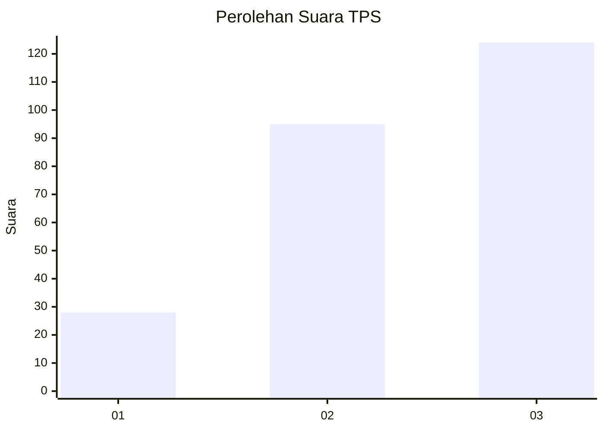
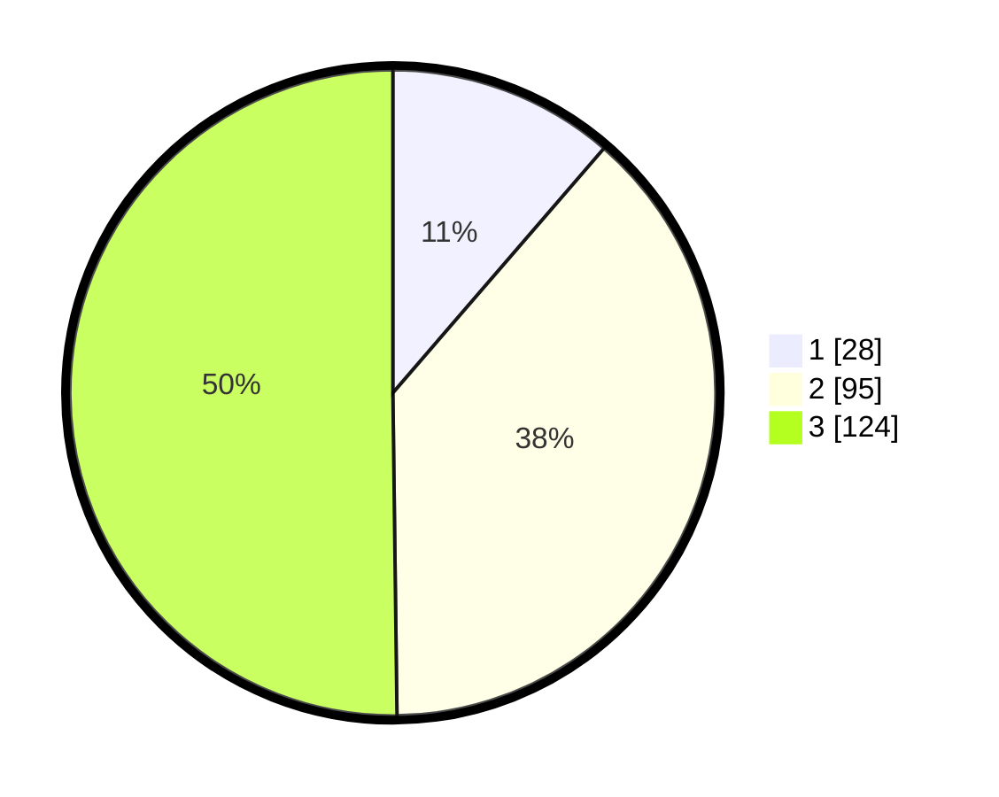

# Hasil

## Grafik

## Tabel

| No. | Nama Paslon    | Suara | Suara (raw) | Persentase |
|:--- |:-------------- | -----:| -----------:| ----------:|
| 1   | ANIES MUHAIMIN | 28    | [28][p-1]   | 11,34      |
| 2   | PRABOWO GIBRAN | 95    | [95][p-2]   | 38,46      |
| 3   | GANJAR MAHFUD  | 124   | [124][p-3]  | 50,20      |

[p-1]: https://github.com/gigit-pemilu/pemilu-2024-34-di-yogyakarta/blob/main/pilpres/hitung-suara/sub/34-di-yogyakarta/sub/01-kulon-progo/sub/08-kokap/sub/2001-hargomulyo/sub/006-tps/sub/paslon-1.txt
[p-2]: https://github.com/gigit-pemilu/pemilu-2024-34-di-yogyakarta/blob/main/pilpres/hitung-suara/sub/34-di-yogyakarta/sub/01-kulon-progo/sub/08-kokap/sub/2001-hargomulyo/sub/006-tps/sub/paslon-2.txt
[p-3]: https://github.com/gigit-pemilu/pemilu-2024-34-di-yogyakarta/blob/main/pilpres/hitung-suara/sub/34-di-yogyakarta/sub/01-kulon-progo/sub/08-kokap/sub/2001-hargomulyo/sub/006-tps/sub/paslon-3.txt

## Foto C Plano

https://sirekap-obj-formc.kpu.go.id/8b38/pemilu/ppwp/34/01/08/20/01/3401082001006-20240216-134537--969c5778-100d-413c-9346-a488272bc1be.jpg

https://sirekap-obj-formc.kpu.go.id/8b38/pemilu/ppwp/34/01/08/20/01/3401082001006-20240216-134538--12d2624e-ce1c-4c54-aa0c-3df83d1acf16.jpg

https://sirekap-obj-formc.kpu.go.id/8b38/pemilu/ppwp/34/01/08/20/01/3401082001006-20240216-134537--3bec3319-ba6d-449c-a72e-5d115f66ab87.jpg

## Metadata

| Key        | Value               |
| ---------- | ------------------- |
| Time Stamp | 2024-02-21 14:00:00 |

## DATA PEMILIH TETAP

Jumlah pemilih dalam DPT: **289**.
 * L: **130**.
 * P: **159**.

## DATA PENGGUNA HAK PILIH

Jumlah pengguna hak pilih dalam DPT: **248**.
 * L: **109**.
 * P: **139**.

Jumlah pengguna hak pilih dalam DPTb: **1**.
 * L: **0**.
 * P: **1**.

Jumlah pengguna hak pilih dalam DPK: **1**.
 * L: **0**.
 * P: **1**.

Jumlah pengguna hak pilih: **250**.
 * L: **109**.
 * P: **141**.

## JUMLAH SUARA SAH DAN TIDAK SAH

JUMLAH SELURUH SUARA SAH: **247**.

JUMLAH SUARA TIDAK SAH: **3**.

JUMLAH SELURUH SUARA SAH DAN SUARA TIDAK SAH: **250**.

