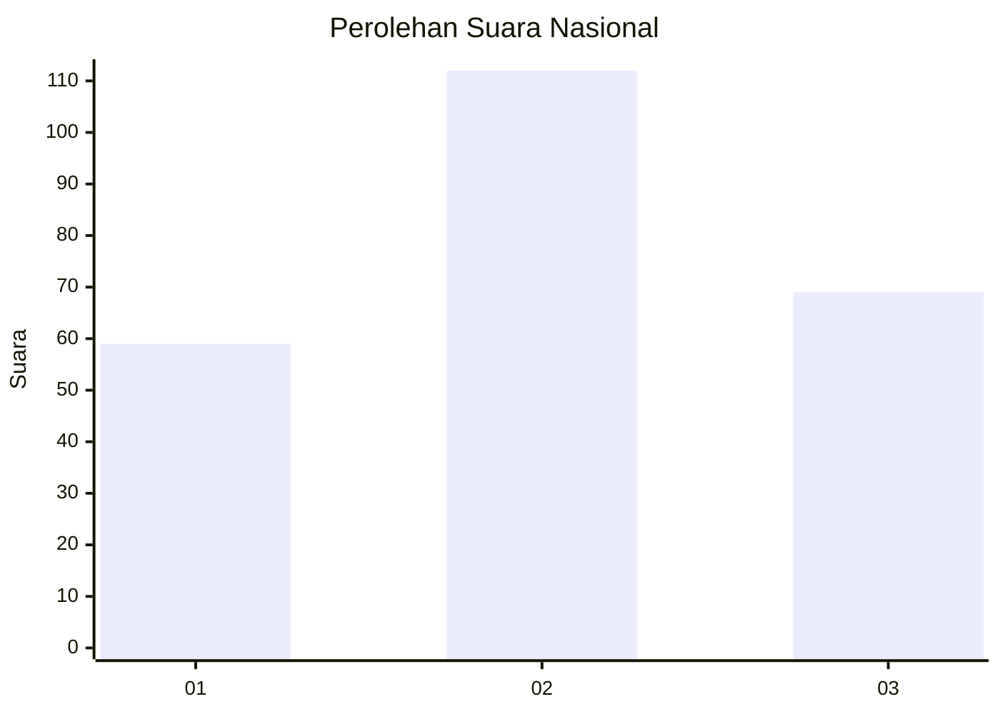
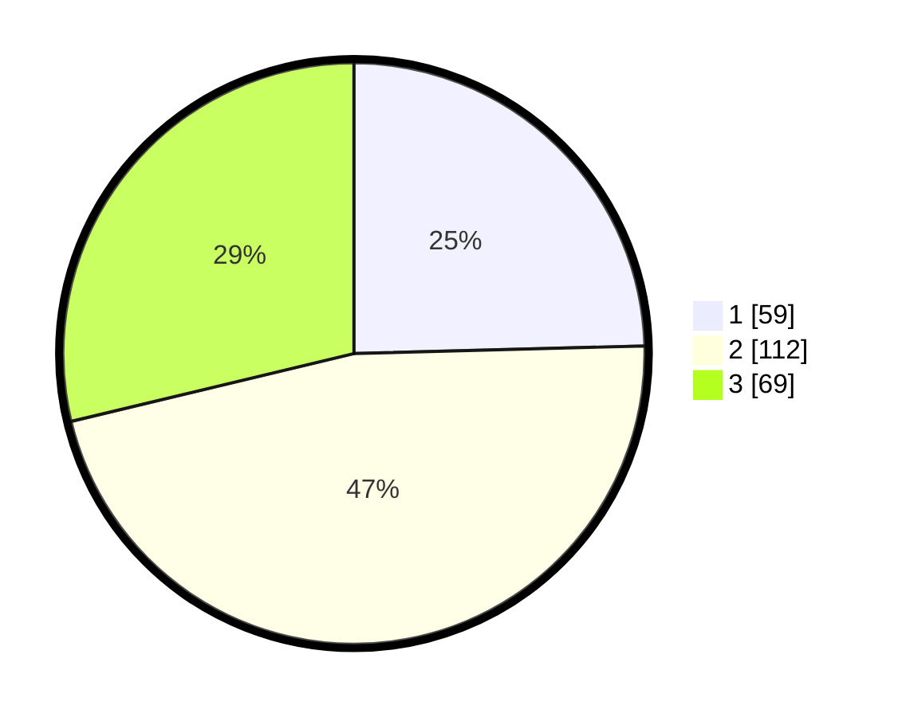

# Hasil

## Grafik

## Tabel

| No. | Nama Paslon    | Suara | Suara (raw) | Persentase |
|:--- |:-------------- | -----:| -----------:| ----------:|
| 1   | ANIES MUHAIMIN | 59    | [59][p-1]   | 24,58      |
| 2   | PRABOWO GIBRAN | 112   | [112][p-2]  | 46,67      |
| 3   | GANJAR MAHFUD  | 69    | [69][p-3]   | 28,75      |

[p-1]: https://github.com/gigit-pemilu/pemilu-2024/blob/main/pilpres/hitung-suara/sub/34-di-yogyakarta/sub/01-kulon-progo/sub/08-kokap/sub/2001-hargomulyo/sub/016-tps/sub/paslon-1.txt
[p-2]: https://github.com/gigit-pemilu/pemilu-2024/blob/main/pilpres/hitung-suara/sub/34-di-yogyakarta/sub/01-kulon-progo/sub/08-kokap/sub/2001-hargomulyo/sub/016-tps/sub/paslon-2.txt
[p-3]: https://github.com/gigit-pemilu/pemilu-2024/blob/main/pilpres/hitung-suara/sub/34-di-yogyakarta/sub/01-kulon-progo/sub/08-kokap/sub/2001-hargomulyo/sub/016-tps/sub/paslon-3.txt

## Foto C Plano

https://sirekap-obj-formc.kpu.go.id/3fa4/pemilu/ppwp/34/01/08/20/01/3401082001016-20240216-122436--9f76edf2-902b-4727-9f3e-b70565be901a.jpg

https://sirekap-obj-formc.kpu.go.id/3fa4/pemilu/ppwp/34/01/08/20/01/3401082001016-20240216-091337--91457a91-e980-4dde-b837-f4093f998308.jpg

https://sirekap-obj-formc.kpu.go.id/3fa4/pemilu/ppwp/34/01/08/20/01/3401082001016-20240216-122437--90907cc2-6ac2-4846-966a-23d42cb3408d.jpg

## Metadata

| Key        | Value               |
| ---------- | ------------------- |
| Time Stamp | 2024-02-21 14:00:00 |

## DATA PEMILIH TETAP

Jumlah pemilih dalam DPT: **285**.
 * L: **141**.
 * P: **144**.

## DATA PENGGUNA HAK PILIH

Jumlah pengguna hak pilih dalam DPT: **237**.
 * L: **119**.
 * P: **118**.

Jumlah pengguna hak pilih dalam DPTb: **9**.
 * L: **8**.
 * P: **1**.

Jumlah pengguna hak pilih dalam DPK: **2**.
 * L: **0**.
 * P: **2**.

Jumlah pengguna hak pilih: **248**.
 * L: **127**.
 * P: **121**.

## JUMLAH SUARA SAH DAN TIDAK SAH

JUMLAH SELURUH SUARA SAH: **240**.

JUMLAH SUARA TIDAK SAH: **8**.

JUMLAH SELURUH SUARA SAH DAN SUARA TIDAK SAH: **248**.

