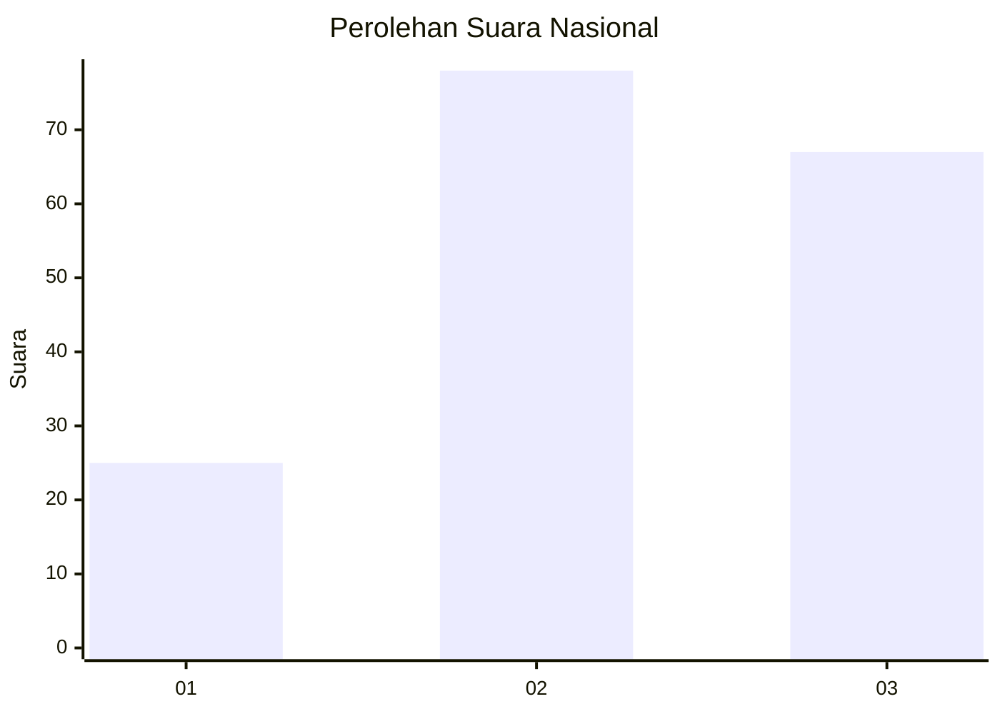
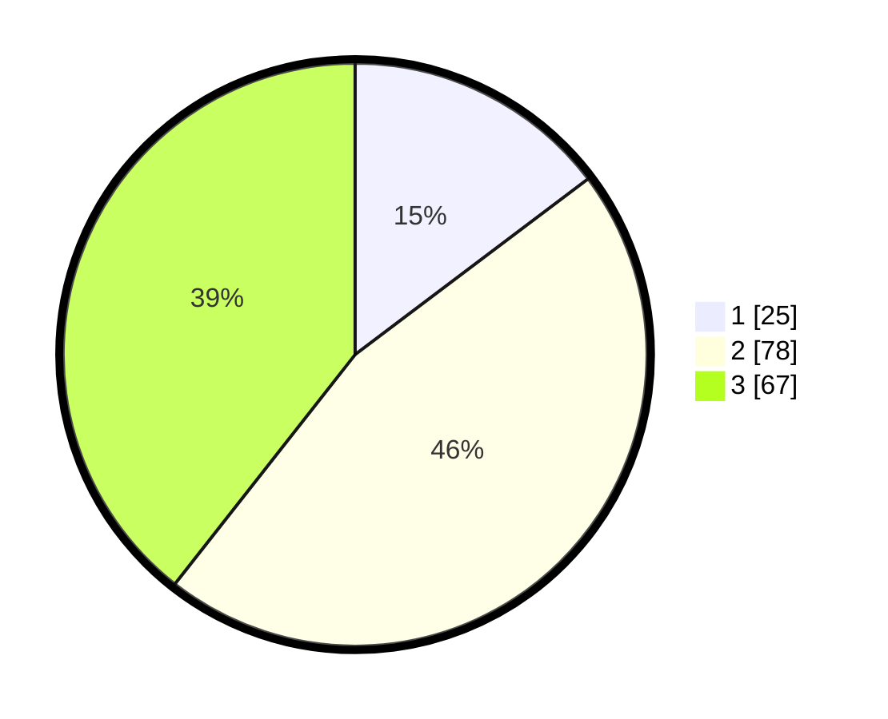

# Hasil

## Grafik

## Tabel

| No. | Nama Paslon    | Suara | Suara (raw) | Persentase |
|:--- |:-------------- | -----:| -----------:| ----------:|
| 1   | ANIES MUHAIMIN | 25    | [25][p-1]   | 14,71      |
| 2   | PRABOWO GIBRAN | 78    | [78][p-2]   | 45,88      |
| 3   | GANJAR MAHFUD  | 67    | [67][p-3]   | 39,41      |

[p-1]: https://github.com/gigit-pemilu/pemilu-2024/blob/main/pilpres/hitung-suara/sub/34-di-yogyakarta/sub/01-kulon-progo/sub/08-kokap/sub/2002-hargorejo/sub/002-tps/sub/paslon-1.txt
[p-2]: https://github.com/gigit-pemilu/pemilu-2024/blob/main/pilpres/hitung-suara/sub/34-di-yogyakarta/sub/01-kulon-progo/sub/08-kokap/sub/2002-hargorejo/sub/002-tps/sub/paslon-2.txt
[p-3]: https://github.com/gigit-pemilu/pemilu-2024/blob/main/pilpres/hitung-suara/sub/34-di-yogyakarta/sub/01-kulon-progo/sub/08-kokap/sub/2002-hargorejo/sub/002-tps/sub/paslon-3.txt

## Foto C Plano

https://sirekap-obj-formc.kpu.go.id/e7a0/pemilu/ppwp/34/01/08/20/02/3401082002002-20240215-044155--6065035d-0345-41fa-be2c-62d590f92c71.jpg

https://sirekap-obj-formc.kpu.go.id/e7a0/pemilu/ppwp/34/01/08/20/02/3401082002002-20240215-044254--d15bfa76-be8a-4a37-bfcb-73a3bc7726c3.jpg

https://sirekap-obj-formc.kpu.go.id/e7a0/pemilu/ppwp/34/01/08/20/02/3401082002002-20240215-044411--13dc1c5a-05bd-44cf-a813-e2c9f16785be.jpg

## Metadata

| Key        | Value               |
| ---------- | ------------------- |
| Time Stamp | 2024-02-15 15:30:25 |

