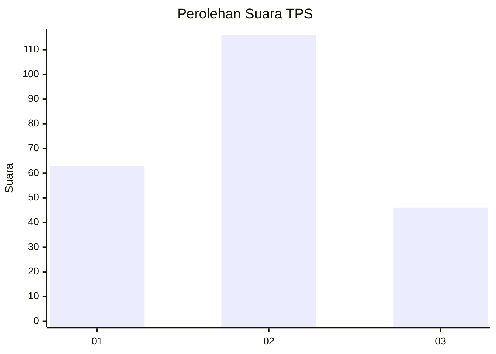
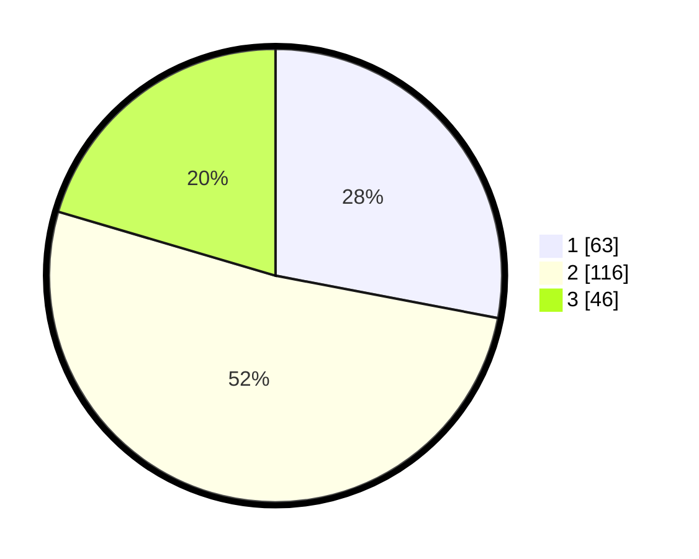

# Hasil

## Grafik

## Tabel

| No. | Nama Paslon    | Suara | Suara (raw) | Persentase |
|:--- |:-------------- | -----:| -----------:| ----------:|
| 1   | ANIES MUHAIMIN | 63    | [63][p-1]   | 28,00      |
| 2   | PRABOWO GIBRAN | 116   | [116][p-2]  | 51,56      |
| 3   | GANJAR MAHFUD  | 46    | [46][p-3]   | 20,44      |

[p-1]: https://github.com/gigit-pemilu/pemilu-2024-34-di-yogyakarta/blob/main/pilpres/hitung-suara/sub/34-di-yogyakarta/sub/01-kulon-progo/sub/08-kokap/sub/2002-hargorejo/sub/004-tps/sub/paslon-1.txt
[p-2]: https://github.com/gigit-pemilu/pemilu-2024-34-di-yogyakarta/blob/main/pilpres/hitung-suara/sub/34-di-yogyakarta/sub/01-kulon-progo/sub/08-kokap/sub/2002-hargorejo/sub/004-tps/sub/paslon-2.txt
[p-3]: https://github.com/gigit-pemilu/pemilu-2024-34-di-yogyakarta/blob/main/pilpres/hitung-suara/sub/34-di-yogyakarta/sub/01-kulon-progo/sub/08-kokap/sub/2002-hargorejo/sub/004-tps/sub/paslon-3.txt

## Foto C Plano

https://sirekap-obj-formc.kpu.go.id/c432/pemilu/ppwp/34/01/08/20/02/3401082002004-20240216-152009--46a8a845-dd27-4236-bd88-61b095570d78.jpg

https://sirekap-obj-formc.kpu.go.id/c432/pemilu/ppwp/34/01/08/20/02/3401082002004-20240216-152059--b8afb204-de2d-41a8-9eac-cf11011ee883.jpg

https://sirekap-obj-formc.kpu.go.id/c432/pemilu/ppwp/34/01/08/20/02/3401082002004-20240216-152139--5e7b3557-52ac-468b-887d-8dc129168c95.jpg

## Metadata

| Key        | Value               |
| ---------- | ------------------- |
| Time Stamp | 2024-02-19 06:16:00 |

