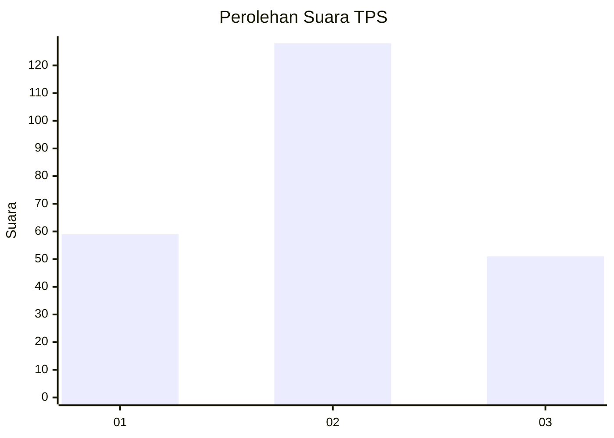
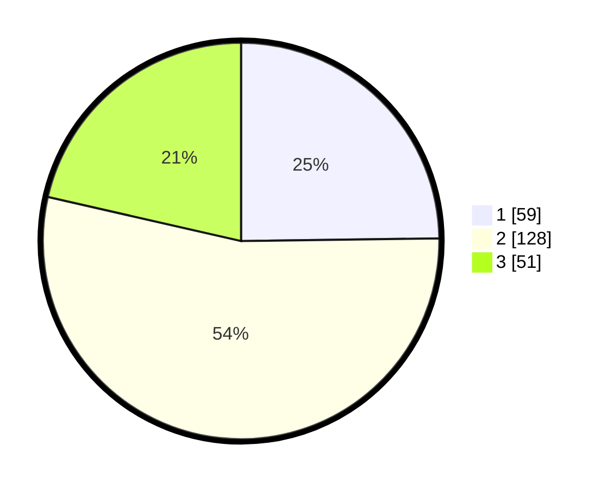

# Hasil

## Grafik

## Tabel

| No. | Nama Paslon    | Suara | Suara (raw) | Persentase |
|:--- |:-------------- | -----:| -----------:| ----------:|
| 1   | ANIES MUHAIMIN | 59    | [59][p-1]   | 24,79      |
| 2   | PRABOWO GIBRAN | 128   | [128][p-2]  | 53,78      |
| 3   | GANJAR MAHFUD  | 51    | [51][p-3]   | 21,43      |

[p-1]: https://github.com/gigit-pemilu/pemilu-2024-34-di-yogyakarta/blob/main/pilpres/hitung-suara/sub/34-di-yogyakarta/sub/01-kulon-progo/sub/08-kokap/sub/2002-hargorejo/sub/005-tps/sub/paslon-1.txt
[p-2]: https://github.com/gigit-pemilu/pemilu-2024-34-di-yogyakarta/blob/main/pilpres/hitung-suara/sub/34-di-yogyakarta/sub/01-kulon-progo/sub/08-kokap/sub/2002-hargorejo/sub/005-tps/sub/paslon-2.txt
[p-3]: https://github.com/gigit-pemilu/pemilu-2024-34-di-yogyakarta/blob/main/pilpres/hitung-suara/sub/34-di-yogyakarta/sub/01-kulon-progo/sub/08-kokap/sub/2002-hargorejo/sub/005-tps/sub/paslon-3.txt

## Foto C Plano

https://sirekap-obj-formc.kpu.go.id/79f1/pemilu/ppwp/34/01/08/20/02/3401082002005-20240215-023545--a8f5dbc9-5f63-4ca7-8a88-c47b42b08996.jpg

https://sirekap-obj-formc.kpu.go.id/79f1/pemilu/ppwp/34/01/08/20/02/3401082002005-20240215-012010--a17d2a65-6124-4a2a-a3a7-5f67176f2ea9.jpg

## Metadata

| Key        | Value               |
| ---------- | ------------------- |
| Time Stamp | 2024-02-21 20:00:00 |

