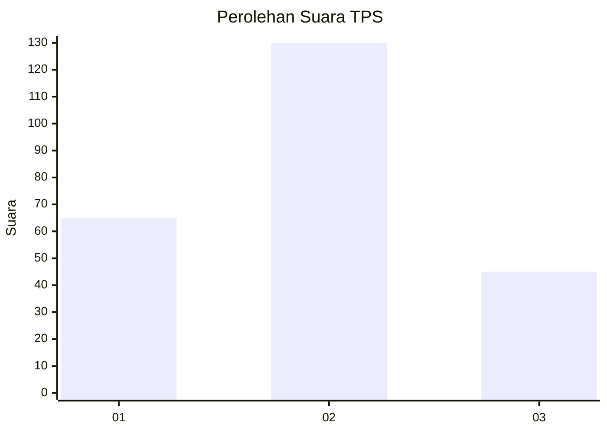
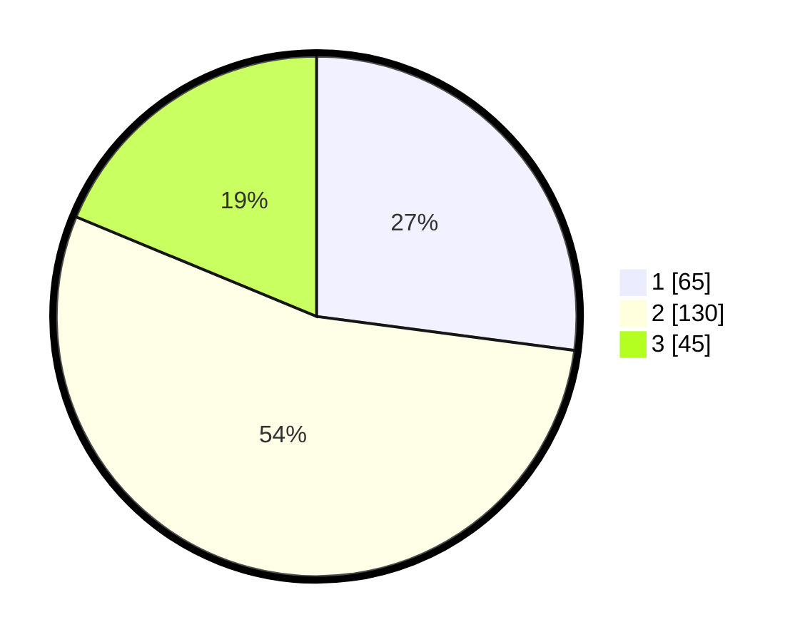

# Hasil

## Grafik

## Tabel

| No. | Nama Paslon    | Suara | Suara (raw) | Persentase |
|:--- |:-------------- | -----:| -----------:| ----------:|
| 1   | ANIES MUHAIMIN | 65    | [65][p-1]   | 27,08      |
| 2   | PRABOWO GIBRAN | 130   | [130][p-2]  | 54,17      |
| 3   | GANJAR MAHFUD  | 45    | [45][p-3]   | 18,75      |

[p-1]: https://github.com/gigit-pemilu/pemilu-2024-34-di-yogyakarta/blob/main/pilpres/hitung-suara/sub/34-di-yogyakarta/sub/01-kulon-progo/sub/08-kokap/sub/2002-hargorejo/sub/007-tps/sub/paslon-1.txt
[p-2]: https://github.com/gigit-pemilu/pemilu-2024-34-di-yogyakarta/blob/main/pilpres/hitung-suara/sub/34-di-yogyakarta/sub/01-kulon-progo/sub/08-kokap/sub/2002-hargorejo/sub/007-tps/sub/paslon-2.txt
[p-3]: https://github.com/gigit-pemilu/pemilu-2024-34-di-yogyakarta/blob/main/pilpres/hitung-suara/sub/34-di-yogyakarta/sub/01-kulon-progo/sub/08-kokap/sub/2002-hargorejo/sub/007-tps/sub/paslon-3.txt

## Foto C Plano

https://sirekap-obj-formc.kpu.go.id/489b/pemilu/ppwp/34/01/08/20/02/3401082002007-20240216-192419--99c37abc-e927-4a0a-aebc-ff9e1fa2c21c.jpg

https://sirekap-obj-formc.kpu.go.id/489b/pemilu/ppwp/34/01/08/20/02/3401082002007-20240215-030325--fe78fc12-3696-4c6b-9769-8677dc914f75.jpg

https://sirekap-obj-formc.kpu.go.id/489b/pemilu/ppwp/34/01/08/20/02/3401082002007-20240215-060824--7b3bf1fb-9c1b-4b42-b488-7d17cb2fbd95.jpg

## Metadata

| Key        | Value               |
| ---------- | ------------------- |
| Time Stamp | 2024-02-16 21:01:00 |

