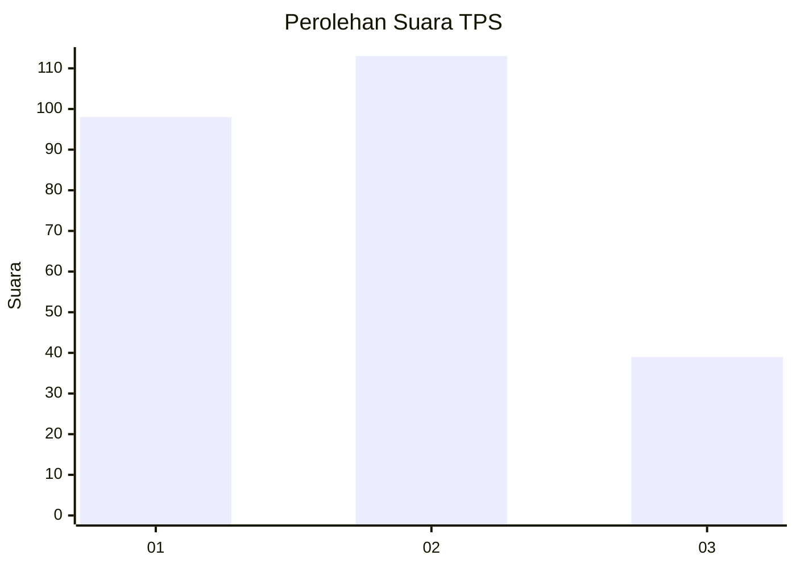
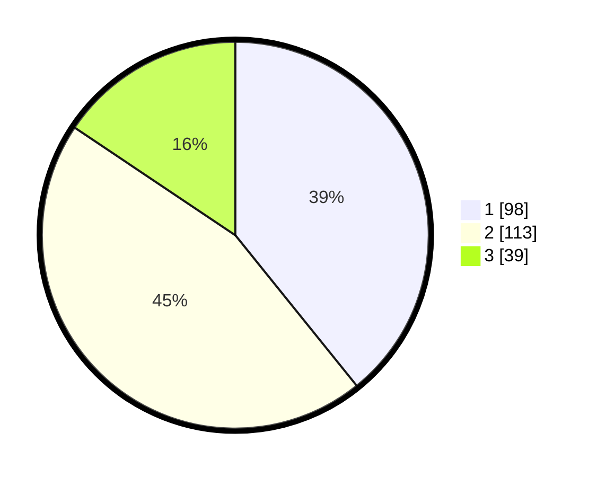

# Hasil

## Grafik

## Tabel

| No. | Nama Paslon    | Suara | Suara (raw) | Persentase |
|:--- |:-------------- | -----:| -----------:| ----------:|
| 1   | ANIES MUHAIMIN | 98    | [98][p-1]   | 39,20      |
| 2   | PRABOWO GIBRAN | 113   | [113][p-2]  | 45,20      |
| 3   | GANJAR MAHFUD  | 39    | [39][p-3]   | 15,60      |

[p-1]: https://github.com/gigit-pemilu/pemilu-2024-34-di-yogyakarta/blob/main/pilpres/hitung-suara/sub/34-di-yogyakarta/sub/01-kulon-progo/sub/08-kokap/sub/2002-hargorejo/sub/008-tps/sub/paslon-1.txt
[p-2]: https://github.com/gigit-pemilu/pemilu-2024-34-di-yogyakarta/blob/main/pilpres/hitung-suara/sub/34-di-yogyakarta/sub/01-kulon-progo/sub/08-kokap/sub/2002-hargorejo/sub/008-tps/sub/paslon-2.txt
[p-3]: https://github.com/gigit-pemilu/pemilu-2024-34-di-yogyakarta/blob/main/pilpres/hitung-suara/sub/34-di-yogyakarta/sub/01-kulon-progo/sub/08-kokap/sub/2002-hargorejo/sub/008-tps/sub/paslon-3.txt

## Foto C Plano

https://sirekap-obj-formc.kpu.go.id/35fa/pemilu/ppwp/34/01/08/20/02/3401082002008-20240214-232440--a970247d-f2c3-4453-b19e-4d323d4959e5.jpg

https://sirekap-obj-formc.kpu.go.id/35fa/pemilu/ppwp/34/01/08/20/02/3401082002008-20240214-232619--864ac24e-214a-42e5-99c3-88b709a56f04.jpg

https://sirekap-obj-formc.kpu.go.id/35fa/pemilu/ppwp/34/01/08/20/02/3401082002008-20240214-232658--88d575bb-f4ec-4058-9fe6-74555001d0ef.jpg

## Metadata

| Key        | Value               |
| ---------- | ------------------- |
| Time Stamp | 2024-02-24 22:31:28 |

