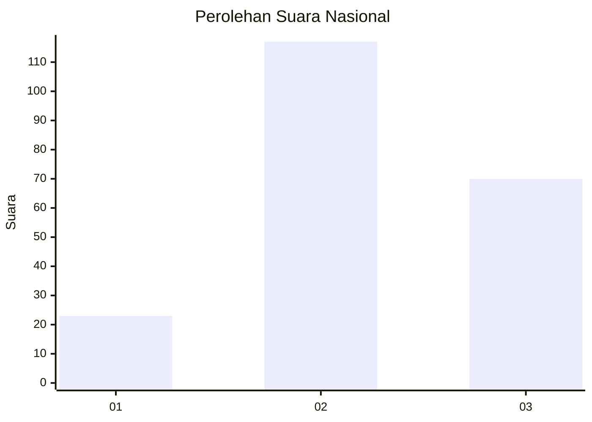
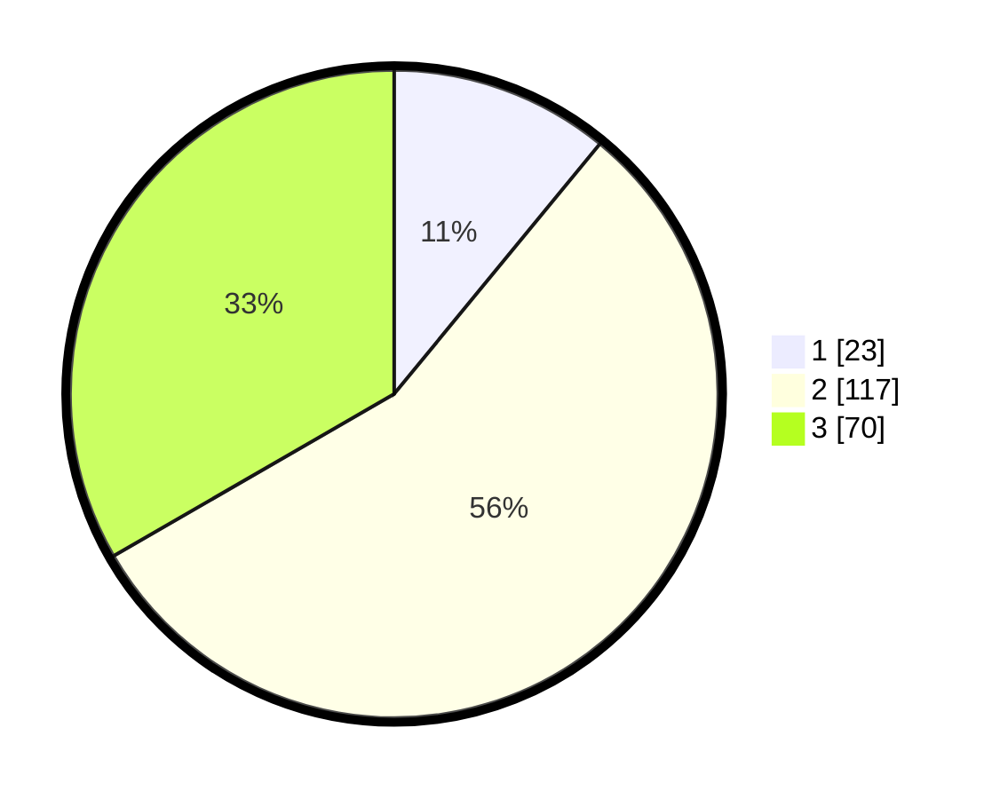

# Hasil

## Grafik

## Tabel

| No. | Nama Paslon    | Suara | Suara (raw) | Persentase |
|:--- |:-------------- | -----:| -----------:| ----------:|
| 1   | ANIES MUHAIMIN | 23    | [23][p-1]   | 10,95      |
| 2   | PRABOWO GIBRAN | 117   | [117][p-2]  | 55,71      |
| 3   | GANJAR MAHFUD  | 70    | [70][p-3]   | 33,33      |

[p-1]: https://github.com/gigit-pemilu/pemilu-2024/blob/main/pilpres/hitung-suara/sub/34-di-yogyakarta/sub/01-kulon-progo/sub/08-kokap/sub/2002-hargorejo/sub/010-tps/sub/paslon-1.txt
[p-2]: https://github.com/gigit-pemilu/pemilu-2024/blob/main/pilpres/hitung-suara/sub/34-di-yogyakarta/sub/01-kulon-progo/sub/08-kokap/sub/2002-hargorejo/sub/010-tps/sub/paslon-2.txt
[p-3]: https://github.com/gigit-pemilu/pemilu-2024/blob/main/pilpres/hitung-suara/sub/34-di-yogyakarta/sub/01-kulon-progo/sub/08-kokap/sub/2002-hargorejo/sub/010-tps/sub/paslon-3.txt

## Foto C Plano

https://sirekap-obj-formc.kpu.go.id/7ccb/pemilu/ppwp/34/01/08/20/02/3401082002010-20240214-233041--1d03e6c9-5622-4cab-8d7c-2bb79c0ed482.jpg

https://sirekap-obj-formc.kpu.go.id/7ccb/pemilu/ppwp/34/01/08/20/02/3401082002010-20240216-182505--fed813ef-8357-4b68-863f-ca10c136cae9.jpg

https://sirekap-obj-formc.kpu.go.id/7ccb/pemilu/ppwp/34/01/08/20/02/3401082002010-20240214-233238--4e991bf7-7297-4f5a-839c-194fc3121259.jpg

## Metadata

| Key        | Value               |
| ---------- | ------------------- |
| Time Stamp | 2024-02-24 22:31:28 |

