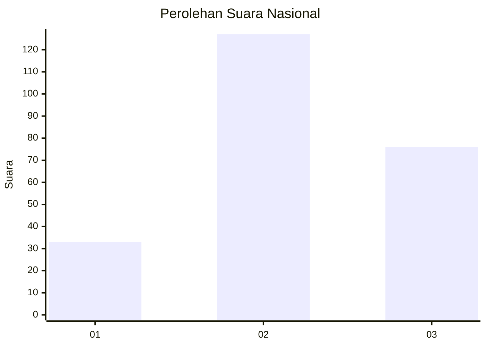
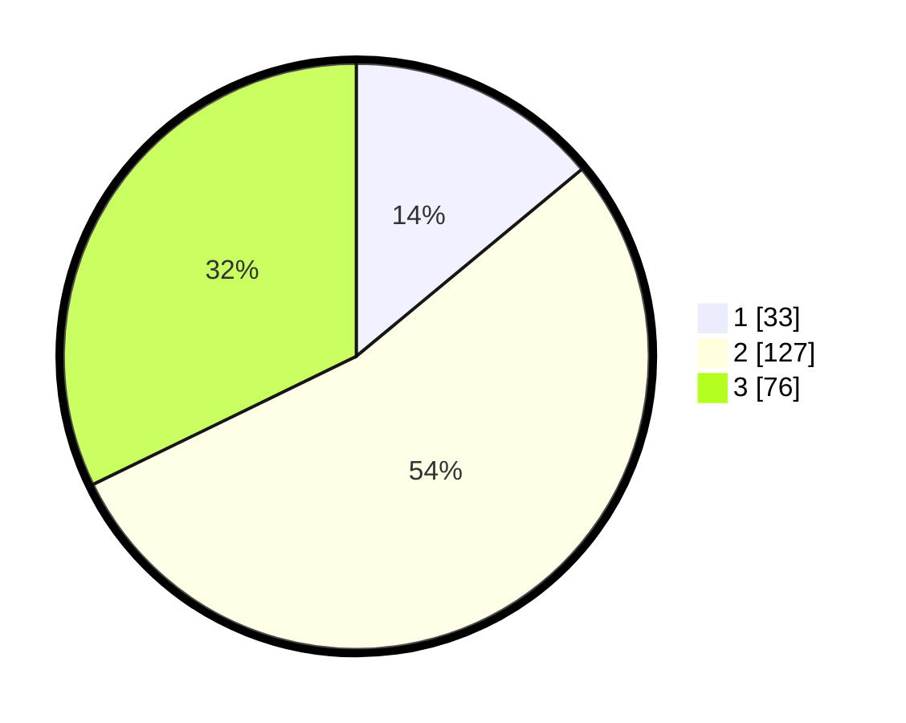

# Hasil

## Grafik

## Tabel

| No. | Nama Paslon    | Suara | Suara (raw) | Persentase |
|:--- |:-------------- | -----:| -----------:| ----------:|
| 1   | ANIES MUHAIMIN | 33    | [33][p-1]   | 13,98      |
| 2   | PRABOWO GIBRAN | 127   | [127][p-2]  | 53,81      |
| 3   | GANJAR MAHFUD  | 76    | [76][p-3]   | 32,20      |

[p-1]: https://github.com/gigit-pemilu/pemilu-2024/blob/main/pilpres/hitung-suara/sub/34-di-yogyakarta/sub/01-kulon-progo/sub/08-kokap/sub/2002-hargorejo/sub/024-tps/sub/paslon-1.txt
[p-2]: https://github.com/gigit-pemilu/pemilu-2024/blob/main/pilpres/hitung-suara/sub/34-di-yogyakarta/sub/01-kulon-progo/sub/08-kokap/sub/2002-hargorejo/sub/024-tps/sub/paslon-2.txt
[p-3]: https://github.com/gigit-pemilu/pemilu-2024/blob/main/pilpres/hitung-suara/sub/34-di-yogyakarta/sub/01-kulon-progo/sub/08-kokap/sub/2002-hargorejo/sub/024-tps/sub/paslon-3.txt

## Foto C Plano

https://sirekap-obj-formc.kpu.go.id/5e8f/pemilu/ppwp/34/01/08/20/02/3401082002024-20240215-003404--96670a03-a589-41d0-a2bb-b11583b21fe3.jpg

https://sirekap-obj-formc.kpu.go.id/5e8f/pemilu/ppwp/34/01/08/20/02/3401082002024-20240215-061801--8b591288-4099-4d36-bc44-534d5cd058ec.jpg

## Metadata

| Key        | Value               |
| ---------- | ------------------- |
| Time Stamp | 2024-02-25 10:00:00 |

