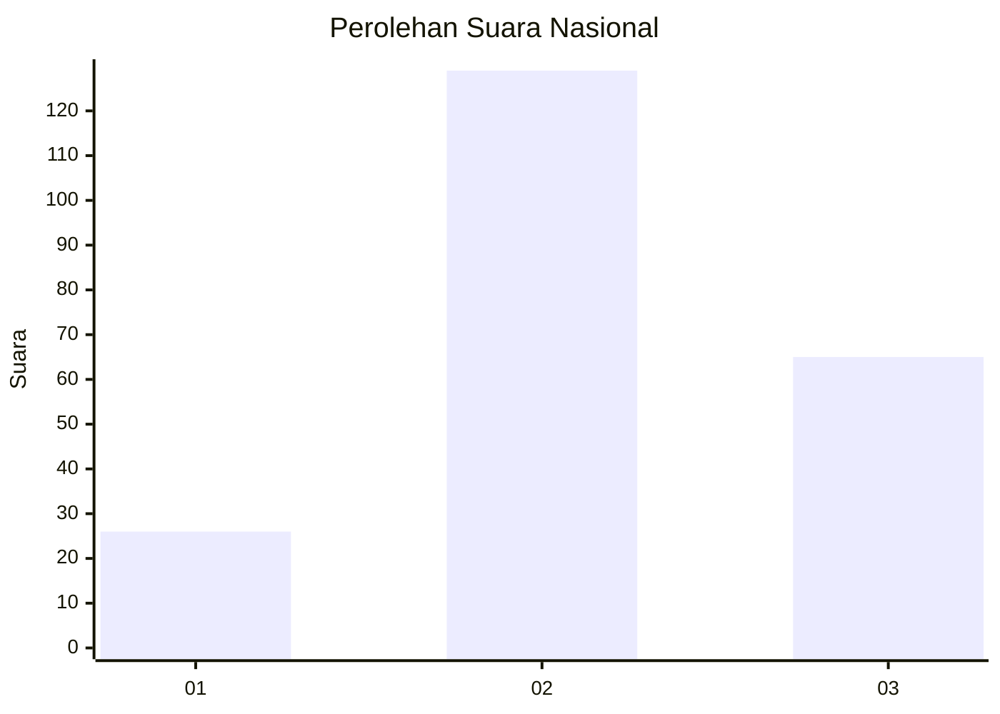
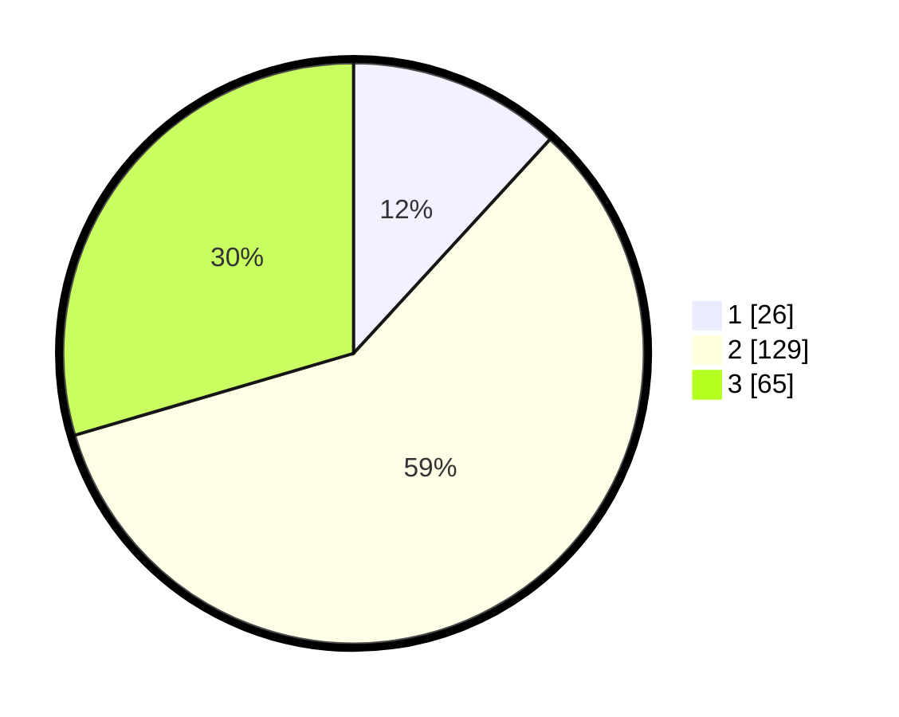

# Hasil

## Grafik

## Tabel

| No. | Nama Paslon    | Suara | Suara (raw) | Persentase |
|:--- |:-------------- | -----:| -----------:| ----------:|
| 1   | ANIES MUHAIMIN | 26    | [26][p-1]   | 11,82      |
| 2   | PRABOWO GIBRAN | 129   | [129][p-2]  | 58,64      |
| 3   | GANJAR MAHFUD  | 65    | [65][p-3]   | 29,55      |

[p-1]: https://github.com/gigit-pemilu/pemilu-2024/blob/main/pilpres/hitung-suara/sub/34-di-yogyakarta/sub/01-kulon-progo/sub/08-kokap/sub/2003-hargowilis/sub/002-tps/sub/paslon-1.txt
[p-2]: https://github.com/gigit-pemilu/pemilu-2024/blob/main/pilpres/hitung-suara/sub/34-di-yogyakarta/sub/01-kulon-progo/sub/08-kokap/sub/2003-hargowilis/sub/002-tps/sub/paslon-2.txt
[p-3]: https://github.com/gigit-pemilu/pemilu-2024/blob/main/pilpres/hitung-suara/sub/34-di-yogyakarta/sub/01-kulon-progo/sub/08-kokap/sub/2003-hargowilis/sub/002-tps/sub/paslon-3.txt

## Foto C Plano

https://sirekap-obj-formc.kpu.go.id/623b/pemilu/ppwp/34/01/08/20/03/3401082003002-20240214-155224--1eeecee6-caef-44ce-9003-09079a5d5202.jpg

https://sirekap-obj-formc.kpu.go.id/623b/pemilu/ppwp/34/01/08/20/03/3401082003002-20240214-160114--7ad8ef1d-7bf2-4792-ad86-885ee85777bd.jpg

## Metadata

| Key        | Value               |
| ---------- | ------------------- |
| Time Stamp | 2024-02-24 22:31:28 |

