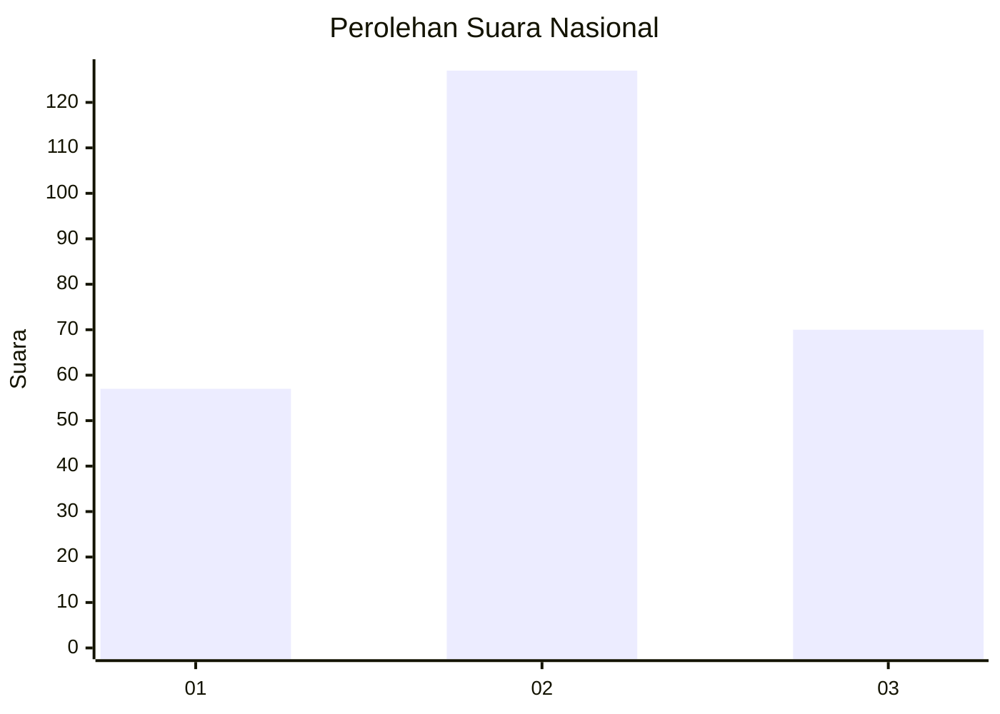
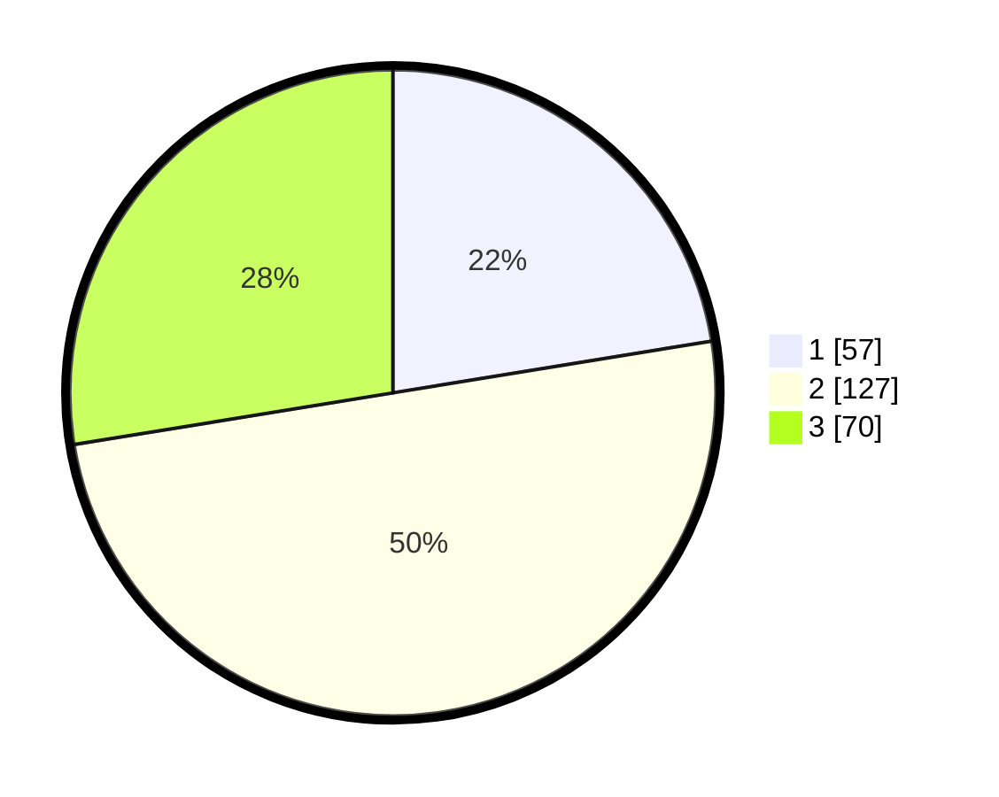

# Hasil

## Grafik

## Tabel

| No. | Nama Paslon    | Suara | Suara (raw) | Persentase |
|:--- |:-------------- | -----:| -----------:| ----------:|
| 1   | ANIES MUHAIMIN | 57    | [57][p-1]   | 22,44      |
| 2   | PRABOWO GIBRAN | 127   | [127][p-2]  | 50,00      |
| 3   | GANJAR MAHFUD  | 70    | [70][p-3]   | 27,56      |

[p-1]: https://github.com/gigit-pemilu/pemilu-2024/blob/main/pilpres/hitung-suara/sub/34-di-yogyakarta/sub/01-kulon-progo/sub/08-kokap/sub/2003-hargowilis/sub/005-tps/sub/paslon-1.txt
[p-2]: https://github.com/gigit-pemilu/pemilu-2024/blob/main/pilpres/hitung-suara/sub/34-di-yogyakarta/sub/01-kulon-progo/sub/08-kokap/sub/2003-hargowilis/sub/005-tps/sub/paslon-2.txt
[p-3]: https://github.com/gigit-pemilu/pemilu-2024/blob/main/pilpres/hitung-suara/sub/34-di-yogyakarta/sub/01-kulon-progo/sub/08-kokap/sub/2003-hargowilis/sub/005-tps/sub/paslon-3.txt

## Foto C Plano

https://sirekap-obj-formc.kpu.go.id/bf56/pemilu/ppwp/34/01/08/20/03/3401082003005-20240214-233809--b32daea5-60da-43ce-b75f-7038d86487ce.jpg

https://sirekap-obj-formc.kpu.go.id/bf56/pemilu/ppwp/34/01/08/20/03/3401082003005-20240214-234051--4b26c81c-f436-42f0-9270-5c692783e936.jpg

https://sirekap-obj-formc.kpu.go.id/bf56/pemilu/ppwp/34/01/08/20/03/3401082003005-20240214-234241--c741d420-2ccb-4a7d-8baa-01ce5af533c0.jpg

## Metadata

| Key        | Value               |
| ---------- | ------------------- |
| Time Stamp | 2024-02-21 12:00:00 |

