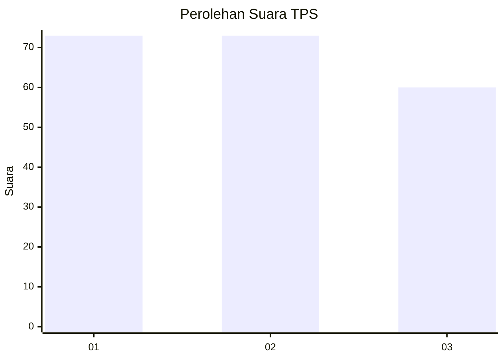
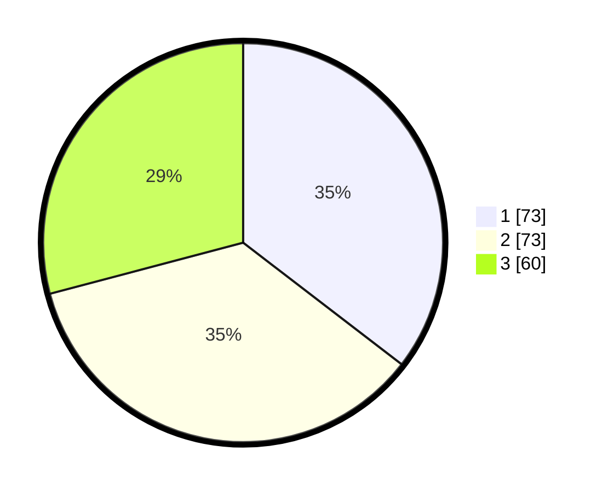

# Hasil

## Grafik

## Tabel

| No. | Nama Paslon    | Suara | Suara (raw) | Persentase |
|:--- |:-------------- | -----:| -----------:| ----------:|
| 1   | ANIES MUHAIMIN | 73    | [73][p-1]   | 35,44      |
| 2   | PRABOWO GIBRAN | 73    | [73][p-2]   | 35,44      |
| 3   | GANJAR MAHFUD  | 60    | [60][p-3]   | 29,13      |

[p-1]: https://github.com/gigit-pemilu/pemilu-2024-34-di-yogyakarta/blob/main/pilpres/hitung-suara/sub/34-di-yogyakarta/sub/01-kulon-progo/sub/08-kokap/sub/2003-hargowilis/sub/018-tps/sub/paslon-1.txt
[p-2]: https://github.com/gigit-pemilu/pemilu-2024-34-di-yogyakarta/blob/main/pilpres/hitung-suara/sub/34-di-yogyakarta/sub/01-kulon-progo/sub/08-kokap/sub/2003-hargowilis/sub/018-tps/sub/paslon-2.txt
[p-3]: https://github.com/gigit-pemilu/pemilu-2024-34-di-yogyakarta/blob/main/pilpres/hitung-suara/sub/34-di-yogyakarta/sub/01-kulon-progo/sub/08-kokap/sub/2003-hargowilis/sub/018-tps/sub/paslon-3.txt

## Foto C Plano

https://sirekap-obj-formc.kpu.go.id/6582/pemilu/ppwp/34/01/08/20/03/3401082003018-20240214-141754--ce9e3460-0e45-45c3-bb25-0b323e3e04d5.jpg

https://sirekap-obj-formc.kpu.go.id/6582/pemilu/ppwp/34/01/08/20/03/3401082003018-20240214-141903--b0149f47-2999-41e1-a48f-09b2e6c29db6.jpg

https://sirekap-obj-formc.kpu.go.id/6582/pemilu/ppwp/34/01/08/20/03/3401082003018-20240216-030357--b3a9289d-b50d-429a-b6a3-1d50ea20f545.jpg

## Metadata

| Key        | Value               |
| ---------- | ------------------- |
| Time Stamp | 2024-02-16 03:30:26 |

## DATA PEMILIH TETAP

Jumlah pemilih dalam DPT: **250**.
 * L: **132**.
 * P: **118**.

## DATA PENGGUNA HAK PILIH

Jumlah pengguna hak pilih dalam DPT: **200**.
 * L: **101**.
 * P: **99**.

Jumlah pengguna hak pilih dalam DPTb: **5**.
 * L: **3**.
 * P: **2**.

Jumlah pengguna hak pilih dalam DPK: **5**.
 * L: **2**.
 * P: **3**.

Jumlah pengguna hak pilih: **210**.
 * L: **106**.
 * P: **104**.

## JUMLAH SUARA SAH DAN TIDAK SAH

JUMLAH SELURUH SUARA SAH: **206**.

JUMLAH SUARA TIDAK SAH: **4**.

JUMLAH SELURUH SUARA SAH DAN SUARA TIDAK SAH: **210**.

