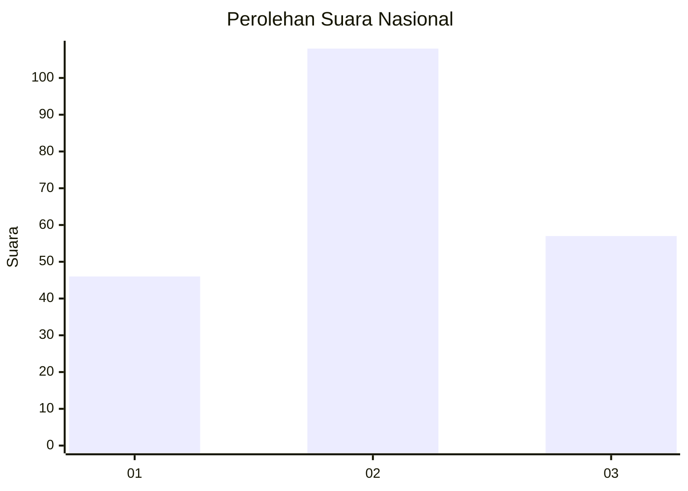
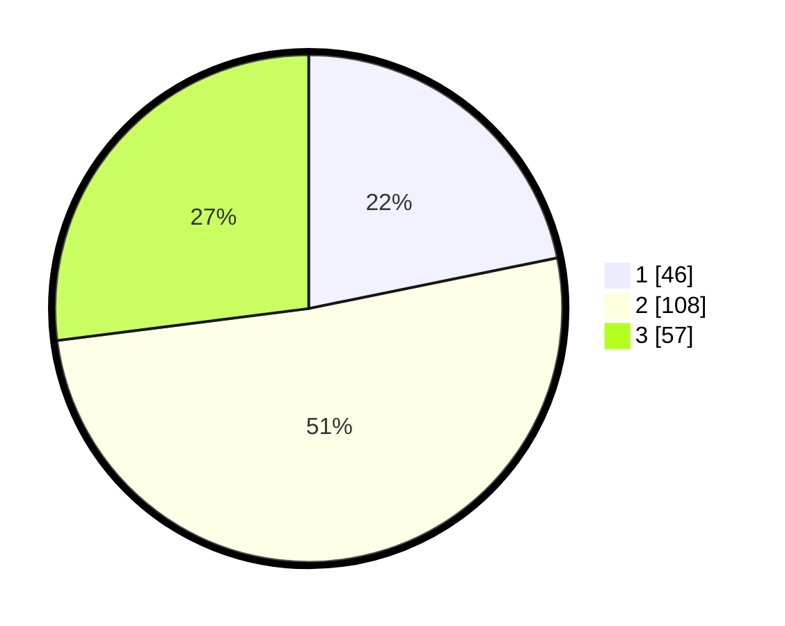

# Hasil

## Grafik

## Tabel

| No. | Nama Paslon    | Suara | Suara (raw) | Persentase |
|:--- |:-------------- | -----:| -----------:| ----------:|
| 1   | ANIES MUHAIMIN | 46    | [46][p-1]   | 21,80      |
| 2   | PRABOWO GIBRAN | 108   | [108][p-2]  | 51,18      |
| 3   | GANJAR MAHFUD  | 57    | [57][p-3]   | 27,01      |

[p-1]: https://github.com/gigit-pemilu/pemilu-2024/blob/main/pilpres/hitung-suara/sub/34-di-yogyakarta/sub/01-kulon-progo/sub/08-kokap/sub/2004-kalirejo/sub/006-tps/sub/paslon-1.txt
[p-2]: https://github.com/gigit-pemilu/pemilu-2024/blob/main/pilpres/hitung-suara/sub/34-di-yogyakarta/sub/01-kulon-progo/sub/08-kokap/sub/2004-kalirejo/sub/006-tps/sub/paslon-2.txt
[p-3]: https://github.com/gigit-pemilu/pemilu-2024/blob/main/pilpres/hitung-suara/sub/34-di-yogyakarta/sub/01-kulon-progo/sub/08-kokap/sub/2004-kalirejo/sub/006-tps/sub/paslon-3.txt

## Foto C Plano

https://sirekap-obj-formc.kpu.go.id/b68d/pemilu/ppwp/34/01/08/20/04/3401082004006-20240215-003723--987ec89e-0e6e-46b7-8181-58ae733604da.jpg

https://sirekap-obj-formc.kpu.go.id/b68d/pemilu/ppwp/34/01/08/20/04/3401082004006-20240215-022607--91974ccf-0849-4ce4-a43d-7006d5188466.jpg

https://sirekap-obj-formc.kpu.go.id/b68d/pemilu/ppwp/34/01/08/20/04/3401082004006-20240215-010332--188d26a9-27ee-4d3a-8c91-eef2bd823f72.jpg

## Metadata

| Key        | Value               |
| ---------- | ------------------- |
| Time Stamp | 2024-02-15 16:30:25 |

