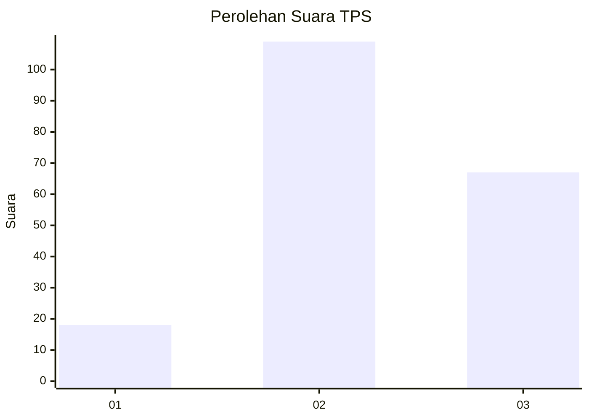
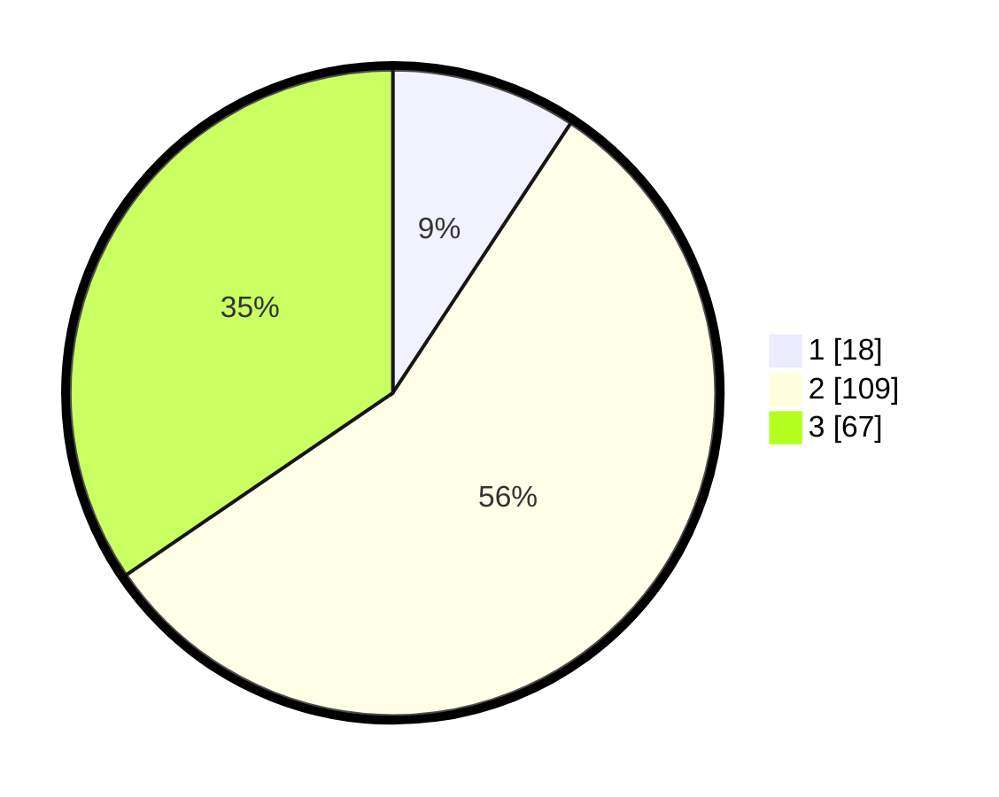

# Hasil

## Grafik

## Tabel

| No. | Nama Paslon    | Suara | Suara (raw) | Persentase |
|:--- |:-------------- | -----:| -----------:| ----------:|
| 1   | ANIES MUHAIMIN | 18    | [18][p-1]   | 9,28       |
| 2   | PRABOWO GIBRAN | 109   | [109][p-2]  | 56,19      |
| 3   | GANJAR MAHFUD  | 67    | [67][p-3]   | 34,54      |

[p-1]: https://github.com/gigit-pemilu/pemilu-2024-34-di-yogyakarta/blob/main/pilpres/hitung-suara/sub/34-di-yogyakarta/sub/01-kulon-progo/sub/08-kokap/sub/2004-kalirejo/sub/008-tps/sub/paslon-1.txt
[p-2]: https://github.com/gigit-pemilu/pemilu-2024-34-di-yogyakarta/blob/main/pilpres/hitung-suara/sub/34-di-yogyakarta/sub/01-kulon-progo/sub/08-kokap/sub/2004-kalirejo/sub/008-tps/sub/paslon-2.txt
[p-3]: https://github.com/gigit-pemilu/pemilu-2024-34-di-yogyakarta/blob/main/pilpres/hitung-suara/sub/34-di-yogyakarta/sub/01-kulon-progo/sub/08-kokap/sub/2004-kalirejo/sub/008-tps/sub/paslon-3.txt

## Foto C Plano

https://sirekap-obj-formc.kpu.go.id/72ad/pemilu/ppwp/34/01/08/20/04/3401082004008-20240215-231048--5d2c13a6-f7ad-4472-a6fb-2b0ac5da33f5.jpg

https://sirekap-obj-formc.kpu.go.id/72ad/pemilu/ppwp/34/01/08/20/04/3401082004008-20240215-231052--6e685094-0a20-4353-9863-dc8cf681cac8.jpg

https://sirekap-obj-formc.kpu.go.id/72ad/pemilu/ppwp/34/01/08/20/04/3401082004008-20240215-231050--9d665429-6081-47b2-8065-ed9ca1753b37.jpg

## Metadata

| Key        | Value               |
| ---------- | ------------------- |
| Time Stamp | 2024-02-24 22:31:28 |

## DATA PEMILIH TETAP

Jumlah pemilih dalam DPT: **218**.
 * L: **110**.
 * P: **108**.

## DATA PENGGUNA HAK PILIH

Jumlah pengguna hak pilih dalam DPT: **190**.
 * L: **97**.
 * P: **93**.

Jumlah pengguna hak pilih dalam DPTb: **6**.
 * L: **6**.
 * P: **0**.

Jumlah pengguna hak pilih dalam DPK: **2**.
 * L: **1**.
 * P: **1**.

Jumlah pengguna hak pilih: **198**.
 * L: **104**.
 * P: **94**.

## JUMLAH SUARA SAH DAN TIDAK SAH

JUMLAH SELURUH SUARA SAH: **194**.

JUMLAH SUARA TIDAK SAH: **4**.

JUMLAH SELURUH SUARA SAH DAN SUARA TIDAK SAH: **198**.

