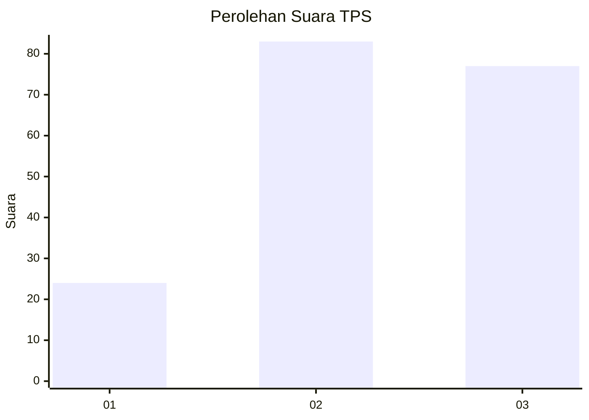
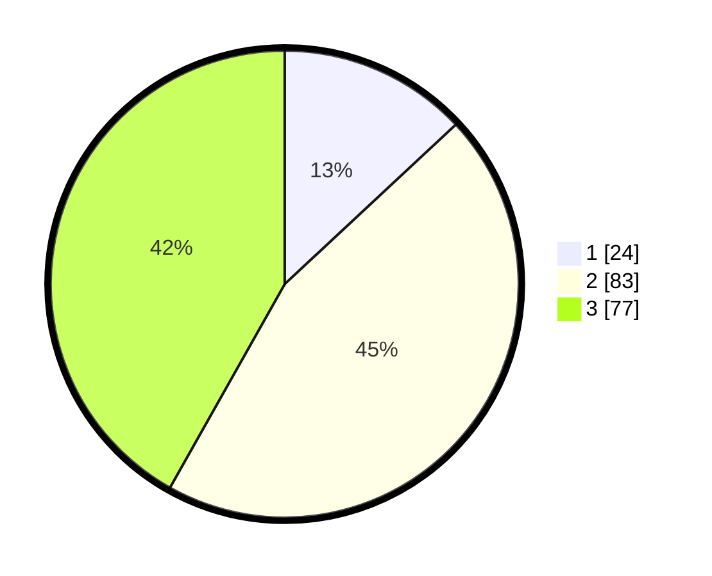

# Hasil

## Grafik

## Tabel

| No. | Nama Paslon    | Suara | Suara (raw) | Persentase |
|:--- |:-------------- | -----:| -----------:| ----------:|
| 1   | ANIES MUHAIMIN | 24    | [24][p-1]   | 13,04      |
| 2   | PRABOWO GIBRAN | 83    | [83][p-2]   | 45,11      |
| 3   | GANJAR MAHFUD  | 77    | [77][p-3]   | 41,85      |

[p-1]: https://github.com/gigit-pemilu/pemilu-2024-34-di-yogyakarta/blob/main/pilpres/hitung-suara/sub/34-di-yogyakarta/sub/01-kulon-progo/sub/08-kokap/sub/2005-hargotirto/sub/003-tps/sub/paslon-1.txt
[p-2]: https://github.com/gigit-pemilu/pemilu-2024-34-di-yogyakarta/blob/main/pilpres/hitung-suara/sub/34-di-yogyakarta/sub/01-kulon-progo/sub/08-kokap/sub/2005-hargotirto/sub/003-tps/sub/paslon-2.txt
[p-3]: https://github.com/gigit-pemilu/pemilu-2024-34-di-yogyakarta/blob/main/pilpres/hitung-suara/sub/34-di-yogyakarta/sub/01-kulon-progo/sub/08-kokap/sub/2005-hargotirto/sub/003-tps/sub/paslon-3.txt

## Foto C Plano

https://sirekap-obj-formc.kpu.go.id/6d4d/pemilu/ppwp/34/01/08/20/05/3401082005003-20240215-031350--ab4a30da-dafd-491e-860c-3816ba672f1c.jpg

https://sirekap-obj-formc.kpu.go.id/6d4d/pemilu/ppwp/34/01/08/20/05/3401082005003-20240214-191528--c8c0ea53-62b6-4eb8-a060-7a65f2413548.jpg

https://sirekap-obj-formc.kpu.go.id/6d4d/pemilu/ppwp/34/01/08/20/05/3401082005003-20240215-031756--403d4ede-5da4-42ff-a3da-c19f1b5109fc.jpg

## Metadata

| Key        | Value               |
| ---------- | ------------------- |
| Time Stamp | 2024-02-15 16:00:26 |

