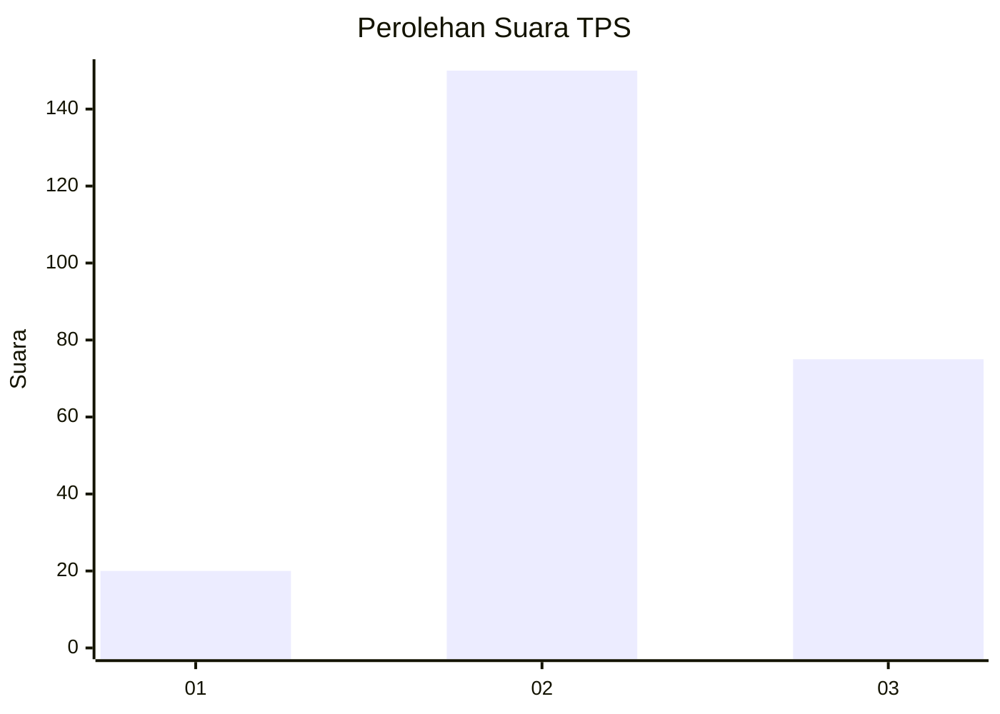
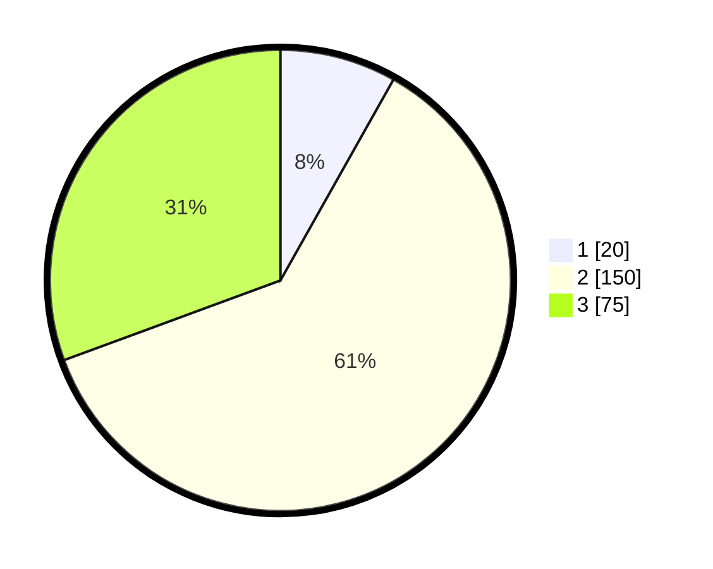

# Hasil

## Grafik

## Tabel

| No. | Nama Paslon    | Suara | Suara (raw) | Persentase |
|:--- |:-------------- | -----:| -----------:| ----------:|
| 1   | ANIES MUHAIMIN | 20    | [20][p-1]   | 8,16       |
| 2   | PRABOWO GIBRAN | 150   | [150][p-2]  | 61,22      |
| 3   | GANJAR MAHFUD  | 75    | [75][p-3]   | 30,61      |

[p-1]: https://github.com/gigit-pemilu/pemilu-2024-34-di-yogyakarta/blob/main/pilpres/hitung-suara/sub/34-di-yogyakarta/sub/01-kulon-progo/sub/08-kokap/sub/2005-hargotirto/sub/010-tps/sub/paslon-1.txt
[p-2]: https://github.com/gigit-pemilu/pemilu-2024-34-di-yogyakarta/blob/main/pilpres/hitung-suara/sub/34-di-yogyakarta/sub/01-kulon-progo/sub/08-kokap/sub/2005-hargotirto/sub/010-tps/sub/paslon-2.txt
[p-3]: https://github.com/gigit-pemilu/pemilu-2024-34-di-yogyakarta/blob/main/pilpres/hitung-suara/sub/34-di-yogyakarta/sub/01-kulon-progo/sub/08-kokap/sub/2005-hargotirto/sub/010-tps/sub/paslon-3.txt

## Foto C Plano

https://sirekap-obj-formc.kpu.go.id/0e45/pemilu/ppwp/34/01/08/20/05/3401082005010-20240214-200216--2cb5e28b-a194-4558-9e31-a57379b60e47.jpg

https://sirekap-obj-formc.kpu.go.id/0e45/pemilu/ppwp/34/01/08/20/05/3401082005010-20240214-200319--daab2722-ef71-4321-80fa-8855a28976db.jpg

https://sirekap-obj-formc.kpu.go.id/0e45/pemilu/ppwp/34/01/08/20/05/3401082005010-20240214-200644--e0698f48-e485-406a-9a6f-cc1be3dd22ef.jpg

## Metadata

| Key        | Value               |
| ---------- | ------------------- |
| Time Stamp | 2024-02-15 16:30:25 |

