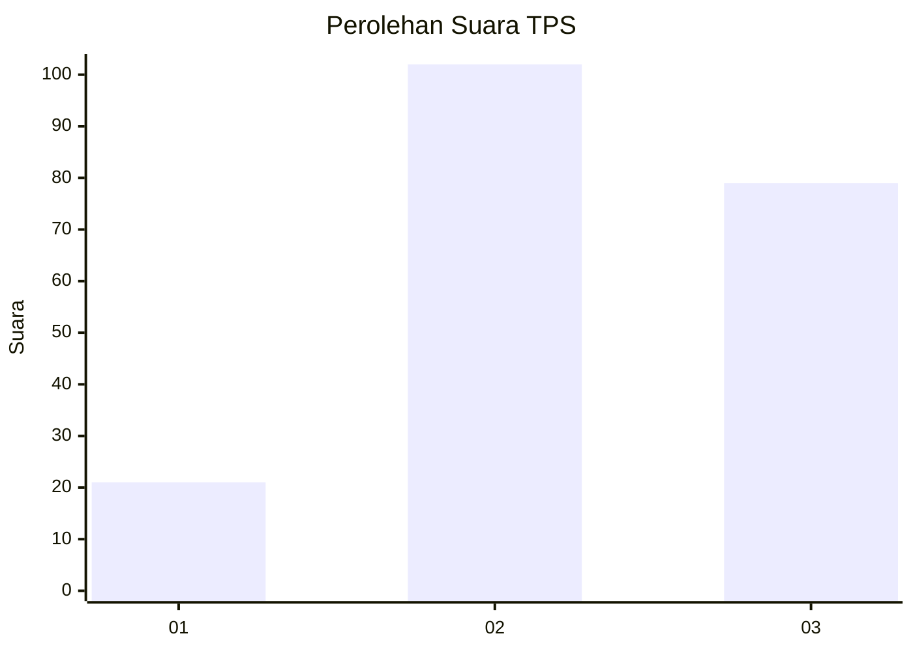
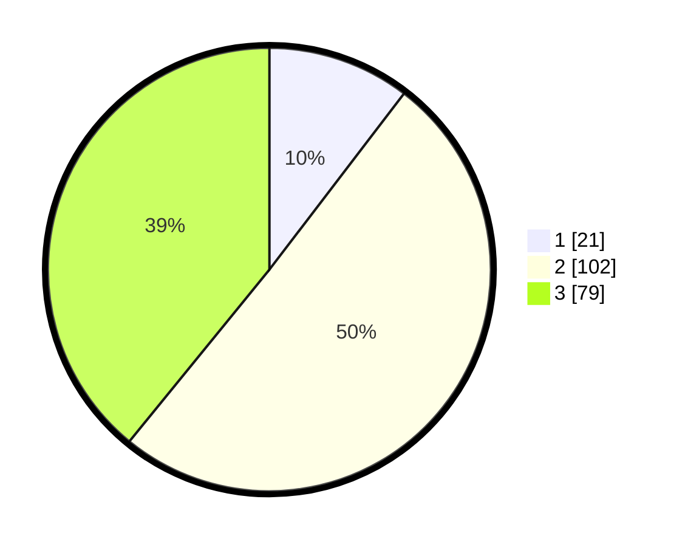

# Hasil

## Grafik

## Tabel

| No. | Nama Paslon    | Suara | Suara (raw) | Persentase |
|:--- |:-------------- | -----:| -----------:| ----------:|
| 1   | ANIES MUHAIMIN | 21    | [21][p-1]   | 10,40      |
| 2   | PRABOWO GIBRAN | 102   | [102][p-2]  | 50,50      |
| 3   | GANJAR MAHFUD  | 79    | [79][p-3]   | 39,11      |

[p-1]: https://github.com/gigit-pemilu/pemilu-2024-34-di-yogyakarta/blob/main/pilpres/hitung-suara/sub/34-di-yogyakarta/sub/01-kulon-progo/sub/08-kokap/sub/2005-hargotirto/sub/011-tps/sub/paslon-1.txt
[p-2]: https://github.com/gigit-pemilu/pemilu-2024-34-di-yogyakarta/blob/main/pilpres/hitung-suara/sub/34-di-yogyakarta/sub/01-kulon-progo/sub/08-kokap/sub/2005-hargotirto/sub/011-tps/sub/paslon-2.txt
[p-3]: https://github.com/gigit-pemilu/pemilu-2024-34-di-yogyakarta/blob/main/pilpres/hitung-suara/sub/34-di-yogyakarta/sub/01-kulon-progo/sub/08-kokap/sub/2005-hargotirto/sub/011-tps/sub/paslon-3.txt

## Foto C Plano

https://sirekap-obj-formc.kpu.go.id/7cbd/pemilu/ppwp/34/01/08/20/05/3401082005011-20240214-192532--52bb91be-79d9-4d79-8d29-c7533e86ab13.jpg

https://sirekap-obj-formc.kpu.go.id/7cbd/pemilu/ppwp/34/01/08/20/05/3401082005011-20240214-192550--fc26c0d9-f53b-4fe3-9690-95deeaa4fbd9.jpg

https://sirekap-obj-formc.kpu.go.id/7cbd/pemilu/ppwp/34/01/08/20/05/3401082005011-20240214-192609--c1428451-cc6b-4047-9ad0-2b6e8f15a2fc.jpg

## Metadata

| Key        | Value               |
| ---------- | ------------------- |
| Time Stamp | 2024-02-15 16:30:25 |

