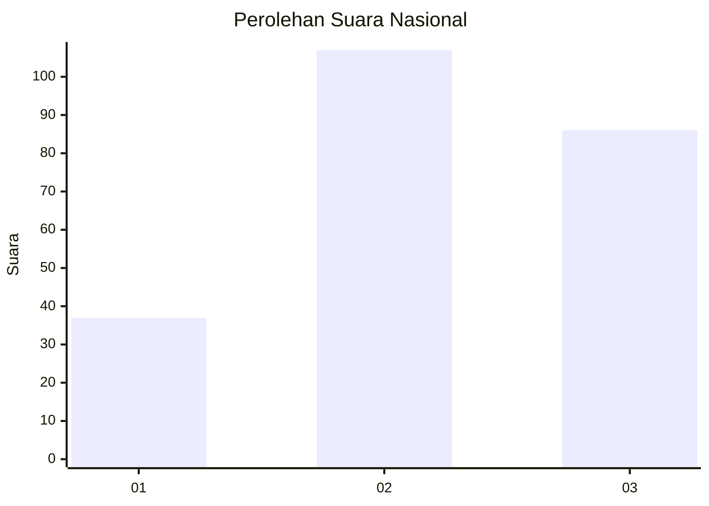
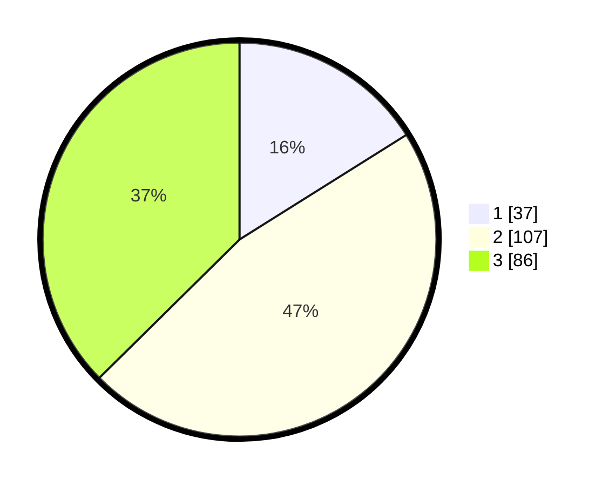

# Hasil

## Grafik

## Tabel

| No. | Nama Paslon    | Suara | Suara (raw) | Persentase |
|:--- |:-------------- | -----:| -----------:| ----------:|
| 1   | ANIES MUHAIMIN | 37    | [37][p-1]   | 16,09      |
| 2   | PRABOWO GIBRAN | 107   | [107][p-2]  | 46,52      |
| 3   | GANJAR MAHFUD  | 86    | [86][p-3]   | 37,39      |

[p-1]: https://github.com/gigit-pemilu/pemilu-2024/blob/main/pilpres/hitung-suara/sub/34-di-yogyakarta/sub/01-kulon-progo/sub/08-kokap/sub/2005-hargotirto/sub/015-tps/sub/paslon-1.txt
[p-2]: https://github.com/gigit-pemilu/pemilu-2024/blob/main/pilpres/hitung-suara/sub/34-di-yogyakarta/sub/01-kulon-progo/sub/08-kokap/sub/2005-hargotirto/sub/015-tps/sub/paslon-2.txt
[p-3]: https://github.com/gigit-pemilu/pemilu-2024/blob/main/pilpres/hitung-suara/sub/34-di-yogyakarta/sub/01-kulon-progo/sub/08-kokap/sub/2005-hargotirto/sub/015-tps/sub/paslon-3.txt

## Foto C Plano

https://sirekap-obj-formc.kpu.go.id/ec3c/pemilu/ppwp/34/01/08/20/05/3401082005015-20240215-001715--2840f4b5-308e-4af9-9fca-d057a7145e5e.jpg

https://sirekap-obj-formc.kpu.go.id/ec3c/pemilu/ppwp/34/01/08/20/05/3401082005015-20240214-210407--c4bc88ef-e76f-4bb3-aa79-bfee266039f2.jpg

https://sirekap-obj-formc.kpu.go.id/ec3c/pemilu/ppwp/34/01/08/20/05/3401082005015-20240215-002055--15940882-b527-4dfa-a1be-5a3cb6b60abc.jpg

## Metadata

| Key        | Value               |
| ---------- | ------------------- |
| Time Stamp | 2024-02-15 12:00:28 |

