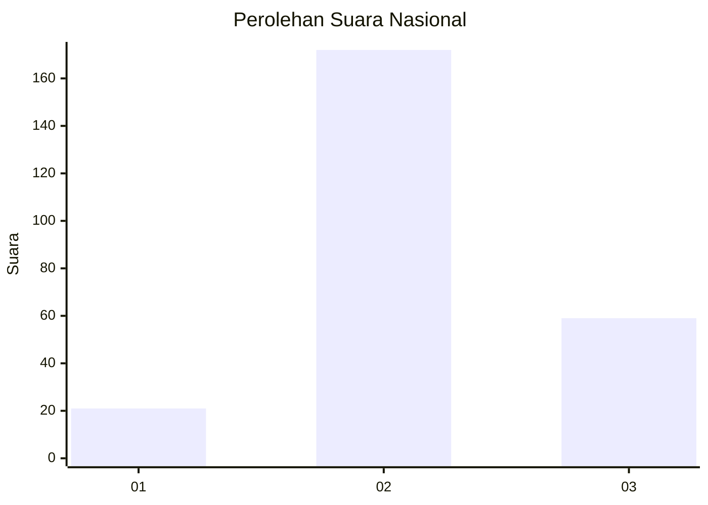
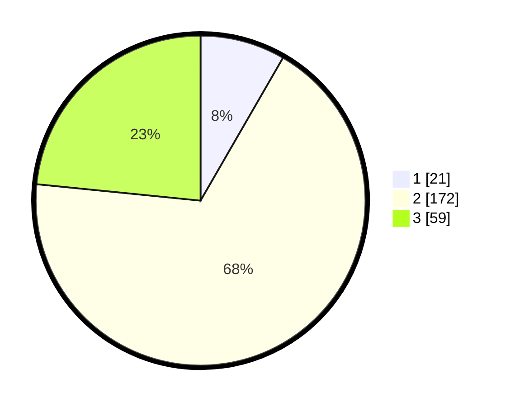

# Hasil

## Grafik

## Tabel

| No. | Nama Paslon    | Suara | Suara (raw) | Persentase |
|:--- |:-------------- | -----:| -----------:| ----------:|
| 1   | ANIES MUHAIMIN | 21    | [21][p-1]   | 8,33       |
| 2   | PRABOWO GIBRAN | 172   | [172][p-2]  | 68,25      |
| 3   | GANJAR MAHFUD  | 59    | [59][p-3]   | 23,41      |

[p-1]: https://github.com/gigit-pemilu/pemilu-2024/blob/main/pilpres/hitung-suara/sub/34-di-yogyakarta/sub/01-kulon-progo/sub/09-girimulyo/sub/2001-jatimulyo/sub/001-tps/sub/paslon-1.txt
[p-2]: https://github.com/gigit-pemilu/pemilu-2024/blob/main/pilpres/hitung-suara/sub/34-di-yogyakarta/sub/01-kulon-progo/sub/09-girimulyo/sub/2001-jatimulyo/sub/001-tps/sub/paslon-2.txt
[p-3]: https://github.com/gigit-pemilu/pemilu-2024/blob/main/pilpres/hitung-suara/sub/34-di-yogyakarta/sub/01-kulon-progo/sub/09-girimulyo/sub/2001-jatimulyo/sub/001-tps/sub/paslon-3.txt

## Foto C Plano

https://sirekap-obj-formc.kpu.go.id/0b31/pemilu/ppwp/34/01/09/20/01/3401092001001-20240216-123953--ccffcefd-82ae-4414-8d63-0e34cb5c18cb.jpg

https://sirekap-obj-formc.kpu.go.id/0b31/pemilu/ppwp/34/01/09/20/01/3401092001001-20240216-123955--e0a448eb-89b4-458b-ae57-c69061687574.jpg

https://sirekap-obj-formc.kpu.go.id/0b31/pemilu/ppwp/34/01/09/20/01/3401092001001-20240216-123954--e21dfbd2-f852-4c74-be1c-9a2de502bf47.jpg

## Metadata

| Key        | Value               |
| ---------- | ------------------- |
| Time Stamp | 2024-02-21 13:00:00 |

## DATA PEMILIH TETAP

Jumlah pemilih dalam DPT: **281**.
 * L: **141**.
 * P: **140**.

## DATA PENGGUNA HAK PILIH

Jumlah pengguna hak pilih dalam DPT: **255**.
 * L: **125**.
 * P: **130**.

Jumlah pengguna hak pilih dalam DPTb: **4**.
 * L: **2**.
 * P: **2**.

Jumlah pengguna hak pilih dalam DPK: **0**.
 * L: **0**.
 * P: **0**.

Jumlah pengguna hak pilih: **259**.
 * L: **127**.
 * P: **132**.

## JUMLAH SUARA SAH DAN TIDAK SAH

JUMLAH SELURUH SUARA SAH: **252**.

JUMLAH SUARA TIDAK SAH: **7**.

JUMLAH SELURUH SUARA SAH DAN SUARA TIDAK SAH: **259**.

